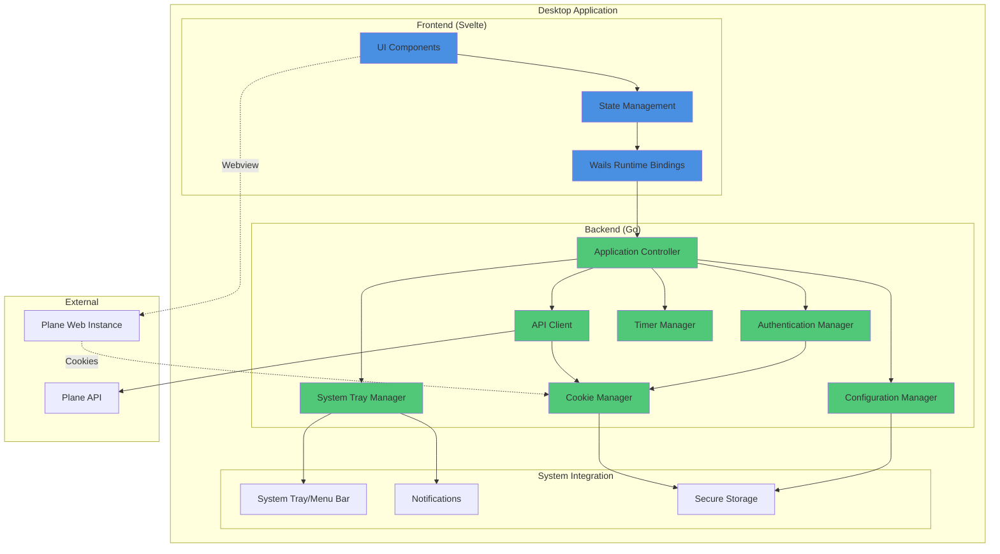
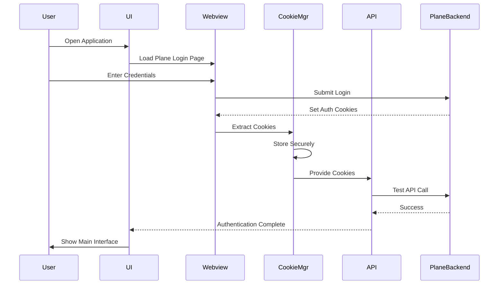
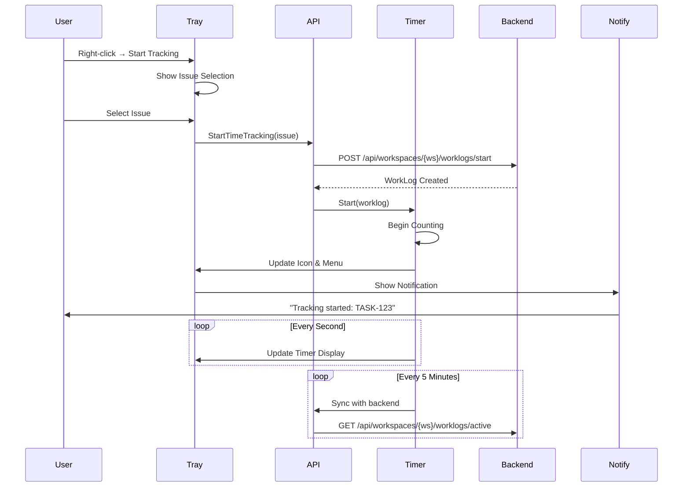
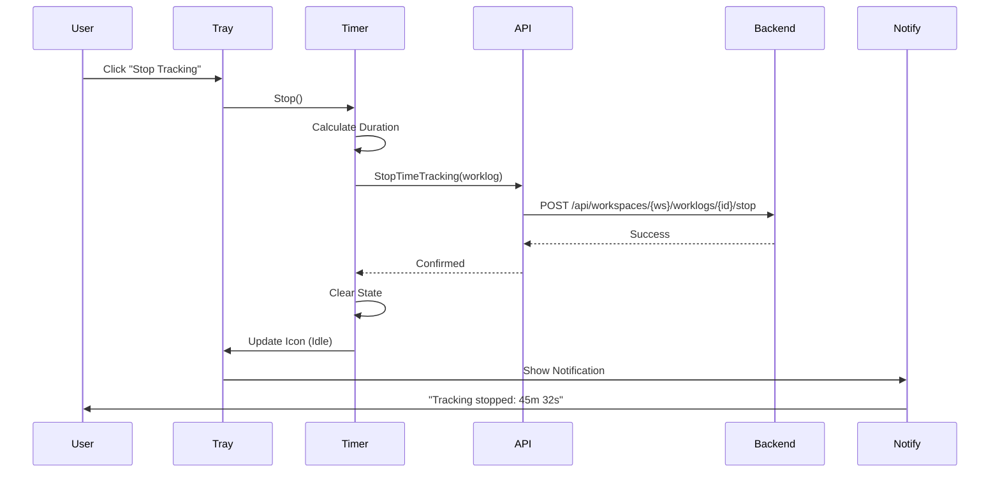
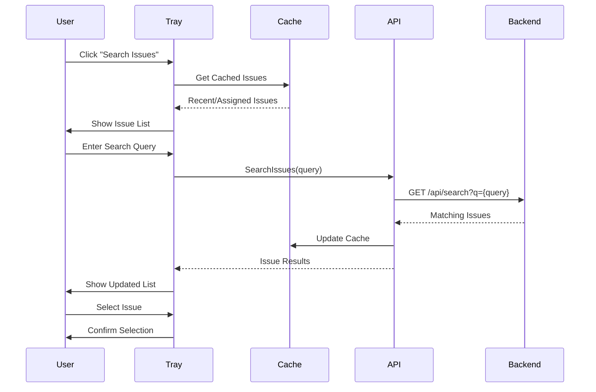

# Plane Desktop Application - Technical Design

## 1. Architecture Overview

The Plane Desktop Application follows a layered architecture with clear separation between the Go backend (business logic, API integration) and Svelte frontend (UI). The Wails framework provides the bridge between these layers.

### 1.1 High-Level Architecture



### 1.2 Component Descriptions

#### Frontend Components (Svelte)
- **UI Components**: Svelte components for settings, task selection, and main window
- **State Management**: Centralized state using Svelte stores
- **Wails Runtime Bindings**: JavaScript bindings generated by Wails to call Go functions

#### Backend Components (Go)
- **Application Controller**: Main application lifecycle and coordination
- **Configuration Manager**: Handles app settings and preferences
- **Authentication Manager**: Manages user authentication state
- **API Client**: HTTP client for Plane API with cookie handling
- **System Tray Manager**: Controls system tray icon and menu
- **Timer Manager**: Tracks active time tracking sessions
- **Cookie Manager**: Extracts and manages authentication cookies from webview

## 2. Component Design

### 2.1 Configuration Manager

**Responsibilities:**
- Load/save application configuration
- Manage default and user-provided Plane instance URL
- Store user preferences (startup behavior, notification settings)

**Configuration Structure:**
```go
type Config struct {
    PlaneURL          string `json:"plane_url"`
    StartMinimized    bool   `json:"start_minimized"`
    NotificationSound bool   `json:"notification_sound"`
    LongSessionAlert  int    `json:"long_session_alert_minutes"` // 0 = disabled
    LastWorkspace     string `json:"last_workspace"`
}
```

**Storage Location:**
- Windows: `%APPDATA%/plane-desktop/config.json`
- macOS: `~/Library/Application Support/plane-desktop/config.json`
- Linux: `~/.config/plane-desktop/config.json`

### 2.2 Cookie Manager

**Responsibilities:**
- Extract cookies from embedded webview
- Store cookies securely
- Provide cookies to API client
- Handle cookie expiration and refresh

**Cookie Storage:**
```go
type CookieStore struct {
    Cookies    []*http.Cookie `json:"cookies"`
    UpdatedAt  time.Time      `json:"updated_at"`
    ExpiresAt  time.Time      `json:"expires_at"`
}
```

**Key Methods:**
```go
func (cm *CookieManager) ExtractFromWebview() error
func (cm *CookieManager) GetCookiesForRequest() []*http.Cookie
func (cm *CookieManager) SaveSecurely() error
func (cm *CookieManager) LoadSecurely() error
func (cm *CookieManager) IsValid() bool
```

### 2.3 API Client

**Responsibilities:**
- Make authenticated requests to Plane API
- Handle request/response serialization
- Implement retry logic and error handling
- Manage rate limiting

**Key Endpoints:**
```go
type PlaneAPI struct {
    BaseURL    string
    HTTPClient *http.Client
    Cookies    CookieManager
}

// Time Tracking
func (api *PlaneAPI) StartTimeTracking(workspaceSlug, projectID, issueID string) (*WorkLog, error)
func (api *PlaneAPI) StopTimeTracking(workspaceSlug, projectID, issueID, worklogID string) error
func (api *PlaneAPI) GetActiveTimeTracking(workspaceSlug string) (*WorkLog, error)

// Work Items
func (api *PlaneAPI) GetMyIssues(workspaceSlug string, filters IssueFilters) ([]Issue, error)
func (api *PlaneAPI) GetIssue(workspaceSlug, projectID, issueID string) (*Issue, error)
func (api *PlaneAPI) SearchIssues(workspaceSlug, query string) ([]Issue, error)

// User & Workspace
func (api *PlaneAPI) GetCurrentUser() (*User, error)
func (api *PlaneAPI) GetWorkspaces() ([]Workspace, error)
```

### 2.4 System Tray Manager

**Responsibilities:**
- Create and manage system tray icon
- Update tray icon based on tracking state
- Build and update context menu
- Handle menu item clicks

**Tray States:**
- **Idle**: Default icon, no tracking active
- **Tracking**: Animated or colored icon, shows timer
- **Error**: Warning icon when connection issues occur

**Context Menu Structure:**
```
┌─────────────────────────────────────┐
│ ⏱️  00:23:45 - TASK-123: Fix bug   │ (tracking active)
├─────────────────────────────────────┤
│ ⏹️  Stop Tracking                   │
│ ▶️  Start New Tracking              │ →  Recent Issues submenu
├─────────────────────────────────────┤
│ 🔍 Search Issues...                 │
├─────────────────────────────────────┤
│ 🪟 Show Window                      │
│ ⚙️  Settings                        │
│ 🚪 Quit                             │
└─────────────────────────────────────┘
```

### 2.5 Timer Manager

**Responsibilities:**
- Track elapsed time for active work log
- Emit timer updates every second
- Persist timer state to prevent data loss
- Sync with backend periodically

**Timer State:**
```go
type TimerState struct {
    WorklogID   string    `json:"worklog_id"`
    IssueID     string    `json:"issue_id"`
    IssueTitle  string    `json:"issue_title"`
    ProjectID   string    `json:"project_id"`
    StartTime   time.Time `json:"start_time"`
    ElapsedSecs int64     `json:"elapsed_seconds"`
    IsActive    bool      `json:"is_active"`
}
```

**Key Methods:**
```go
func (tm *TimerManager) Start(worklog *WorkLog) error
func (tm *TimerManager) Stop() error
func (tm *TimerManager) GetElapsed() time.Duration
func (tm *TimerManager) Tick() // Called every second
func (tm *TimerManager) SyncWithBackend() error
```

## 3. Data Flow Diagrams

### 3.1 Login Flow



### 3.2 Start Time Tracking Flow



### 3.3 Stop Time Tracking Flow



### 3.4 Issue Search and Selection Flow



## 4. User Interface Design

### 4.1 Main Window

**Layout:**
```
┌─────────────────────────────────────────────┐
│  Plane Desktop               🗕 🗗 ✕        │
├─────────────────────────────────────────────┤
│                                             │
│          [Embedded Webview]                 │
│                                             │
│     (Full Plane Web Interface)              │
│                                             │
│                                             │
│                                             │
├─────────────────────────────────────────────┤
│  Status: Connected | Tracking: TASK-123    │
└─────────────────────────────────────────────┘
```

### 4.2 Settings Dialog

**Tabs:**
1. **General**
   - Plane Instance URL
   - Start on system startup
   - Start minimized

2. **Notifications**
   - Enable desktop notifications
   - Notification sound
   - Long session alerts (threshold)

3. **Time Tracking**
   - Default workspace
   - Auto-start tracking on issue open
   - Sync interval

4. **About**
   - Version information
   - Check for updates
   - Links to documentation

### 4.3 System Tray Icon States

**Icon Variations:**
- **Idle**: Plane logo in grayscale
- **Tracking**: Plane logo with colored overlay + timer text
- **Error**: Plane logo with warning indicator
- **Syncing**: Animated dots or spinner

## 5. State Management

### 5.1 Application State

```typescript
// Svelte Store Structure
interface AppState {
  config: Config;
  user: User | null;
  currentWorkspace: Workspace | null;
  timerState: TimerState | null;
  issues: {
    recent: Issue[];
    assigned: Issue[];
    search: Issue[];
  };
  connectivity: {
    online: boolean;
    lastSync: Date;
  };
}
```

### 5.2 State Persistence

- **Session State**: Saved on every change to prevent data loss
- **Cache**: Issues and workspaces cached for 5 minutes
- **Timer State**: Persisted every minute to survive crashes

## 6. Security Considerations

### 6.1 Cookie Storage

- Cookies encrypted using OS-specific secure storage:
  - **Windows**: Windows Credential Manager (DPAPI)
  - **macOS**: Keychain
  - **Linux**: Secret Service API (gnome-keyring/kwallet)

### 6.2 API Communication

- All API calls use HTTPS (enforced)
- Certificate validation enabled
- No sensitive data in logs
- Timeout on all requests (30s)

### 6.3 Webview Security

- JavaScript injection restricted
- Content Security Policy enforced
- Navigation restricted to Plane domain
- Local storage isolated

## 7. Error Handling

### 7.1 Network Errors

```go
type ErrorHandler struct {
    MaxRetries    int
    RetryDelay    time.Duration
    Backoff       float64 // Exponential backoff multiplier
}

func (eh *ErrorHandler) HandleAPIError(err error) error {
    if isNetworkError(err) {
        return eh.retryWithBackoff()
    }
    if isAuthError(err) {
        return eh.refreshAuth()
    }
    return err
}
```

### 7.2 Error Categories

1. **Network Errors**: Retry with exponential backoff
2. **Authentication Errors**: Re-extract cookies or prompt re-login
3. **API Errors**: Display user-friendly message
4. **System Errors**: Log and gracefully degrade functionality

### 7.3 Fallback Behavior

- **No Network**: Show cached data, queue operations
- **Invalid Cookies**: Prompt user to re-login via webview
- **API Changes**: Log incompatibility, suggest update

## 8. Testing Strategy

### 8.1 Unit Tests

- Go backend functions (80% coverage target)
- API client with mocked HTTP responses
- Timer logic with time manipulation
- Cookie extraction and storage

### 8.2 Integration Tests

- End-to-end API flows
- Webview cookie extraction
- System tray interactions
- State persistence

### 8.3 Platform Testing

- Test on Windows 10/11
- Test on macOS 11+ (Intel and Apple Silicon)
- Test on Ubuntu 22.04 and Fedora 38
- Verify system tray on each platform

## 9. Build and Deployment

### 9.1 Build Process

```bash
# Development build
wails dev

# Production build
wails build -clean

# Platform-specific builds
wails build -platform windows/amd64
wails build -platform darwin/universal  # Universal binary for macOS
wails build -platform linux/amd64
```

### 9.2 Packaging

- **Windows**: MSI installer + portable exe
- **macOS**: DMG with signed .app bundle
- **Linux**: AppImage, .deb, and .rpm packages

### 9.3 Auto-Updates

- Use built-in Wails update mechanism
- Check for updates on startup (optional)
- Download and verify update signatures
- Apply updates on restart

## 10. Performance Considerations

### 10.1 Optimization Targets

- **Startup Time**: < 3 seconds to main window
- **Memory Usage**: < 200MB typical, < 400MB peak
- **CPU Usage**: < 5% idle, < 20% during sync
- **API Latency**: Display cached data while fetching updates

### 10.2 Caching Strategy

```go
type Cache struct {
    TTL     time.Duration
    Data    map[string]CacheEntry
    MaxSize int
}

type CacheEntry struct {
    Value     interface{}
    ExpiresAt time.Time
}

// Cache TTLs
const (
    UserCacheTTL      = 1 * time.Hour
    WorkspaceCacheTTL = 30 * time.Minute
    IssueCacheTTL     = 5 * time.Minute
)
```

### 10.3 Resource Management

- Lazy load issue details
- Paginate issue lists
- Compress cache storage
- Clean up old logs and cache entries

## 11. Accessibility

- Keyboard shortcuts for all major actions
- Screen reader support for tray menu
- High contrast mode support
- Configurable font sizes
- ARIA labels on all UI elements

## 12. Internationalization (Future)

- Prepare architecture for i18n
- Use translation keys in UI
- Store locale preference
- Support for RTL languages

## 13. Technical Debt and Future Improvements

### 13.1 Phase 1 (MVP)
- Basic webview with cookie extraction
- Simple time tracking with system tray
- Issue search and selection

### 13.2 Phase 2
- Advanced caching and offline support
- Keyboard shortcuts
- Auto-update mechanism
- Statistics and reporting

### 13.3 Phase 3
- Plugin system
- Custom themes
- Advanced notifications
- AI-powered task suggestions
