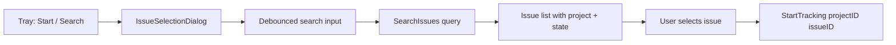

# Spec: Issue Selection Dialog

## Status

| Field        | Value         |
| ------------ | ------------- |
| Priority     | P0            |
| Phase        | 4.3–4.4       |
| Requirements | FR4, FR5, US4 |

## Problem

System tray "Start Tracking" and "Search Issues" call `onStart(nil)`. Users cannot pick an issue to track from the desktop app.

## Goals

1. Modal or dedicated window listing searchable issues
2. Start time tracking on selected issue (API + local timer)
3. Callable from tray menu and frontend

## Design

### UI Flow



### Svelte Component

`frontend/src/components/IssueSelectionDialog.svelte`:

- Props: `open`, `workspace`, `onSelect`, `onClose`
- Calls `SearchIssues(query)` via Wails bindings
- Shows loading / empty / error states
- Keyboard: Enter to select first result, Esc to close

### Backend

Existing methods sufficient:

- `SearchIssues(query string)`
- `StartTracking(projectID, issueID string)`

Enhancement: fetch issue title after start (TODO in `app.go` line 291).

### Tray Integration

Replace nil callbacks in `tray.go`:

```go
// onStartItem -> runtime.EventsEmit or WindowShow + open dialog flag
```

Use Wails `runtime.EventsEmit` to signal frontend to open dialog when tray clicked.

## Acceptance Criteria

- [ ] Tray "Start Tracking" opens issue picker
- [ ] Search filters issues by title/ID
- [ ] Selecting issue starts backend worklog + local timer
- [ ] Tray shows active issue title and elapsed time

## References

- `app.go` `handleStartTracking`, `tray.go` `handleEvents`
- `internal/api/client.go` `SearchIssues`, `StartTimeTracking`
