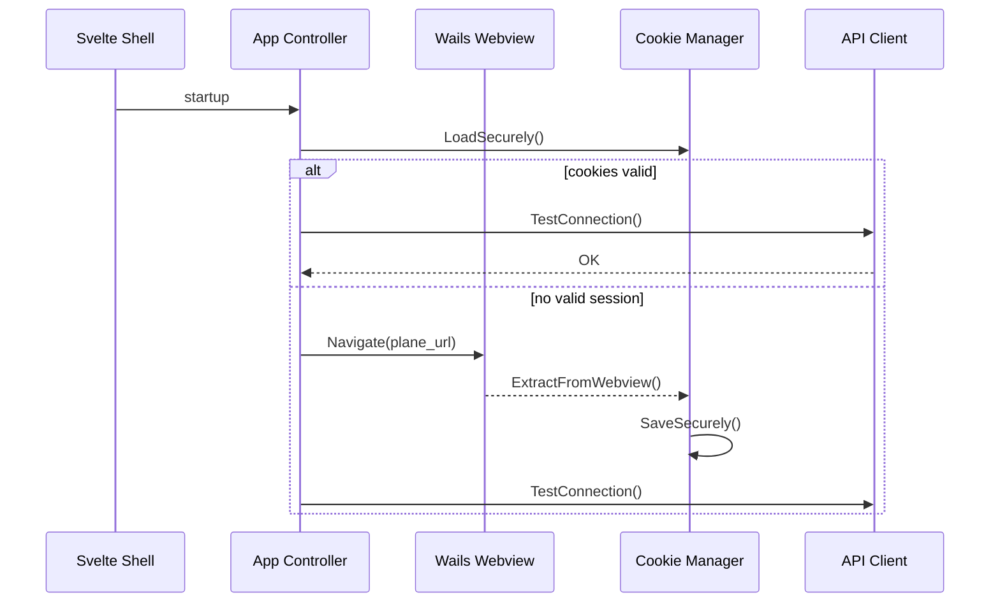

# Spec: Webview Integration & Authentication

## Status

| Field        | Value         |
| ------------ | ------------- |
| Priority     | P0            |
| Phase        | 4.1–4.2       |
| Requirements | FR2, FR3, US2 |

## Problem

Users cannot log in through the desktop app. The cookie manager stores cookies in a JSON file but has no `ExtractFromWebview()` implementation. Without webview integration, API calls fail unless cookies are manually injected.

## Goals

1. Embed the configured Plane instance URL in the main Wails window.
2. Detect successful login (cookie presence / API probe).
3. Persist session cookies via the cookie manager.
4. Restore session on next launch without re-login when cookies remain valid.

## Non-Goals

- SSO provider-specific flows (handled by Plane web UI)
- Multi-account switching in v1

## Design

### Architecture



### Wails Configuration

Update `main.go` / `wails.json`:

- Set `StartHidden` optional per config
- Enable webview navigation to external Plane URL (same-origin cookies)
- Consider split layout: webview primary + optional sidebar for timer status

### Cookie Extraction

Implement `cookie.Manager.ExtractFromWebview()`:

1. Use Wails runtime cookie APIs or document JS bridge if required
2. Filter cookies for Plane host (session, CSRF if applicable)
3. Set `UpdatedAt` / `ExpiresAt` from cookie metadata
4. Call `SaveSecurely()`

### Session Refresh

- On `401` from API client, clear cookies and show webview login
- Optional: poll `GetCurrentUser` on interval from config

## API Surface

No new public Go methods required beyond existing `authenticate()` flow; may add:

```go
func (a *App) OpenLogin() error
func (a *App) IsAuthenticated() bool
```

## Acceptance Criteria

- [ ] First launch shows Plane login page in main window
- [ ] After web login, tray shows authenticated state
- [ ] Restart app reuses stored session when cookies valid
- [ ] Invalid/expired session prompts re-login

## Risks

| Risk                         | Mitigation                                    |
| ---------------------------- | --------------------------------------------- |
| Wails cookie API limitations | Spike on target OSes early                    |
| CORS / cookie `SameSite`     | Use same webview origin as Plane URL          |
| CSRF tokens                  | Mirror web client header behavior if required |

## References

- `design.md` §2.2, §4.1
- `requirements.md` FR2, US2
- [Wails webview docs](https://wails.io/docs/reference/runtime/window)
