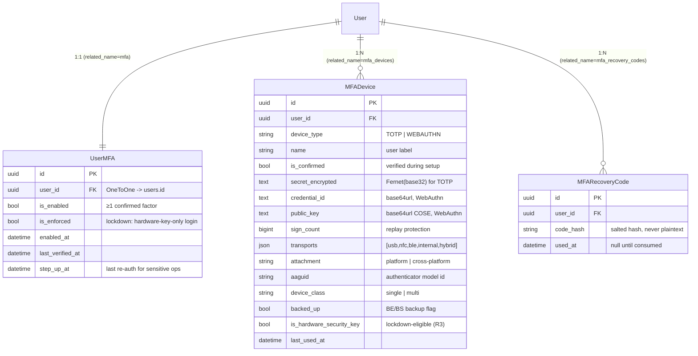
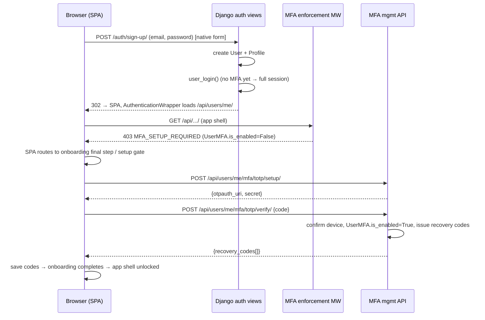
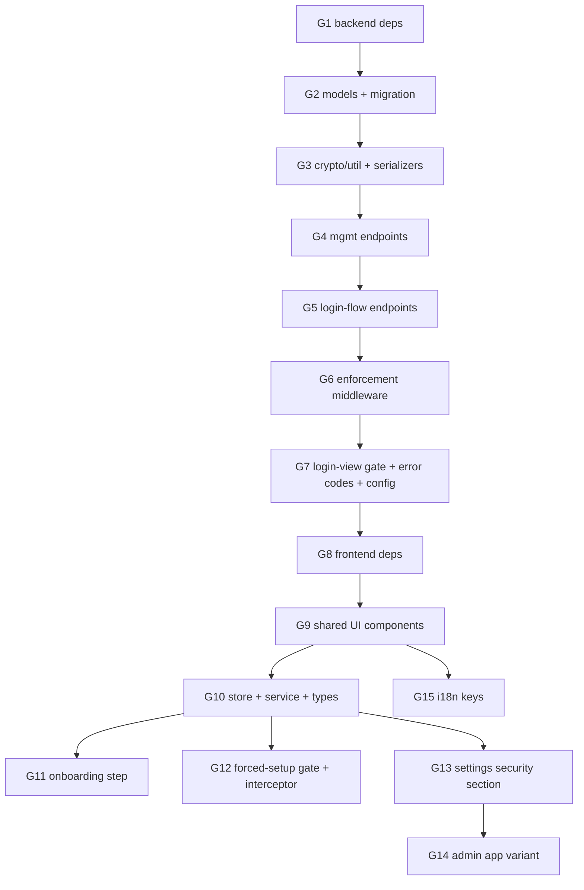

# Local 2FA / MFA — SDLC Software Engineering Specification

> **Project:** Plane (self-hosted project management) — monorepo root
> `/home/frannas/.cursor/worktrees/plane__SSH__ubuntu-24-dev.netbird.selfhosted_/wrrw`.
> **Document type:** Formal 4-part SDLC specification (Requirements → Architecture/Design →
> Implementation Plan → Testing/Validation).
> **Scope:** _Local_ multi-factor authentication — **Authenticator app (TOTP)**, **Passkey
> (WebAuthn platform)**, and **FIDO2 hardware security key (cross-platform / YubiKey)**, with a
> **FIDO2 lockdown mode**. **No email / SMS factors.**
> **Status:** Implementation in progress on branch `feat/local-2fa` (2026-06-28).
>
> **Source investigations** (read in full; this spec reuses their exact paths, model names,
> endpoint names, and pinned versions):
>
> - `docs/2fa/01-backend-libraries.md` — library stack, versions, security best practices.
> - `docs/2fa/02-backend-integration.md` — Django auth flow, models, middleware, endpoints.
> - `docs/2fa/03-frontend-ui-research.md` — UI/UX patterns, browser WebAuthn libs, components.
> - `docs/2fa/04-frontend-integration.md` — Vite + React Router SPA integration points.
>
> **Key environment facts** (verified in the investigations):
>
> - Backend: Python **3.13.2**, Django **6.0.5**, DRF **3.17.1**, `cryptography==48.0.1`,
>   Redis/`django-redis` available. Custom auth app (`plane.authentication`), **server-side DB
>   sessions** (`session-id` cookie), **no JWT** for first-party apps.
> - Frontend: `apps/web` and `apps/admin` are **Vite + React Router v7 SPAs** (NOT Next.js).
>   Password login is a **native HTML form POST** to Django that redirects back to the SPA;
>   auth state is read from `GET /api/users/me/`. The single auth gate is the React
>   `AuthenticationWrapper` component.

---

## Implementation progress (live tracker)

Last updated: **2026-06-28**. Branch: **`feat/local-2fa`**.

| ID  | Task group                                  | Status         | Notes                                                          |
| --- | ------------------------------------------- | -------------- | -------------------------------------------------------------- |
| G1  | Backend deps (`pyotp`, `webauthn`, …)       | ✅ Done        | Pinned in `apps/api/requirements/base.txt`                     |
| G2  | Models + migration `0130_user_mfa`          | ✅ Done        | `UserMFA`, `MFADevice`, `MFARecoveryCode`                      |
| G3  | Crypto/util helpers + serializers           | ✅ Done        | `authentication/utils/mfa.py`, `app/serializers/mfa.py`        |
| G4  | Management endpoints (`api/users/me/mfa/*`) | ✅ Done        | `app/views/user/mfa.py`                                        |
| G5  | Login-flow endpoints (`auth/mfa/*`)         | ✅ Done        | `authentication/views/app/mfa.py`                              |
| G6  | Enforcement middleware                      | ✅ Done        | `authentication/middleware/mfa_enforcement.py`                 |
| G7  | Login-view gate + error codes + config      | ✅ Done        | Email/magic/OAuth views patched; `MFA_ENFORCED` flag           |
| G8  | Frontend deps                               | ✅ Done        | `@simplewebauthn/browser@13.3.0`, `qrcode.react@4.2.0`         |
| G9  | Shared UI components                        | ✅ Done        | `packages/ui/src/two-factor/*`                                 |
| G10 | Store + service + types                     | ✅ Done        | `MfaStore`, `MfaService`, `@plane/types`                       |
| G11 | Onboarding step                             | ✅ Done        | Final `MFA_SETUP` step wired                                   |
| G12 | Forced-setup gate + interceptor             | ✅ Done        | `AuthenticationWrapper`, axios 403, `/accounts/setup-2fa`      |
| G13 | Settings security section                   | ✅ Done        | Device management in profile security tab                      |
| G14 | Admin app variant                           | ⚠️ Partial     | TOTP/recovery login verify only; no admin WebAuthn             |
| G15 | i18n keys                                   | ⚠️ Partial     | English only (`packages/i18n/src/locales/en/auth.json`)        |
| T1  | Backend pytest (Docker)                     | ❌ Not run     | Tests written; needs `docker-compose-test.yml` run             |
| T2  | Frontend unit/integration tests             | ❌ Not started | Spec §4.2 not implemented                                      |
| T3  | Manual QA (real hardware)                   | ❌ Not started | Spec §4.3 checklist                                            |
| T4  | E2E browser on local Docker stack           | ❌ Not started | `docker-compose-local.yml` + browser automation                |
| V1  | `pnpm fix:format`                           | ✅ Done        | Ran 2026-06-28                                                 |
| V2  | `pnpm check:lint` (2FA packages)            | ✅ Done        | 0 new lint errors                                              |
| V3  | `pnpm check:types` (2FA packages)           | ⚠️ Partial     | Pre-existing `use-page-fallback.ts` error in `web` (unrelated) |
| V4  | `pnpm build` (web/admin/ui)                 | ✅ Done        | Succeeds                                                       |

**Known gaps before merge:** backend Docker pytest not executed; no E2E browser pass on local compose; admin WebAuthn login; non-English locales; step-up re-auth modal (spec §2.6, optional).

---

## Table of contents

- [Implementation progress (live tracker)](#implementation-progress-live-tracker)

- [Part 1 — Requirements Specification](#part-1--requirements-specification)
- [Part 2 — Architecture & Design](#part-2--architecture--design)
- [Part 3 — Implementation Plan](#part-3--implementation-plan)
- [Part 4 — Testing & Validation Plan](#part-4--testing--validation-plan)

---

# Part 1 — Requirements Specification

## 1.1 Functional requirements

Each requirement is enumerated `R<n>` for traceability (see the matrix in §4.7).

### Core enrollment & enforcement

- **R1 — 2FA enabled and required by default for all users.** The instance ships with 2FA
  _available_ (`MFA_ENABLED=1`) and _enforced_ (`MFA_ENFORCED=1`) by default. Enforcement is
  **per-user**, evaluated for **every** user account, and is **not tied to projects, workspaces,
  roles, or assignments**. A user who is a member of nothing is still required to configure 2FA.
- **R2 — Three supported methods only.** The system supports exactly: (a) **Authenticator app
  (TOTP)**, (b) **Passkey** (WebAuthn _platform_ authenticator — Touch ID / Face ID / Windows
  Hello), (c) **FIDO2 security key** (WebAuthn _cross-platform_ / roaming hardware key, e.g.
  YubiKey). **No email and no SMS factors** are offered or implemented.
- **R3 — Security keys are distinguishable from passkeys.** At registration the server resolves
  and persists whether a WebAuthn credential is a _hardware security key_ vs a _passkey_, using
  `authenticator_attachment` (`cross-platform` vs `platform`), `transports`
  (`usb`/`nfc`/`ble` vs `internal`/`hybrid`), `credential_device_type`/`credential_backed_up`
  flags, and AAGUID. The client is never the source of truth for this classification.
- **R4 — FIDO2 lockdown mode.** When a user has **≥ 2 registered hardware security keys**, they
  may enable _lockdown_. While lockdown is ON, **only hardware security keys** are accepted at
  login; TOTP, passkeys, and recovery codes are disabled for that user's login challenge.
  Removing keys below the threshold auto-disables lockdown.
- **R5 — 2FA as the final onboarding step.** For new sign-ups, 2FA configuration is a step of the
  registration / onboarding flow and is presented as the final "Secure your account" step before
  onboarding can complete.
- **R6 — Forced setup for existing users.** Any already-existing user without configured 2FA is
  forced into setup on their next authenticated session and is **blocked from all other app
  functionality** (every route/API except the allowlisted setup/verify/sign-out endpoints) until
  2FA is configured. Enforcement is guaranteed server-side by middleware, not merely by the SPA.
- **R7 — Reusable 2FA form across contexts.** A single reusable setup component
  (`<TwoFactorSetup variant="onboarding" | "forced" | "settings" | "admin" />`) and a single
  `<TwoFactorVerify />` challenge component are used in onboarding, forced-setup, the admin app,
  and Settings.
- **R8 — Secure persistence in the existing DB/ORM.** All 2FA state persists via the existing
  Django ORM/Postgres using new models (`UserMFA`, `MFADevice`, `MFARecoveryCode`). TOTP secrets
  are encrypted at rest; recovery codes are stored only as hashes; WebAuthn stores public keys
  (never private keys, which never leave the authenticator).
- **R9 — Delete & reconfigure in Settings.** Users can list, rename, add, delete, and reconfigure
  their factors from the profile Settings → Security tab, including regenerating recovery codes
  and toggling lockdown.

### Login-flow requirements

- **R10 — Partial-auth challenge.** After a correct first factor (password / magic-code / OAuth
  per policy), a user with 2FA enabled is placed in a **partial-auth** state
  (`request.session["mfa_pending_user_id"]`) that is **not** a logged-in session; a full session
  is created only after the second factor verifies.
- **R11 — TOTP login.** A user can complete login by entering a 6-digit TOTP code, validated
  server-side with a ±1 step (±30 s) drift window.
- **R12 — WebAuthn login.** A user can complete login via a WebAuthn assertion (passkey or
  security key), validated server-side with origin/RP-ID binding and sign-counter replay checks.
- **R13 — Recovery-code login.** Outside lockdown, a user can complete login using a single-use
  recovery code when no factor device is available.

### Management requirements

- **R14 — TOTP two-phase enrollment.** TOTP setup returns an `otpauth://` URI + Base32 secret,
  creates an _unconfirmed_ `MFADevice`, and only marks 2FA enabled after the user confirms one
  valid code.
- **R15 — WebAuthn registration ceremony.** Begin/complete endpoints implement the WebAuthn
  registration ceremony, steering attachment by method (passkey = `platform`, security key =
  `cross-platform`) and persisting all classification signals (R3).
- **R16 — Recovery codes issuance.** On first factor confirmation the system issues ~10 single-use
  recovery codes, displayed once, stored hashed, regenerable (regeneration invalidates the prior
  set).
- **R17 — Step-up re-authentication for sensitive changes.** Deleting a factor, regenerating
  recovery codes, or toggling lockdown requires a fresh second-factor / password re-auth.
- **R18 — Instance config & method toggles.** Admins can read/manage instance flags
  (`MFA_ENABLED`, `MFA_ENFORCED`, `MFA_ALLOW_TOTP`, `MFA_ALLOW_WEBAUTHN`, WebAuthn RP config) and
  these are surfaced to the login UI via `GET /api/instances/`.

## 1.2 Non-functional requirements

- **NFR1 — Secret encryption at rest.** TOTP secrets are encrypted with `cryptography` Fernet
  (reusing `plane.license.utils.encryption`), never stored as plaintext base32. WebAuthn private
  keys are never received or stored.
- **NFR2 — Replay protection.** Persist WebAuthn `sign_count` per credential; reject assertions
  whose returned counter is not greater than the stored value (treat constant `0` as
  "counter unsupported", enforce monotonicity when non-zero).
- **NFR3 — Challenge expiry / nonce.** Each ceremony uses a cryptographically random challenge,
  bound to the user/session, stored server-side (Redis) with a short TTL (≈2–5 min), consumed
  single-use. Always validate `expected_origin` and `expected_rp_id`.
- **NFR4 — Rate limiting.** Throttle TOTP and assertion verification per-user and per-IP (DRF
  throttles + a Redis attempt counter à la `MagicCodeProvider.MAX_VERIFY_ATTEMPTS`), because the
  6-digit TOTP space is brute-forceable.
- **NFR5 — Accessibility.** All inputs labeled; QR always paired with copyable manual secret;
  errors via `role="alert"`; method cards keyboard-operable; meaningful `alt` text; WebAuthn
  "Waiting for your device…" pending state with cancel.
- **NFR6 — Internationalization.** All user-facing strings live under
  `packages/i18n/src/locales/*/auth.json` (and `settings.json`), added across all shipped locales
  via the repo `translate` skill.
- **NFR7 — Backward compatibility with existing sessions.** Already-logged-in users keep their
  sessions; the forced-setup gate intercepts their next requests and routes them to setup without
  breaking existing session cookies. The rollout must not lock out admins during deploy (see §3.5).
- **NFR8 — Recovery codes.** Provide a non-device fallback (R13/R16); disabled under lockdown.
- **NFR9 — Phishing resistance / secure context.** WebAuthn requires HTTPS (or `localhost`);
  origin & RP-ID binding enforced server-side; UV `required` for passkeys, `preferred` for
  second-factor security keys, `required` under strict lockdown.
- **NFR10 — Maintainability / pinned deps.** Use only actively maintained libraries with exact
  `==` (backend) / exact (frontend) version pins; no new system packages on the Alpine image.
- **NFR11 — No new system dependencies & no Pillow.** TOTP QR is rendered client-side from the
  `otpauth://` URI (or with pure-Python `segno` server-side); `qrcode[pil]`/Pillow is forbidden.

## 1.3 Out of scope / explicit non-goals

- **NG1** — Email-OTP and SMS/voice factors (explicitly excluded; discouraged by OWASP/Teleport).
- **NG2** — "Remember this device" / trusted-device step-up skipping (design leaves a hook
  `mfa_authenticated_at` but does not implement it in v1).
- **NG3** — Passwordless / usernameless first-factor login via Conditional UI autofill (noted as a
  future enhancement; v1 keeps WebAuthn as a _second_ factor).
- **NG4** — 2FA for the separate API-key app (`plane.api`); programmatic API keys are out of scope.
- **NG5** — Enforcing local 2FA on pure OAuth/SSO logins is a **policy decision** (see §2.3); the
  default is to still require local 2FA, but exempting SSO is configurable and not a hard goal.
- **NG6** — FIDO Metadata Service (MDS) strict AAGUID allowlisting is optional (the `fido2`
  library is listed as optional); v1 lockdown relies on attachment/transport/backup-flag
  classification, not a curated hardware allowlist.
- **NG7** — Mobile native app changes beyond the shared onboarding JSON flag.

## 1.4 Acceptance criteria (per requirement)

| Req        | Acceptance criteria                                                                                                                                                                                                     |
| ---------- | ----------------------------------------------------------------------------------------------------------------------------------------------------------------------------------------------------------------------- |
| R1         | With defaults, a freshly created user and an untouched existing user are both blocked until 2FA is configured; enforcement does not reference any project/workspace membership.                                         |
| R2         | Exactly three method cards render; no email/SMS code path exists in backend or frontend.                                                                                                                                |
| R3         | After registering a YubiKey, the stored `MFADevice` has `is_hardware_security_key=True`; after a Touch ID passkey it is `False`; values derived server-side.                                                            |
| R4         | Lockdown toggle is hidden with < 2 hardware keys; with ≥ 2 and lockdown ON, a TOTP/passkey/recovery login attempt is rejected and only a hardware-key assertion succeeds; dropping below 2 keys auto-disables lockdown. |
| R5         | A new sign-up cannot reach `is_onboarded=true` without a confirmed factor; the final onboarding step is the 2FA setup.                                                                                                  |
| R6         | An existing user with no `UserMFA.is_enabled` receives `403 {error_code: MFA_SETUP_REQUIRED}` on any non-allowlisted API and is redirected by the SPA to the setup gate.                                                |
| R7         | The same `<TwoFactorSetup>` renders in onboarding, forced-setup, settings, and admin via the `variant` prop with no logic fork in callers.                                                                              |
| R8         | DB migration creates `user_mfa`, `mfa_devices`, `mfa_recovery_codes`; TOTP secret column contains ciphertext; no plaintext secret present.                                                                              |
| R9         | From Settings a user can add/rename/delete/reconfigure factors, regenerate recovery codes, and toggle lockdown, each reflected in `GET /api/users/me/mfa/`.                                                             |
| R10        | After correct password with 2FA enabled, `request.user` is anonymous and `mfa_pending_user_id` is set; no `_auth_user_id` until verify succeeds.                                                                        |
| R11        | A valid TOTP within ±1 step verifies; a code outside the window or reused beyond window fails.                                                                                                                          |
| R12        | A valid assertion with matching origin/RP-ID and a strictly greater (or zero) sign counter verifies; mismatched origin or stale counter fails.                                                                          |
| R13        | A single-use recovery code logs in once and is then marked used; reuse fails. (Disabled under lockdown.)                                                                                                                |
| R14        | TOTP setup with a wrong confirmation code leaves `UserMFA.is_enabled=False` and the device `is_confirmed=False`.                                                                                                        |
| R15        | Register begin returns valid options JSON; complete persists `credential_id`, `public_key`, `sign_count`, transports, attachment, AAGUID, and resolved `is_hardware_security_key`.                                      |
| R16        | Confirming the first factor returns exactly the configured number of plaintext recovery codes once; DB stores only hashes; regenerate invalidates the old set.                                                          |
| R17        | Delete/regenerate/lockdown-toggle without recent re-auth returns a step-up-required error.                                                                                                                              |
| R18        | Toggling `MFA_ENFORCED` in admin changes whether new gate applies; `GET /api/instances/` reflects `is_mfa_enabled`/`is_mfa_enforced`.                                                                                   |
| NFR1–NFR11 | Verified by the security checklist (§4.6) and mapped tests (§4.7).                                                                                                                                                      |

---

# Part 2 — Architecture & Design

## 2.1 Data model

All new models live in **`apps/api/plane/db/models/mfa.py`** and are registered in
`apps/api/plane/db/models/__init__.py` (`from .mfa import UserMFA, MFADevice, MFARecoveryCode`).
They extend the project `BaseModel` (`apps/api/plane/db/models/base.py`: UUID PK + audit fields).

> **Soft-delete decision.** `BaseModel` uses `SoftDeletionManager` and soft `.delete()`. For
> security, factor removal must be a **hard delete** (`instance.delete(soft=False)`) so secrets do
> not linger and `unique` constraints are evaluated correctly. `MFADevice` deletions therefore
> always hard-delete.

### 2.1.1 ER overview



### 2.1.2 Field-level detail, constraints, indexes

**`UserMFA`** (`db_table = "user_mfa"`) — one row per user; the **source of truth for the gate**.

| Field              | Type                                                                    | Notes                                                                   |
| ------------------ | ----------------------------------------------------------------------- | ----------------------------------------------------------------------- |
| `user`             | `OneToOneField(AUTH_USER_MODEL, on_delete=CASCADE, related_name="mfa")` | Unique by definition.                                                   |
| `is_enabled`       | `BooleanField(default=False)`                                           | True once ≥1 factor is confirmed (R8/R14). Drives the enforcement gate. |
| `is_enforced`      | `BooleanField(default=False)`                                           | Lockdown flag (R4). Only settable when ≥2 hardware keys exist.          |
| `enabled_at`       | `DateTimeField(null=True)`                                              | Set when first factor confirmed.                                        |
| `last_verified_at` | `DateTimeField(null=True)`                                              | Updated on each successful login challenge.                             |
| `step_up_at`       | `DateTimeField(null=True)`                                              | Timestamp of last re-auth; gates sensitive ops (R17).                   |

**`MFADevice`** (`db_table = "mfa_devices"`) — one TOTP secret **or** one WebAuthn credential.

| Field                      | Type                                          | Notes                                                                 |
| -------------------------- | --------------------------------------------- | --------------------------------------------------------------------- |
| `user`                     | `ForeignKey(..., related_name="mfa_devices")` |                                                                       |
| `device_type`              | `CharField(choices=DeviceType.choices)`       | `TOTP` \| `WEBAUTHN`.                                                 |
| `name`                     | `CharField(max_length=255, blank=True)`       | Friendly label ("YubiKey 5C — work").                                 |
| `is_confirmed`             | `BooleanField(default=False)`                 | Two-phase enrollment guard.                                           |
| `secret_encrypted`         | `TextField(blank=True, default="")`           | Fernet-encrypted base32 TOTP secret; empty for WebAuthn.              |
| `credential_id`            | `TextField(blank=True, default="")`           | base64url; **unique** when present (see constraint).                  |
| `public_key`               | `TextField(blank=True, default="")`           | base64url COSE public key.                                            |
| `sign_count`               | `PositiveBigIntegerField(default=0)`          | Replay protection (NFR2).                                             |
| `transports`               | `JSONField(default=list)`                     | e.g. `["usb","nfc"]` or `["internal"]`.                               |
| `attachment`               | `CharField(max_length=20, blank=True)`        | `platform` \| `cross-platform`.                                       |
| `aaguid`                   | `CharField(max_length=64, blank=True)`        | Authenticator model id (DIRECT attestation).                          |
| `device_class`             | `CharField(max_length=10, blank=True)`        | `single` \| `multi` (`credential_device_type`).                       |
| `backed_up`                | `BooleanField(default=False)`                 | `credential_backed_up`.                                               |
| `is_hardware_security_key` | `BooleanField(default=False)`                 | **Resolved server-side** (R3); counts toward lockdown threshold (R4). |
| `last_used_at`             | `DateTimeField(null=True)`                    |                                                                       |

Constraints / indexes:

- `UniqueConstraint(fields=["credential_id"], condition=Q(device_type="WEBAUTHN"), name="uq_mfa_webauthn_credential_id")` — credential IDs globally unique.
- `Index(fields=["user", "device_type"])` — fast per-user factor lookups in the gate and challenge.
- `Index(fields=["user", "is_confirmed"])`.
- Hard-delete only (see §2.1 note). Extend `BaseModel` but call `delete(soft=False)`.

**`MFARecoveryCode`** (`db_table = "mfa_recovery_codes"`).

| Field       | Type                                                 | Notes                                                                   |
| ----------- | ---------------------------------------------------- | ----------------------------------------------------------------------- |
| `user`      | `ForeignKey(..., related_name="mfa_recovery_codes")` |                                                                         |
| `code_hash` | `CharField(max_length=128)`                          | Salted hash (Django password hasher or PBKDF2); never plaintext (NFR8). |
| `used_at`   | `DateTimeField(null=True)`                           | Set when consumed; single-use.                                          |

- `Index(fields=["user", "used_at"])`.

**Encryption notes (NFR1).** `secret_encrypted` is produced via `encrypt_data()` /
`decrypt_data()` from `apps/api/plane/license/utils/encryption.py` (Fernet, PBKDF2-HMAC-SHA256).
Per the library research, prefer a dedicated MFA key from the environment/secret store rather than
`SECRET_KEY`; the v1 minimum is to reuse the existing Fernet helper, with a `MFA_ENCRYPTION_KEY`
setting as the documented hardening upgrade.

**Challenge storage (not in DB).** WebAuthn/registration/authentication challenges and the TOTP
brute-force counter live in **Redis** keyed by session/user with a short TTL (NFR3/NFR4), never in
Postgres.

## 2.2 Backend API design

Two endpoint families, mirroring the existing codebase split (investigation 02 §5, §7.2):

- **Login-flow** endpoints under `auth/` — new views in
  `apps/api/plane/authentication/views/app/mfa.py`, registered in
  `apps/api/plane/authentication/urls.py`. They operate on the **partial-auth session state**
  (`AllowAny` + pending-state), and on success call
  `plane.authentication.utils.login.user_login()` to finalize the real session.
- **Management** endpoints under `api/users/me/mfa/` — new views in
  `apps/api/plane/app/views/user/mfa.py` subclassing `BaseAPIView`
  (`IsAuthenticated` + `BaseSessionAuthentication`), registered in
  `apps/api/plane/app/urls/user.py`.

All errors use `AuthenticationException.get_error_dict()` with numeric codes added to
`AUTHENTICATION_ERROR_CODES` (`apps/api/plane/authentication/adapter/error.py`) in a new
**`5200`–`5230`** range: `MFA_REQUIRED`, `MFA_SETUP_REQUIRED`, `MFA_INVALID_CODE`,
`MFA_CODE_EXPIRED`, `MFA_ATTEMPTS_EXHAUSTED`, `MFA_ALREADY_ENABLED`, `MFA_NOT_ENABLED`,
`MFA_INVALID_RECOVERY_CODE`, `MFA_STEP_UP_REQUIRED`, `MFA_LOCKDOWN_ACTIVE`,
`WEBAUTHN_REGISTRATION_FAILED`, `WEBAUTHN_AUTH_FAILED`.

### 2.2.1 Partial-auth session design (`mfa_pending_user_id`)

```text
# Set after first factor verifies but BEFORE user_login() (investigation 02 §4b):
request.session["mfa_pending_user_id"] = str(user.id)
request.session["mfa_pending_until"]   = (now + 5 min).isoformat()
request.session.save()
# django.contrib.auth.login() is NOT called → request.user stays AnonymousUser,
# _auth_user_id absent → genuinely not logged in (R10).
```

The verify endpoints read `mfa_pending_user_id`, check `mfa_pending_until` expiry, validate the
factor against the user's `MFADevice`s, and only then call `user_login(request, user, is_app=True)`
and clear the pending keys. On finalize, also set `request.session["mfa_authenticated_at"]`
(hook for future step-up/"remember device", NG2) and `UserMFA.last_verified_at`.

### 2.2.2 Enforcement middleware (`MFA_SETUP_REQUIRED` 403)

`apps/api/plane/authentication/middleware/mfa_enforcement.py`, registered in `MIDDLEWARE`
(`apps/api/plane/settings/common.py`) **after** `AuthenticationMiddleware`/`crum` so `request.user`
is populated. Logic:

- Anonymous `request.user` → pass through (login flow handles it).
- `MFA_ENABLED` off → pass through.
- Authenticated user, (`MFA_ENFORCED` on **or** user opted-in) **and** `UserMFA.is_enabled` is
  False → **block**, allowing only an allowlist resolved via `resolve()` (URL names, robust to
  `APP_BASE_PATH`): the `api/users/me/mfa/*` + `auth/mfa/*` setup/verify routes, `auth/sign-out/`,
  `auth/get-csrf-token/`, and the `users/me` read endpoints needed to render the setup page.
- Blocked XHR/API → `JsonResponse({"error_code": MFA_SETUP_REQUIRED, "error_message": "MFA_SETUP_REQUIRED"}, status=403)`.
- Blocked browser navigation → redirect to the SPA setup route.

### 2.2.3 Endpoint catalogue

**Login-flow (`auth/…`, `views/app/mfa.py`, `AllowAny`, throttled):**

| Method & path                                   | Auth state                      | Request                              | Response                                          | Purpose                                                                   |
| ----------------------------------------------- | ------------------------------- | ------------------------------------ | ------------------------------------------------- | ------------------------------------------------------------------------- |
| `POST auth/mfa/verify/`                         | pending (`mfa_pending_user_id`) | `{code}` (TOTP) or `{recovery_code}` | 302 / `{success, redirect}` or `MFA_INVALID_CODE` | Verify TOTP / recovery during login; on success `user_login()` (R11/R13). |
| `POST auth/mfa/webauthn/authenticate/begin/`    | pending                         | `{}`                                 | `PublicKeyCredentialRequestOptionsJSON`           | Start assertion; sets `allowCredentials` (lockdown-filtered, R4).         |
| `POST auth/mfa/webauthn/authenticate/complete/` | pending                         | `AuthenticationResponseJSON`         | 302 / `{success}` or `WEBAUTHN_AUTH_FAILED`       | Verify assertion (origin/RP-ID, sign-count) → `user_login()` (R12).       |

**Management (`api/users/me/mfa/…`, `views/user/mfa.py`, `BaseAPIView` → `IsAuthenticated`):**

| Method & path                                       | Request                                         | Response                                                          | Purpose                                                                                 |
| --------------------------------------------------- | ----------------------------------------------- | ----------------------------------------------------------------- | --------------------------------------------------------------------------------------- |
| `GET api/users/me/mfa/`                             | —                                               | `UserMFASerializer` (status + device list + lockdown eligibility) | Current MFA state (R9).                                                                 |
| `POST api/users/me/mfa/totp/setup/`                 | `{name?}`                                       | `{otpauth_uri, secret, device_id}`                                | Create unconfirmed TOTP device; return provisioning URI (R14).                          |
| `POST api/users/me/mfa/totp/verify/`                | `{device_id, code}`                             | `{recovery_codes[]}` on first enable                              | Confirm TOTP; set `is_confirmed`, `UserMFA.is_enabled`; issue recovery codes (R14/R16). |
| `POST api/users/me/mfa/webauthn/register/begin/`    | `{attachment: platform\|cross-platform, name?}` | `PublicKeyCredentialCreationOptionsJSON`                          | Registration options; `exclude_credentials` set (R15).                                  |
| `POST api/users/me/mfa/webauthn/register/complete/` | `RegistrationResponseJSON`                      | `MFADeviceSerializer` (+ recovery codes if first factor)          | Verify & persist credential incl. resolved `is_hardware_security_key` (R3/R15).         |
| `GET api/users/me/mfa/devices/`                     | —                                               | `[MFADeviceSerializer]`                                           | List factors (R9).                                                                      |
| `PATCH api/users/me/mfa/devices/<uuid:pk>/`         | `{name}`                                        | `MFADeviceSerializer`                                             | Rename.                                                                                 |
| `DELETE api/users/me/mfa/devices/<uuid:pk>/`        | step-up header                                  | `204`                                                             | Hard-delete a factor (R9/R17). Auto-disables lockdown if hardware keys drop < 2.        |
| `POST api/users/me/mfa/recovery-codes/regenerate/`  | step-up                                         | `{recovery_codes[]}`                                              | Re-issue codes; invalidate old set (R16/R17).                                           |
| `POST api/users/me/mfa/lockdown/`                   | step-up `{enable: bool}`                        | `UserMFASerializer`                                               | Toggle `UserMFA.is_enforced`; only allowed when ≥2 hardware keys (R4/R17).              |
| `POST api/users/me/mfa/step-up/`                    | `{password?}` or assertion                      | `{step_up_at}`                                                    | Establish recent re-auth for sensitive ops (R17).                                       |

**Modified existing login views (gate injection, investigation 02 §2.3, §7.5):**
`apps/api/plane/authentication/views/app/email.py` (`SignInAuthEndpoint`, `SignUpAuthEndpoint`),
`apps/api/plane/authentication/views/app/magic.py`, and OAuth callbacks
(`google.py`/`github.py`/`gitlab.py`/`gitea.py`) — insert the gate **between**
`provider.authenticate()` and `user_login()`.

## 2.3 Auth / login sequence diagrams

### 2.3.1 New signup → onboarding 2FA setup



### 2.3.2 Existing user forced setup

```mermaid
sequenceDiagram
    participant B as Browser
    participant D as Django login view
    participant MW as MFA enforcement MW
    B->>D: POST /auth/sign-in/ (email, password)
    D->>D: password OK; UserMFA missing/!is_enabled
    D->>D: user_login() (full session; no second factor exists yet)
    D-->>B: 302 → SPA
    B->>MW: any non-allowlisted API request
    MW-->>B: 403 MFA_SETUP_REQUIRED
    B->>B: AuthenticationWrapper redirects to /account/setup-2fa
    Note over B,MW: User blocked from all app functionality until a factor is confirmed (R6)
```

### 2.3.3 Normal login with TOTP

```mermaid
sequenceDiagram
    participant B as Browser
    participant D as Django sign-in view
    participant V as auth/mfa/verify
    B->>D: POST /auth/sign-in/ (email, password)
    D->>D: password OK AND UserMFA.is_enabled
    D->>D: session["mfa_pending_user_id"]=user.id (NO user_login)
    D-->>B: 302 → SPA with ?mfa=required marker
    B->>B: AuthRoot switches to EAuthSteps.MFA_VERIFY → <TwoFactorVerify/>
    B->>V: POST /auth/mfa/verify/ {code}  (+CSRF)
    V->>V: validate TOTP ±1 step, check pending_until, throttle
    V->>V: user_login(); clear pending; UserMFA.last_verified_at=now
    V-->>B: 302 → workspace (full session)
```

### 2.3.4 Login with security key under lockdown

```mermaid
sequenceDiagram
    participant B as Browser
    participant D as Django sign-in view
    participant A as auth/mfa/webauthn/authenticate
    B->>D: POST /auth/sign-in/ (email, password)
    D->>D: password OK; UserMFA.is_enabled AND is_enforced (lockdown)
    D->>D: session["mfa_pending_user_id"]=user.id
    D-->>B: 302 → SPA (?mfa=required)
    B->>A: POST .../authenticate/begin/
    A->>A: allow_credentials = ONLY is_hardware_security_key devices (R4)
    A-->>B: options JSON (no TOTP / passkey / recovery offered)
    B->>B: navigator.credentials.get() → hardware key
    B->>A: POST .../authenticate/complete/ (assertion)
    A->>A: verify origin/RP-ID + sign_count; device.is_hardware_security_key must be True
    A->>A: user_login()
    A-->>B: 302 → workspace
    Note over A: TOTP/passkey/recovery rejected with MFA_LOCKDOWN_ACTIVE
```

## 2.4 Frontend architecture (Vite + React Router v7 SPA — NOT Next.js)

### 2.4.1 Component tree

```text
@plane/ui (presentational, MobX-free)         packages/ui/src/two-factor/
  ├─ <TwoFactorSetup variant>                  two-factor-setup.tsx   (wizard: pick→enroll→verify→recovery→success)
  │    ├─ <MethodCard type recommended disabled>  method-card.tsx
  │    ├─ <TotpEnroll>                          totp-enroll.tsx   (<QRCode/> + manual secret + 6-digit verify)
  │    │    └─ <QRCode>                         qr-code.tsx       (qrcode.react QRCodeSVG)
  │    ├─ <WebAuthnEnroll attachment>           webauthn-enroll.tsx (startRegistration; platform|cross-platform)
  │    └─ <RecoveryCodesPanel>                  recovery-codes.tsx  (copy/download/print; required-save)
  ├─ <TwoFactorVerify availableMethods lockdown> two-factor-verify.tsx (login challenge; "use another method")
  ├─ <TwoFactorDeviceList>                      device-list.tsx   (badges, rename/reconfigure/delete, Add method)
  └─ <LockdownModeToggle>                       lockdown-toggle.tsx (visible only when ≥2 security keys)

apps/web (containers inject store/service)     apps/web/core/components/account/two-factor/
  ├─ onboarding step (variant="onboarding")    onboarding/steps/mfa/
  ├─ forced-setup gate (variant="forced")      account/two-factor/forced-setup.tsx
  └─ settings section (variant="settings")     settings/profile/.../security.tsx (TwoFactorSection)

apps/admin (thin wrapper, variant="admin")     apps/admin/components/...
```

The reusable `useWebAuthn()` hook centralizes `browserSupportsWebAuthn()` /
`platformAuthenticatorIsAvailable()` / `startRegistration` / `startAuthentication` / abort + error
→ copy mapping (investigation 03 §5.1). The existing segmented-code component
`apps/web/core/components/account/auth-forms/unique-code.tsx` is the model for the TOTP input.

### 2.4.2 `MfaStore`, services, types

- **`MfaStore`** — `apps/web/core/store/user/mfa.store.ts`, composed into `UserStore`
  (`apps/web/core/store/user/index.ts`) beside `accounts`. Holds `status`, `devices`, `lockdown`,
  `isMfaEnforced`, and a computed `setupRequired` that drives the gate. Follows existing MobX
  conventions (`makeObservable`, optimistic mutate + rollback).
- **`MfaService`** — `apps/web/core/services/mfa.service.ts` (and/or
  `packages/services/src/auth/mfa.service.ts` for admin reuse) `extends APIService`
  (`withCredentials: true`). One method per endpoint in §2.2.3; WebAuthn ceremonies call
  `startRegistration`/`startAuthentication` between the begin/complete calls; management
  `POST/DELETE` send `X-CSRFTOKEN` via `requestCSRFToken()`.
- **Types** — `packages/types/src/users.ts` (`IUser`: add `mfa_enabled?`, `mfa_setup_required?`),
  `packages/types/src/auth.ts` (`IMfaChallenge`, `IMfaVerifyPayload`, `TMfaMethod`,
  `IWebAuthnRegistrationOptions`), `packages/types/src/settings.ts`
  (`TProfileSettingsTabs` if a dedicated tab is added).

### 2.4.3 `AuthenticationWrapper` gate + axios interceptor + onboarding insertion + settings tab

- **Gate:** `apps/web/core/lib/wrappers/authentication-wrapper.tsx`, `EPageTypes.AUTHENTICATED`
  branch — after `isUserOnboard` passes, if `mfaSetupRequired && pathname !== "/account/setup-2fa"`
  redirect to the setup route (mirrors the existing onboarding short-circuit). Optionally add a
  sibling `EPageTypes.MFA_SETUP`.
- **Axios interceptor:** `apps/web/core/services/api.service.ts` — extend the existing
  response interceptor (today only 401) with `if (status === 403 && data?.error_code ===
"MFA_SETUP_REQUIRED")` → set store flag / redirect. (The shared
  `packages/services/src/api.service.ts` has no interceptor, so the component gate is the reliable
  enforcement; the interceptor is a UX convenience.)
- **Login challenge:** add `EAuthSteps.MFA_VERIFY` + new error codes (`MFA_REQUIRED`,
  `INVALID_MFA_CODE`, `MFA_CODE_EXPIRED`) to `apps/web/helpers/authentication.helper.tsx`;
  `AuthRoot`/`AuthFormRoot` (`.../auth-forms/{auth-root,form-root}.tsx`) render `<TwoFactorVerify/>`
  on the backend `?mfa=required` marker, reusing the native-form-POST + CSRF + `next_path` mechanics
  of `password.tsx` (option A in investigation 04 §1.5).
- **Onboarding step:** add `MFA_SETUP = "MFA_SETUP"` to `EOnboardingSteps`
  (`packages/types/src/workspace.ts`), a case in
  `apps/web/core/components/onboarding/steps/root.tsx`, and a `steps/mfa/` folder; track via
  `onboarding_step.mfa_setup`. Because 2FA is mandatory by default, completion is enforced by the
  gate (not only the onboarding AND-clause), keeping behavior correct when an instance disables MFA.
- **Settings:** extend `apps/web/core/components/settings/profile/content/pages/security.tsx` with a
  Two-factor section hosting `<TwoFactorDeviceList>` + `<LockdownModeToggle>` (existing `security`
  tab; no new tab required).
- **Admin:** `apps/admin/app/(all)/(home)/sign-in-form.tsx` keeps its native form POST to
  `/api/instances/admins/sign-in/`; renders `variant="admin"` for the challenge.

## 2.5 Lockdown-mode logic

- **Classification (server-side, R3).** At `register/complete`, resolve
  `is_hardware_security_key = (attachment == "cross-platform") AND (transports ∩ {usb,nfc,ble} ≠ ∅)
AND (device_class == "single" / backed_up == False)`. With `attestation=DIRECT`, optionally
  verify AAGUID against an allowlist (optional `fido2`/MDS, NG6). Persist all signals on `MFADevice`.
- **Eligibility.** The `LockdownModeToggle` is shown (and `POST .../lockdown/ {enable:true}` is
  accepted) only when `count(MFADevice where is_hardware_security_key=True and is_confirmed=True) ≥ 2`
  for the user.
- **Login enforcement (R4).** When `UserMFA.is_enforced` is True, the challenge:
  - WebAuthn `authenticate/begin/` builds `allow_credentials` from **only** hardware-key devices.
  - `auth/mfa/verify/` (TOTP/recovery) and any passkey assertion are rejected with
    `MFA_LOCKDOWN_ACTIVE`.
  - `authenticate/complete/` additionally asserts the matched device's
    `is_hardware_security_key is True`.
- **Auto-disable.** Deleting a hardware key that drops the confirmed count below 2 sets
  `is_enforced=False` in the same transaction (acceptance R4).

## 2.6 Security design details

- **Encryption at rest (NFR1):** Fernet via `plane.license.utils.encryption`; documented upgrade to
  a dedicated `MFA_ENCRYPTION_KEY`.
- **Two-phase TOTP (R14):** candidate secret stored on an unconfirmed device; `UserMFA.is_enabled`
  flips only after one valid code.
- **Replay protection (NFR2):** persisted `sign_count`; reject non-increasing non-zero counters via
  `verify_authentication_response`'s `credential_current_sign_count`.
- **Challenge lifecycle (NFR3):** random challenge in Redis, short TTL, single-use, bound to
  session; `expected_origin` + `expected_rp_id` always validated (derived from `MFA_WEBAUTHN_RP_ID`
  / `WEB_URL`).
- **Rate limiting (NFR4):** DRF `AuthenticationThrottle` / a dedicated `MFAVerifyThrottle`
  (`UserRateThrottle`, e.g. `5/min`) + Redis per-user attempt counter; `auth_exception_handler`
  maps `Throttled→429 RATE_LIMIT_EXCEEDED`.
- **Step-up (R17):** sensitive management ops require `UserMFA.step_up_at` within a short window;
  otherwise `MFA_STEP_UP_REQUIRED`.
- **Session integrity (R10):** full session only via `user_login()` after factor verify; partial
  state never sets `_auth_user_id`.
- **User verification (NFR9):** UV `required` for passkeys, `preferred` for second-factor security
  keys, `required` under strict lockdown.
- **Recovery codes under lockdown (NFR8):** disabled at the challenge step when `is_enforced`.

---

# Part 3 — Implementation Plan

Tasks are grouped by area and ordered so each group depends only on earlier groups. The dependency
spine is: **deps → models/migration → encryption/util helpers → mgmt endpoints → login-flow
endpoints → middleware → login-view gate → frontend deps → shared UI → store/service →
onboarding/forced-gate/settings → admin → i18n**.



## 3.1 Backend — dependencies (G1)

Append to **`apps/api/requirements/base.txt`** (exact `==` pins; re-verify resolved transitive
versions in a 3.13 venv at integration time):

```text
# 2FA — TOTP (authenticator apps)
pyotp==2.10.0
# 2FA — WebAuthn: passkeys + FIDO2 security keys (server-side RP)
webauthn==2.8.0
# 2FA — pin py_webauthn transitive deps for reproducible builds
pyOpenSSL==26.0.0
cbor2==5.6.5
pyasn1==0.6.2
pyasn1-modules==0.4.2
# 2FA — QR rendering for TOTP provisioning URIs (pure-Python; omit if rendering QR client-side)
segno==1.6.6
```

- `cryptography==48.0.1` already present — do **not** re-add. No Dockerfile change (deps installed
  from requirements; just rebuild). No new Alpine system packages; **no Pillow / no `qrcode[pil]`**.
- Optional (only for strict MDS AAGUID allowlisting, NG6): `fido2==2.2.0` (keeps `cryptography` in
  `>=46,<49`).

## 3.2 Backend — models & migration (G2)

1. Create `apps/api/plane/db/models/mfa.py` with `UserMFA`, `MFADevice`, `MFARecoveryCode`
   (fields/constraints/indexes per §2.1).
2. Register in `apps/api/plane/db/models/__init__.py`:
   `from .mfa import UserMFA, MFADevice, MFARecoveryCode`.
3. Generate migration in the API container: `python manage.py makemigrations db` → expected
   `apps/api/plane/db/migrations/0130_user_mfa.py` with
   `dependencies = [("db", "0129_sentry_integration")]`; mirror the generated shape of
   `0127_agent_models.py`. Apply with `migrate`.

**Depends on:** G1. **Files:** `db/models/mfa.py` (new), `db/models/__init__.py` (modify),
`db/migrations/0130_user_mfa.py` (new).

## 3.3 Backend — crypto/util helpers & serializers (G3)

- Add MFA helper module `apps/api/plane/authentication/utils/mfa.py`: TOTP secret gen/verify
  (`pyotp`), recovery-code generation + hashing, WebAuthn classification (`is_hardware_security_key`),
  Redis challenge store/consume, Redis attempt counter.
- Reuse `encrypt_data`/`decrypt_data` from `apps/api/plane/license/utils/encryption.py` for
  `secret_encrypted`.
- Add `MFADeviceSerializer`, `UserMFASerializer` in `apps/api/plane/app/serializers/` (export from
  its `__init__`), modeled on `ProfileSerializer`/`AccountSerializer`.

**Depends on:** G2.

## 3.4 Backend — management endpoints (G4)

- Views: `apps/api/plane/app/views/user/mfa.py` (subclass `BaseAPIView`) implementing all
  `api/users/me/mfa/*` routes in §2.2.3 (TOTP setup/verify, WebAuthn register begin/complete,
  device list/rename/delete, recovery-codes regenerate, lockdown toggle, step-up).
- URLs: register in `apps/api/plane/app/urls/user.py`.
- Throttles from `apps/api/plane/authentication/rate_limit.py` (add `MFAVerifyThrottle`).

**Depends on:** G3.

## 3.5 Backend — login-flow endpoints (G5)

- Views: `apps/api/plane/authentication/views/app/mfa.py` (`AllowAny`, pending-state):
  `auth/mfa/verify/`, `auth/mfa/webauthn/authenticate/begin/`,
  `auth/mfa/webauthn/authenticate/complete/`. On success call
  `plane.authentication.utils.login.user_login()` and clear pending keys.
- URLs: register in `apps/api/plane/authentication/urls.py`.

**Depends on:** G3, G4 (shared helpers/serializers).

## 3.6 Backend — enforcement middleware (G6)

- `apps/api/plane/authentication/middleware/mfa_enforcement.py` (logic per §2.2.2).
- Register in `MIDDLEWARE` (`apps/api/plane/settings/common.py`) after
  `django.contrib.auth.middleware.AuthenticationMiddleware` / `crum.CurrentRequestUserMiddleware`.

**Depends on:** G2 (`UserMFA`), G7 (error codes/flags — can land together).

## 3.7 Backend — login-view gate, error codes, config (G7)

- Add `MFA_*`/`WEBAUTHN_*` codes (`5200`–`5230`) to `AUTHENTICATION_ERROR_CODES`
  (`apps/api/plane/authentication/adapter/error.py`).
- Insert the gate between `provider.authenticate()` and `user_login()` in
  `apps/api/plane/authentication/views/app/email.py` (`SignInAuthEndpoint`, `SignUpAuthEndpoint`),
  `.../views/app/magic.py`, and OAuth callbacks (`google.py`/`github.py`/`gitlab.py`/`gitea.py`)
  per policy (default: enforce; SSO-exempt configurable, NG5). Mirror in `views/space/*` as needed.
- Instance config: add `MFA_ENABLED` (default `"1"`), `MFA_ENFORCED` (default `"1"` per R1),
  `MFA_ALLOW_TOTP`, `MFA_ALLOW_WEBAUTHN`, `MFA_WEBAUTHN_RP_ID`, `MFA_WEBAUTHN_RP_NAME`,
  origin, as `InstanceConfiguration` keys (`apps/api/plane/license/models/instance.py`, read via
  `get_configuration_value`).
- Surface `is_mfa_enabled` / `is_mfa_enforced` in `InstanceEndpoint.get()`
  (`apps/api/plane/license/api/views/instance.py`); manage via the admin configuration endpoint
  (`apps/api/plane/license/api/views/configuration.py`).
- Optional: add `"mfa_setup": False` to `get_default_onboarding()` (`apps/api/plane/db/models/user.py`).
- Settings constants (`MFA_PENDING_TTL_SECONDS`, WebAuthn RP defaults) in
  `apps/api/plane/settings/common.py`.

**Depends on:** G2, G4, G5.

## 3.8 Frontend — dependencies (G8)

```sh
pnpm --filter web add @simplewebauthn/browser@13.3.0 qrcode.react@4.2.0 input-otp@1.4.2
```

```jsonc
// apps/web/package.json (and apps/admin/package.json if used there; qrcode.react may instead
// be a dep of @plane/ui if the QR component lives there)
"@simplewebauthn/browser": "13.3.0",
"qrcode.react": "4.2.0",
"input-otp": "1.4.2"
```

## 3.9 Frontend — shared UI components (G9)

Create `packages/ui/src/two-factor/` (presentational, MobX-free), exported from
`packages/ui/src/index.ts`: `two-factor-setup.tsx`, `two-factor-verify.tsx`, `method-card.tsx`,
`totp-enroll.tsx`, `qr-code.tsx`, `webauthn-enroll.tsx`, `recovery-codes.tsx`, `device-list.tsx`,
`lockdown-toggle.tsx`, plus the `useWebAuthn()` hook. Built on `@plane/ui` / `@plane/propel`
primitives; model the TOTP field on `apps/web/core/components/account/auth-forms/unique-code.tsx`.

**Depends on:** G8.

## 3.10 Frontend — store, service, types (G10)

- `apps/web/core/store/user/mfa.store.ts` (`MfaStore`) composed into `UserStore`
  (`apps/web/core/store/user/index.ts`).
- `apps/web/core/services/mfa.service.ts` (`extends APIService`); optionally
  `packages/services/src/auth/mfa.service.ts` for admin reuse.
- Types in `packages/types/src/{users,auth,settings}.ts` (per §2.4.2).

**Depends on:** G9 (component prop contracts), G4/G5 (endpoint shapes).

## 3.11 Frontend — onboarding step (G11)

- `EOnboardingSteps.MFA_SETUP` in `packages/types/src/workspace.ts`; case in
  `apps/web/core/components/onboarding/steps/root.tsx`; new `steps/mfa/` folder rendering
  `<TwoFactorSetup variant="onboarding"/>`; wire into `handleStepChange` as the final step in
  `apps/web/core/components/onboarding/root.tsx`; track `onboarding_step.mfa_setup`.

**Depends on:** G10.

## 3.12 Frontend — forced-setup gate + interceptor (G12)

- `apps/web/core/lib/wrappers/authentication-wrapper.tsx` — AUTHENTICATED branch redirect to
  `/account/setup-2fa` when `mfaSetupRequired` (render `<TwoFactorSetup variant="forced"/>`).
- `apps/web/core/services/api.service.ts` — add the `403 MFA_SETUP_REQUIRED` interceptor branch.
- `apps/web/helpers/authentication.helper.tsx` — `EAuthSteps.MFA_VERIFY` + new error codes;
  `.../auth-forms/{auth-root,form-root}.tsx` render `<TwoFactorVerify/>`.

**Depends on:** G10.

## 3.13 Frontend — settings security section (G13)

- Extend `apps/web/core/components/settings/profile/content/pages/security.tsx` with a Two-factor
  section (`<TwoFactorDeviceList>` + `<LockdownModeToggle>` + `<TwoFactorSetup variant="settings"/>`
  in a modal). Reuse the existing `security` tab (no new tab required).

**Depends on:** G10, G9.

## 3.14 Admin app variant (G14)

- `apps/admin/app/(all)/(home)/sign-in-form.tsx` keeps native form POST; render the
  `variant="admin"` challenge. Admin consumes `@plane/services` `MfaService`.

**Depends on:** G9, G10.

## 3.15 i18n (G15)

- Add a `two_factor` subtree to `packages/i18n/src/locales/en/auth.json` (login challenge + setup)
  and `settings.json` (management), then propagate to every locale under
  `packages/i18n/src/locales/*/` using the repo `translate` skill
  (`.claude/skills/translate/SKILL.md`).

**Depends on:** G9 (string inventory).

## 3.16 Migration & rollout strategy

1. **Phase 0 — ship dormant.** Deploy code with `MFA_ENABLED=1`, `MFA_ENFORCED=0`. The feature is
   available (users can opt in via Settings) but nobody is blocked. Verify the whole flow on staging.
2. **Data migration for existing users.** Migration `0130` creates tables only. A follow-up
   **data migration** (or management command `python manage.py backfill_user_mfa`) creates a
   `UserMFA(is_enabled=False)` row per existing user so the gate has a deterministic source of truth.
3. **Avoid admin lockout during enforce flip (NFR7).** Before enabling `MFA_ENFORCED`, require at
   least the instance admin(s) to enroll (the forced gate allowlists the setup routes, so even a
   blocked admin can still reach setup + sign-out + CSRF + `users/me`). Recommended sequence:
   enable enforcement instance-wide only after confirming an admin has a confirmed factor; the
   middleware allowlist guarantees an un-enrolled admin is funneled to setup, never hard-locked out.
4. **Flip enforcement.** Set `MFA_ENFORCED=1` (the shipped default per R1). Existing sessions stay
   valid (NFR7) but every next non-allowlisted request returns `403 MFA_SETUP_REQUIRED`, routing the
   user into forced setup.
5. **Rollback.** Setting `MFA_ENABLED=0` (or `MFA_ENFORCED=0`) immediately disables the gate without
   a code deploy, because both are `InstanceConfiguration` values read at request time.
6. **Per-method rollout.** `MFA_ALLOW_TOTP` / `MFA_ALLOW_WEBAUTHN` allow enabling WebAuthn only once
   HTTPS/RP-ID config is verified (WebAuthn requires a secure context, NFR9).

---

# Part 4 — Testing & Validation Plan

## 4.1 Backend pytest plan

Tests run in the Dockerized stack (`docker-compose-test.yml`, root `AGENTS.md`):

```sh
# full suite
docker compose -f docker-compose-test.yml up --build --abort-on-container-exit --exit-code-from api-tests
# subset
docker compose -f docker-compose-test.yml run --rm api-tests pytest -m unit
docker compose -f docker-compose-test.yml run --rm api-tests pytest apps/api/tests/mfa
# teardown
docker compose -f docker-compose-test.yml down -v
```

Follow `apps/api/tests/TESTING_GUIDE.md` conventions (fixtures, markers `@pytest.mark.unit` /
`@pytest.mark.integration`) and put new tests under `apps/api/tests/mfa/`. Mock all WebAuthn
authenticator I/O (no real device in CI) by stubbing `webauthn.verify_registration_response` /
`verify_authentication_response` (or feeding canned `py_webauthn` fixtures).

### Unit tests

| Test module                          | Cases                                                                                                                                                             | Reqs            |
| ------------------------------------ | ----------------------------------------------------------------------------------------------------------------------------------------------------------------- | --------------- |
| `test_totp.py`                       | secret gen is base32; `verify` accepts current code; **drift**: ±1 step accepted, ±2 rejected; reused/expired code rejected.                                      | R11, R14        |
| `test_encryption.py`                 | `secret_encrypted` round-trips via Fernet; DB value is ciphertext (no plaintext base32 substring).                                                                | NFR1, R8        |
| `test_recovery_codes.py`             | N codes generated; only hashes stored; single-use marks `used_at`; reuse rejected; regenerate invalidates old set.                                                | R13, R16, NFR8  |
| `test_classification.py`             | `is_hardware_security_key` resolves True for cross-platform+usb+single+!backed_up; False for platform/internal/backed_up passkey.                                 | R3              |
| `test_webauthn_register.py` (mocked) | begin returns valid options + stored challenge; complete persists `credential_id/public_key/sign_count/transports/attachment/aaguid`.                             | R15             |
| `test_webauthn_assert.py` (mocked)   | valid assertion passes; **sign-count** non-increasing (non-zero) rejected; `0` counter tolerated; bad origin/RP-ID rejected; expired/consumed challenge rejected. | R12, NFR2, NFR3 |

### Integration tests

| Test module                      | Cases                                                                                                                                                                                     | Reqs     |
| -------------------------------- | ----------------------------------------------------------------------------------------------------------------------------------------------------------------------------------------- | -------- |
| `test_login_gate.py`             | password OK + `is_enabled` → no `_auth_user_id`, `mfa_pending_user_id` set, 302 with `mfa=required`; verify finalizes session.                                                            | R10, R11 |
| `test_middleware_enforcement.py` | un-enrolled authed user → `403 MFA_SETUP_REQUIRED` on non-allowlisted route; allowlisted setup/verify/sign-out/csrf/`users/me` pass; `MFA_ENABLED=0` disables gate.                       | R1, R6   |
| `test_lockdown.py`               | toggle rejected with <2 hardware keys; with ≥2 + lockdown ON, TOTP/recovery/passkey login → `MFA_LOCKDOWN_ACTIVE`, hardware-key assertion succeeds; deleting a key below 2 auto-disables. | R4       |
| `test_step_up.py`                | delete/regenerate/lockdown without recent `step_up_at` → `MFA_STEP_UP_REQUIRED`; with step-up succeeds.                                                                                   | R17      |
| `test_rate_limit.py`             | repeated bad TOTP triggers throttle (429 `RATE_LIMIT_EXCEEDED`) + Redis attempt cap.                                                                                                      | NFR4     |
| `test_instance_flags.py`         | `GET /api/instances/` exposes `is_mfa_enabled`/`is_mfa_enforced`; admin config toggles them.                                                                                              | R18      |
| `test_onboarding.py`             | new user cannot reach `is_onboarded` without a confirmed factor.                                                                                                                          | R5       |
| `test_migration.py`              | migration creates `user_mfa`/`mfa_devices`/`mfa_recovery_codes`; backfill creates one `UserMFA` per existing user.                                                                        | R8, NFR7 |

## 4.2 Frontend test plan

- **Component/unit (Vitest/RTL):**
  - `<MethodCard>` renders three methods; disabled card shows inline reason; keyboard-operable.
  - `<TotpEnroll>` renders QR from `otpauth://` + copyable secret; 6-digit input auto-submits;
    `autoComplete="one-time-code"`.
  - `<TwoFactorVerify>` honors `lockdown` (only security-key option), "use another method" lists
    only enrolled methods, recovery-code link hidden under lockdown.
  - `<RecoveryCodesPanel>` blocks completion until "saved" confirmed; copy/download/print.
  - `<LockdownModeToggle>` hidden when <2 security keys.
  - `useWebAuthn()` maps `WebAuthnError` names → friendly copy; hides options when
    `browserSupportsWebAuthn()` is false.
- **Store/service:** `MfaStore` optimistic mutate + rollback on error; `MfaService` posts
  `X-CSRFTOKEN`; WebAuthn ceremonies pass `optionsJSON` through unchanged.
- **Integration:** `AuthenticationWrapper` redirects to `/account/setup-2fa` when
  `mfa_setup_required`; axios interceptor catches `403 MFA_SETUP_REQUIRED`; `AuthRoot` switches to
  `MFA_VERIFY` on the `?mfa=required` marker.

## 4.3 Manual QA checklist (real hardware)

- [ ] **Authenticator app (TOTP):** enroll with Google Authenticator / 1Password; QR scans;
      manual secret entry works; wrong code rejected; correct code enables 2FA; recovery codes shown
      once.
- [ ] **Passkey:** register with Touch ID / Windows Hello; labeled "Passkey"
      (`is_hardware_security_key=False`); login challenge prompts platform authenticator.
- [ ] **YubiKey (FIDO2 security key):** register over USB and NFC; labeled "Security key"
      (`is_hardware_security_key=True`); login prompts the key.
- [ ] **Lockdown:** register two YubiKeys → toggle appears; enable → login offers only security key;
      TOTP/passkey/recovery blocked; remove one key → lockdown auto-disables.
- [ ] **Forced setup:** existing user with no 2FA is blocked from all routes until configured.
- [ ] **Onboarding:** new sign-up reaches the 2FA step as the final step; cannot finish without it.
- [ ] **Settings:** add/rename/delete/reconfigure factors; regenerate recovery codes; step-up
      prompts on sensitive ops.
- [ ] **Admin app:** admin sign-in presents the challenge; admin can enroll.
- [ ] **Accessibility:** keyboard-only nav through wizard; screen-reader labels; QR `alt`; errors
      announced via `role="alert"`.
- [ ] **i18n:** strings localized in at least one non-English locale; placeholders preserved.
- [ ] **Secure context:** WebAuthn disabled over plain HTTP; works on HTTPS/localhost.

## 4.4 Security validation checklist (mapped to NFRs)

| Check                                                                                     | NFR   |
| ----------------------------------------------------------------------------------------- | ----- |
| TOTP secret stored only as Fernet ciphertext; key not `SECRET_KEY` (or documented).       | NFR1  |
| Sign-counter monotonicity enforced; clone/stale-counter assertion rejected.               | NFR2  |
| Challenge random, short-TTL, single-use, origin + RP-ID validated.                        | NFR3  |
| Per-user/per-IP throttle + Redis attempt cap on verify endpoints.                         | NFR4  |
| Full a11y pass on setup + verify flows.                                                   | NFR5  |
| All strings externalized to i18n across locales.                                          | NFR6  |
| Existing sessions survive deploy; gate intercepts on next request; no admin hard-lockout. | NFR7  |
| Recovery codes hashed, single-use, disabled under lockdown.                               | NFR8  |
| WebAuthn requires secure context; UV policy per method.                                   | NFR9  |
| Deps pinned, maintained; no new system packages.                                          | NFR10 |
| No Pillow / `qrcode[pil]`; QR client-side or `segno`.                                     | NFR11 |

## 4.5 Definition of done

All acceptance criteria (§1.4) pass; backend pytest (§4.1) and frontend tests (§4.2) green in
`docker-compose-test.yml` / CI; manual QA (§4.3) and security checklist (§4.4) signed off;
traceability matrix (§4.7) has no unmapped requirement.

## 4.6 Traceability matrix (R → design → implementation → tests)

| Req                        | Design (Part 2)                         | Implementation (Part 3)                | Tests (Part 4)                                                 |
| -------------------------- | --------------------------------------- | -------------------------------------- | -------------------------------------------------------------- |
| R1 default-on & per-user   | §2.2.2 middleware; §2.6                 | G6, G7 (`MFA_ENFORCED=1`), G2 backfill | `test_middleware_enforcement.py`, `test_instance_flags.py`     |
| R2 three methods only      | §2.1 `device_type`; §2.4.1 method cards | G4/G5, G9                              | `<MethodCard>` test; no email/SMS path                         |
| R3 SK vs passkey           | §2.1 `is_hardware_security_key`; §2.5   | G3 classification, G4 complete         | `test_classification.py`, QA                                   |
| R4 lockdown                | §2.5; §2.3.4                            | G3/G4 lockdown toggle + filter         | `test_lockdown.py`, `<TwoFactorVerify>`/`<LockdownModeToggle>` |
| R5 onboarding final step   | §2.3.1; §2.4.3                          | G11                                    | `test_onboarding.py`, onboarding integration                   |
| R6 forced setup blocks app | §2.2.2; §2.3.2                          | G6, G12                                | `test_middleware_enforcement.py`, wrapper test                 |
| R7 reusable form           | §2.4.1 `variant`                        | G9, G11–G14                            | component tests across variants                                |
| R8 secure persistence      | §2.1 models/migration                   | G2, G3                                 | `test_migration.py`, `test_encryption.py`                      |
| R9 delete/reconfigure      | §2.2.3 mgmt API                         | G4, G13                                | device-list tests, mgmt integration                            |
| R10 partial-auth           | §2.2.1                                  | G5, G7 gate                            | `test_login_gate.py`                                           |
| R11 TOTP login             | §2.3.3                                  | G5 verify                              | `test_totp.py`, `test_login_gate.py`                           |
| R12 WebAuthn login         | §2.3.4                                  | G5 authenticate                        | `test_webauthn_assert.py`                                      |
| R13 recovery login         | §2.2.3 verify                           | G3/G5                                  | `test_recovery_codes.py`                                       |
| R14 two-phase TOTP         | §2.6                                    | G3/G4                                  | `test_totp.py`, `<TotpEnroll>`                                 |
| R15 WebAuthn register      | §2.2.3 register                         | G4                                     | `test_webauthn_register.py`                                    |
| R16 recovery issuance      | §2.1 `MFARecoveryCode`; §2.6            | G3/G4                                  | `test_recovery_codes.py`, `<RecoveryCodesPanel>`               |
| R17 step-up                | §2.6; §2.2.3 step-up                    | G4                                     | `test_step_up.py`                                              |
| R18 instance config        | §2.2; §2.4.3                            | G7                                     | `test_instance_flags.py`                                       |
| NFR1 encryption            | §2.1, §2.6                              | G3                                     | `test_encryption.py`, §4.4                                     |
| NFR2 replay                | §2.6                                    | G3/G5                                  | `test_webauthn_assert.py`                                      |
| NFR3 challenge lifecycle   | §2.6                                    | G3                                     | `test_webauthn_assert.py`                                      |
| NFR4 rate limiting         | §2.6                                    | G4/G5                                  | `test_rate_limit.py`                                           |
| NFR5 accessibility         | §2.4.1                                  | G9                                     | component a11y tests, QA                                       |
| NFR6 i18n                  | §2.4.3                                  | G15                                    | QA i18n                                                        |
| NFR7 backward compat       | §2.2.2; §3.16                           | G6, G2 backfill                        | `test_migration.py`, rollout QA                                |
| NFR8 recovery codes        | §2.6                                    | G3                                     | `test_recovery_codes.py`                                       |
| NFR9 phishing/secure ctx   | §2.6                                    | G7/G9                                  | QA secure-context, `test_webauthn_assert.py`                   |
| NFR10 pinned deps          | §3.1, §3.8                              | G1, G8                                 | build/CI                                                       |
| NFR11 no Pillow            | §3.1                                    | G1                                     | build/CI                                                       |

---

## Appendix A — Net new dependencies (consolidated)

**Backend** (`apps/api/requirements/base.txt`): `pyotp==2.10.0`, `webauthn==2.8.0`,
`pyOpenSSL==26.0.0`, `cbor2==5.6.5`, `pyasn1==0.6.2`, `pyasn1-modules==0.4.2`, `segno==1.6.6`
(optional `fido2==2.2.0`). `cryptography==48.0.1` already present.

**Frontend** (`apps/web/package.json`, optionally `apps/admin` / `@plane/ui`):
`@simplewebauthn/browser@13.3.0`, `qrcode.react@4.2.0`, `input-otp@1.4.2`.

## Appendix B — New / modified file inventory

**Backend (new):** `db/models/mfa.py`, `db/migrations/0130_user_mfa.py`,
`authentication/utils/mfa.py`, `authentication/views/app/mfa.py`,
`authentication/middleware/mfa_enforcement.py`, `app/views/user/mfa.py`,
`app/serializers/` (`MFADeviceSerializer`, `UserMFASerializer`).
**Backend (modified):** `db/models/__init__.py`, `app/urls/user.py`,
`authentication/urls.py`, `authentication/adapter/error.py`,
`authentication/views/app/email.py`, `authentication/views/app/magic.py`, OAuth callback views,
`authentication/rate_limit.py`, `settings/common.py`, `license/api/views/instance.py`,
`db/models/user.py` (optional onboarding key).

**Frontend (new):** `packages/ui/src/two-factor/*`,
`apps/web/core/store/user/mfa.store.ts`, `apps/web/core/services/mfa.service.ts`,
`apps/web/core/components/onboarding/steps/mfa/*`,
`apps/web/core/components/account/two-factor/*`.
**Frontend (modified):** `packages/ui/src/index.ts`, `apps/web/core/store/user/index.ts`,
`apps/web/core/services/api.service.ts`,
`apps/web/core/lib/wrappers/authentication-wrapper.tsx`,
`apps/web/helpers/authentication.helper.tsx`,
`apps/web/core/components/account/auth-forms/{auth-root,form-root}.tsx`,
`apps/web/core/components/onboarding/{root,steps/root}.tsx`,
`apps/web/core/components/settings/profile/content/pages/security.tsx`,
`apps/admin/app/(all)/(home)/sign-in-form.tsx`,
`packages/types/src/{users,auth,settings,workspace}.ts`,
`packages/i18n/src/locales/*/auth.json` (+ `settings.json`).
