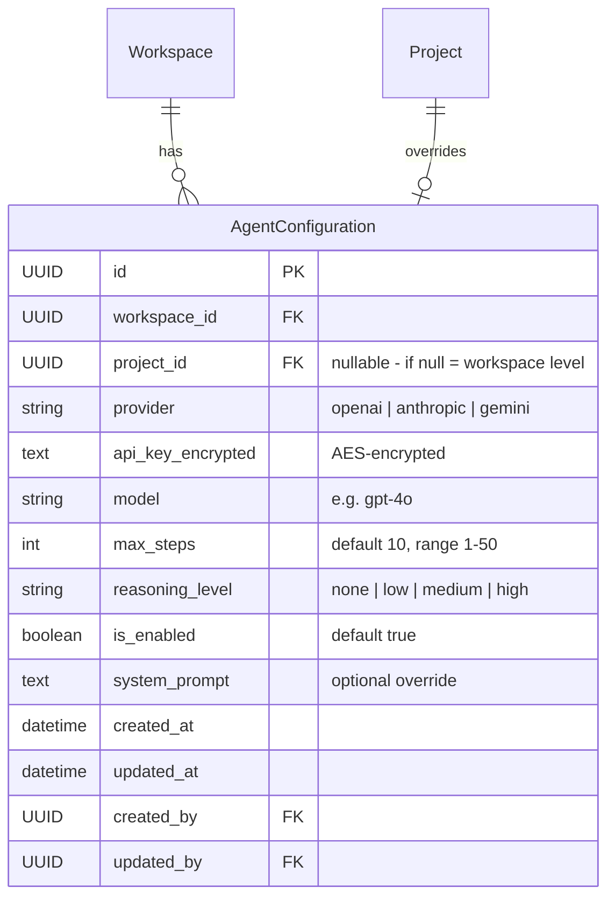
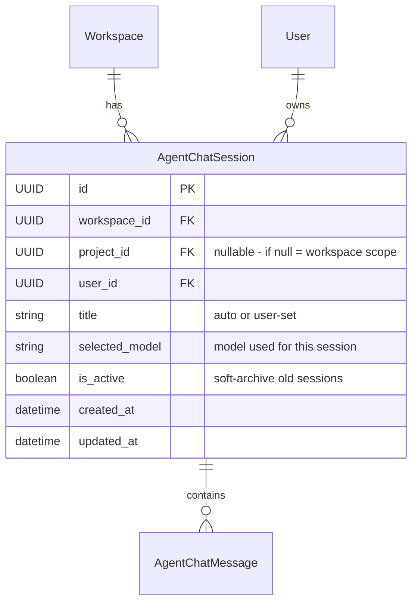
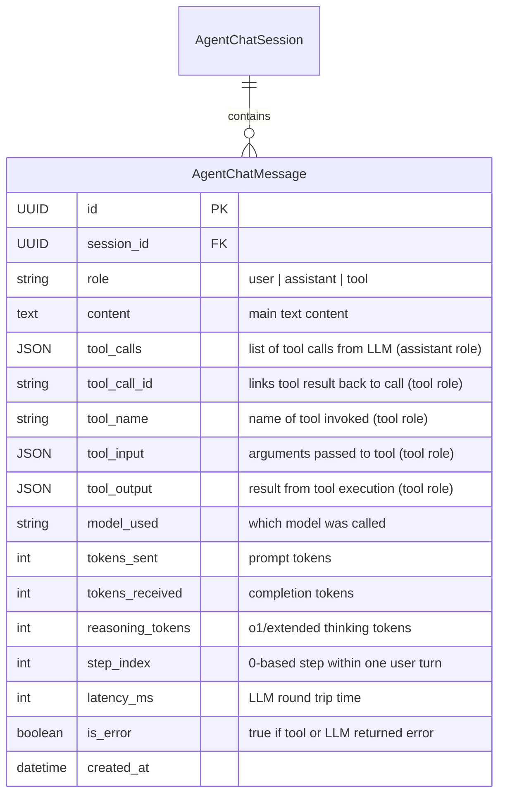
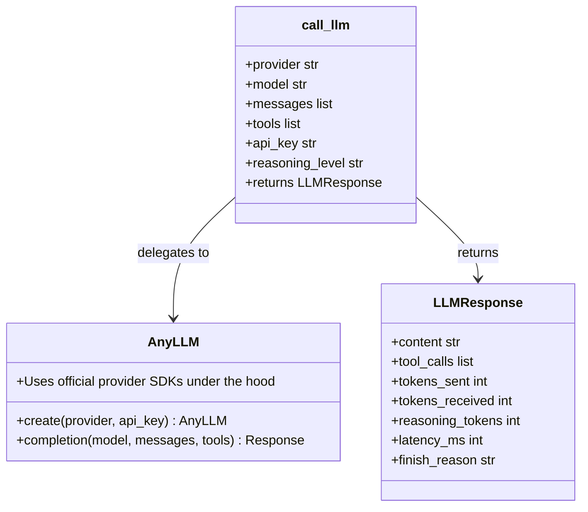
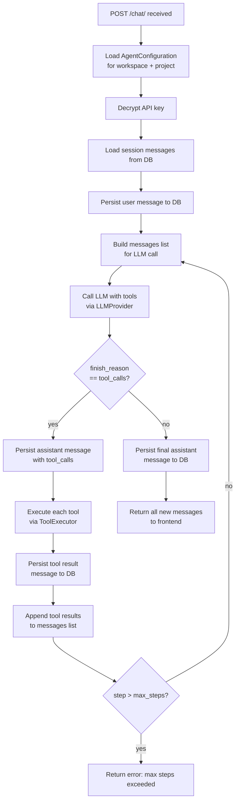
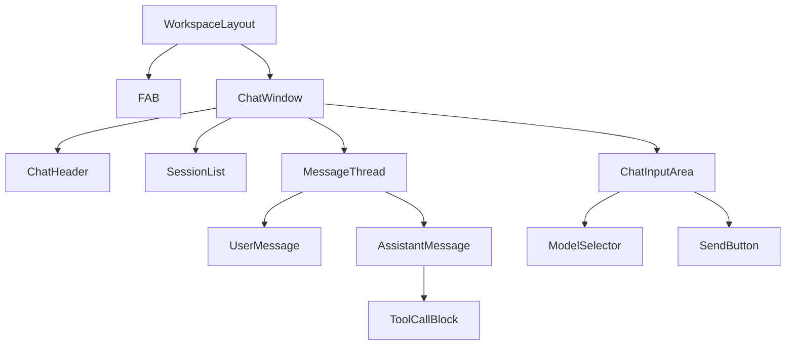
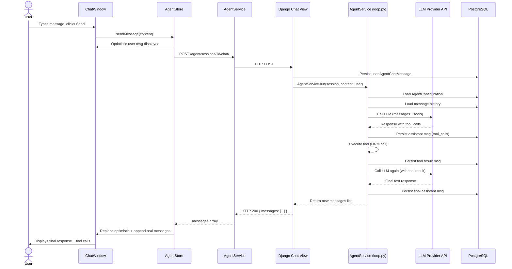
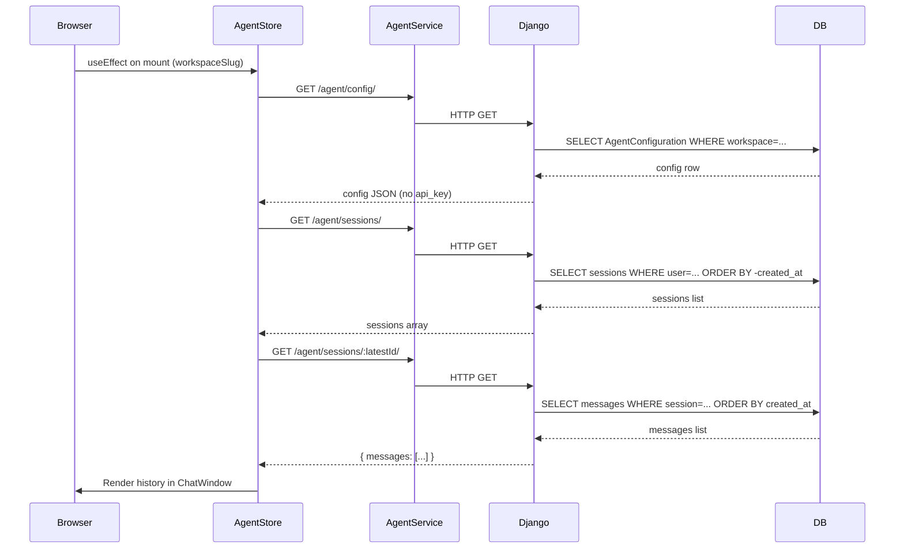
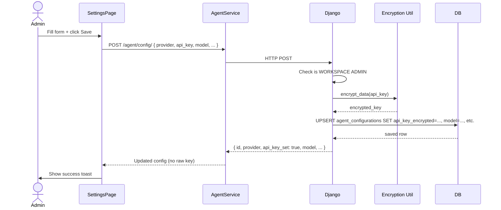

# Design: Plane AI Agent Chat Feature

**Version:** 1.2  
**Date:** 2026-05-27  
**Status:** Draft — reviewed 3 passes; updated to use any-llm (mozilla-ai) for multi-provider support

---

## Table of Contents

1. [Architecture Overview](#1-architecture-overview)
2. [Database Models](#2-database-models)
3. [Backend: Django App Structure](#3-backend-django-app-structure)
4. [Backend: API Endpoints](#4-backend-api-endpoints)
5. [Backend: Agent Service & Agentic Loop](#5-backend-agent-service--agentic-loop)
6. [Backend: Tool Definitions](#6-backend-tool-definitions)
7. [Frontend: Store Design](#7-frontend-store-design)
8. [Frontend: Service Layer](#8-frontend-service-layer)
9. [Frontend: Component Tree](#9-frontend-component-tree)
10. [Frontend: Settings Pages](#10-frontend-settings-pages)
11. [Data Flow Diagrams](#11-data-flow-diagrams)
12. [File-by-File Reference](#12-file-by-file-reference)

---

## 1. Architecture Overview

```mermaid
graph TD
    subgraph Browser
        FAB:::accent0
        ChatWindow:::accent0
        ModelSelector:::accent0
        AgentSettingsPage:::accent0
    end

    subgraph Frontend Store
        AgentStore:::accent1
    end

    subgraph Django API
        ConfigEndpoints:::accent2
        SessionEndpoints:::accent2
        MessageEndpoints:::accent2
        AgentService:::accent3
    end

    subgraph Agent Tools Module
        WorkItemTools:::accent4
        CycleTools:::accent4
        ModuleTools:::accent4
        SearchTools:::accent4
        StateTools:::accent4
    end

    subgraph Django ORM
        AgentConfiguration:::accent5
        AgentChatSession:::accent5
        AgentChatMessage:::accent5
        ExistingModels:::accent5
    end

    subgraph LLM Providers via any-llm
        OpenAI:::accent6
        Anthropic:::accent6
        Gemini:::accent6
        Mistral:::accent6
    end

    FAB --> ChatWindow
    ChatWindow --> AgentStore
    ModelSelector --> AgentStore
    AgentSettingsPage --> ConfigEndpoints

    AgentStore --> ConfigEndpoints
    AgentStore --> SessionEndpoints
    AgentStore --> MessageEndpoints

    MessageEndpoints --> AgentService
    AgentService --> LLM Provider
    AgentService --> Agent Tools Module
    Agent Tools Module --> ExistingModels
    AgentService --> AgentChatMessage

    ConfigEndpoints --> AgentConfiguration
    SessionEndpoints --> AgentChatSession
    MessageEndpoints --> AgentChatMessage
```

---

## 2. Database Models

All new models go in `apps/api/plane/db/models/agent.py`.  
Add imports to `apps/api/plane/db/models/__init__.py`.  
Create a new migration: `0127_agent_configuration_session_message.py`.

### 2.1 AgentConfiguration

```
Table: agent_configurations
Purpose: Stores LLM provider settings per workspace (and optionally per project)
```



**Django model fields:**

```python
class AgentConfiguration(BaseModel):
    workspace = models.ForeignKey("db.Workspace", on_delete=models.CASCADE,
                                   related_name="agent_configurations")
    project   = models.ForeignKey("db.Project", on_delete=models.CASCADE,
                                   related_name="agent_configurations",
                                   null=True, blank=True)
    provider  = models.CharField(max_length=50, default="openai")
    api_key_encrypted = models.TextField()   # stored encrypted
    model     = models.CharField(max_length=100, default="gpt-4o-mini")
    max_steps = models.PositiveSmallIntegerField(default=10)
    reasoning_level = models.CharField(max_length=20, default="medium")
    is_enabled = models.BooleanField(default=True)
    system_prompt = models.TextField(blank=True, default="")

    class Meta:
        db_table = "agent_configurations"
        # Only one config per workspace; one override per project
        unique_together = [["workspace", "project"]]
        constraints = [
            UniqueConstraint(
                fields=["workspace"],
                condition=Q(project__isnull=True),
                name="agent_config_unique_workspace_when_no_project"
            )
        ]
```

### 2.2 AgentChatSession

```
Table: agent_chat_sessions
Purpose: One record per conversation thread per user
```



**Django model fields:**

```python
class AgentChatSession(BaseModel):
    workspace = models.ForeignKey("db.Workspace", on_delete=models.CASCADE,
                                   related_name="agent_sessions")
    project   = models.ForeignKey("db.Project", on_delete=models.SET_NULL,
                                   related_name="agent_sessions",
                                   null=True, blank=True)
    user      = models.ForeignKey(settings.AUTH_USER_MODEL, on_delete=models.CASCADE,
                                   related_name="agent_sessions")
    title     = models.CharField(max_length=255, blank=True, default="")
    selected_model = models.CharField(max_length=100, blank=True, default="")
    is_active = models.BooleanField(default=True)

    class Meta:
        db_table = "agent_chat_sessions"
        ordering = ("-created_at",)
```

### 2.3 AgentChatMessage

```
Table: agent_chat_messages
Purpose: Every single message in a session — user, assistant, tool call, tool result
```



**Django model fields:**

```python
class AgentChatMessage(BaseModel):
    ROLE_CHOICES = [
        ("user", "User"),
        ("assistant", "Assistant"),
        ("tool", "Tool"),
    ]

    session       = models.ForeignKey("db.AgentChatSession", on_delete=models.CASCADE,
                                       related_name="messages")
    role          = models.CharField(max_length=20, choices=ROLE_CHOICES)
    content       = models.TextField(blank=True, default="")
    tool_calls    = models.JSONField(null=True, blank=True)   # OpenAI format list
    tool_call_id  = models.CharField(max_length=255, blank=True, default="")
    tool_name     = models.CharField(max_length=100, blank=True, default="")
    tool_input    = models.JSONField(null=True, blank=True)
    tool_output   = models.JSONField(null=True, blank=True)
    model_used    = models.CharField(max_length=100, blank=True, default="")
    tokens_sent   = models.PositiveIntegerField(default=0)
    tokens_received = models.PositiveIntegerField(default=0)
    reasoning_tokens = models.PositiveIntegerField(default=0)
    step_index    = models.PositiveSmallIntegerField(default=0)
    latency_ms    = models.PositiveIntegerField(null=True, blank=True)
    is_error      = models.BooleanField(default=False)

    class Meta:
        db_table = "agent_chat_messages"
        ordering = ("created_at",)
        indexes = [
            models.Index(fields=["session", "created_at"])
        ]
```

---

## 3. Backend: Django App Structure

Create a new Django app at `apps/api/plane/agent/`.

```
apps/api/plane/agent/
├── __init__.py
├── apps.py                     # AgentConfig app
├── models.py                   # Re-exports from db/models/agent.py
├── serializers/
│   ├── __init__.py
│   ├── configuration.py        # AgentConfigSerializer
│   ├── session.py              # AgentChatSessionSerializer
│   └── message.py              # AgentChatMessageSerializer
├── views/
│   ├── __init__.py
│   ├── base.py                 # AgentBaseView with is_agent_enabled check
│   ├── configuration.py        # Workspace + Project config CRUD views
│   ├── session.py              # Session list/create/retrieve/delete
│   └── chat.py                 # Message send endpoint (triggers agentic loop)
├── urls/
│   ├── __init__.py
│   └── agent.py                # URL patterns
├── service/
│   ├── __init__.py
│   ├── loop.py                 # AgentService — the agentic loop
│   ├── llm.py                  # call_llm() — single LiteLLM-backed function
│   └── context.py              # System prompt builder
└── tools/
    ├── __init__.py
    ├── registry.py             # TOOL_REGISTRY dict + get_tool_definitions()
    ├── work_items.py           # Work item tools
    ├── cycles.py               # Cycle tools
    ├── modules.py              # Module tools
    ├── states_labels.py        # State/label/member tools
    └── search.py               # Search tool
```

Register the app in `apps/api/plane/settings/common.py`:

```python
INSTALLED_APPS = [
    ...
    "plane.agent",
    ...
]
```

Add URLs to `apps/api/plane/urls.py`:

```python
path("api/", include("plane.agent.urls.agent")),
```

---

## 4. Backend: API Endpoints

All endpoints inherit from `AgentBaseView` which:

1. Extends `BaseAPIView` (already has `IsAuthenticated`)
2. Adds a `check_agent_enabled()` guard that returns `403` if `AgentConfiguration.is_enabled == False`
3. Verifies workspace membership (same pattern as existing views)

### 4.1 Configuration Endpoints

| Method | URL                                                          | Auth         | Description                             |
| ------ | ------------------------------------------------------------ | ------------ | --------------------------------------- |
| GET    | `/api/workspaces/<slug>/agent/config/`                       | Admin/Member | Fetch workspace config (API key masked) |
| POST   | `/api/workspaces/<slug>/agent/config/`                       | Admin only   | Create/update workspace config          |
| GET    | `/api/workspaces/<slug>/projects/<project_id>/agent/config/` | Admin/Member | Fetch project config                    |
| POST   | `/api/workspaces/<slug>/projects/<project_id>/agent/config/` | Admin only   | Create/update project config            |

**GET response example:**

```json
{
  "id": "uuid",
  "provider": "openai",
  "api_key_set": true,
  "model": "gpt-4o",
  "max_steps": 10,
  "reasoning_level": "medium",
  "is_enabled": true,
  "system_prompt": "",
  "available_models": ["gpt-4o-mini", "gpt-4o", "o1-mini"]
}
```

Note: `api_key_set` is a boolean, `api_key` is **never** returned. `available_models` is derived from the provider.

**POST request body:**

```json
{
  "provider": "openai",
  "api_key": "sk-...",
  "model": "gpt-4o",
  "max_steps": 15,
  "reasoning_level": "high",
  "is_enabled": true,
  "system_prompt": "You are a helpful project manager..."
}
```

When `api_key` is omitted from a POST (update), keep the existing encrypted key.

### 4.2 Session Endpoints

| Method | URL                                                   | Auth           | Description                    |
| ------ | ----------------------------------------------------- | -------------- | ------------------------------ |
| GET    | `/api/workspaces/<slug>/agent/sessions/`              | Member         | List sessions for current user |
| POST   | `/api/workspaces/<slug>/agent/sessions/`              | Member         | Create new session             |
| GET    | `/api/workspaces/<slug>/agent/sessions/<session_id>/` | Member (owner) | Get session + messages         |
| DELETE | `/api/workspaces/<slug>/agent/sessions/<session_id>/` | Member (owner) | Delete session                 |

**GET /sessions/ response:**

```json
[
  {
    "id": "uuid",
    "title": "Bug triage session",
    "selected_model": "gpt-4o",
    "project_id": "uuid or null",
    "created_at": "2026-05-27T10:00:00Z",
    "last_message_preview": "Sure, I created 3 issues..."
  }
]
```

**GET /sessions/<id>/ response:**

```json
{
  "id": "uuid",
  "title": "...",
  "selected_model": "gpt-4o",
  "messages": [
    { "id": "uuid", "role": "user", "content": "Create 3 bug issues", "created_at": "..." },
    { "id": "uuid", "role": "assistant", "content": "", "tool_calls": [...], "step_index": 0, "tokens_sent": 450, "tokens_received": 120 },
    { "id": "uuid", "role": "tool", "tool_name": "create_work_item", "tool_call_id": "call_abc", "tool_input": {...}, "tool_output": {...} },
    { "id": "uuid", "role": "assistant", "content": "Done! I created issues...", "step_index": 1 }
  ]
}
```

### 4.3 Chat / Message Endpoint

| Method | URL                                                        | Auth           | Description                                            |
| ------ | ---------------------------------------------------------- | -------------- | ------------------------------------------------------ |
| POST   | `/api/workspaces/<slug>/agent/sessions/<session_id>/chat/` | Member (owner) | Send a user message; runs the agentic loop and returns |

**POST /chat/ request body:**

```json
{
  "content": "Create a high priority bug issue called 'Login page crashes on mobile'",
  "model": "gpt-4o",
  "project_id": "uuid"
}
```

**POST /chat/ response (synchronous):**

```json
{
  "session_id": "uuid",
  "messages": [
    { "id": "uuid", "role": "user", "content": "..." },
    { "id": "uuid", "role": "assistant", "tool_calls": [...], "step_index": 0 },
    { "id": "uuid", "role": "tool", "tool_name": "create_work_item", "tool_output": {...} },
    { "id": "uuid", "role": "assistant", "content": "Done! I created issue PROJ-45...", "step_index": 1 }
  ]
}
```

---

## 5. Backend: Agent Service & Agentic Loop

### 5.1 LLM Abstraction (`service/llm.py`)

All LLM calls go through **[any-llm](https://github.com/mozilla-ai/any-llm)** (`any-llm-sdk` on PyPI), a Mozilla AI library that wraps each provider's **official SDK** — unlike LiteLLM which re-implements provider interfaces. This gives a single `completion()` interface while preserving maximum provider compatibility. **Adding a new provider requires zero changes to `llm.py`** — only `SUPPORTED_PROVIDERS` needs updating.

#### How any-llm provider + model parameters work

any-llm accepts `provider` and `model` as **separate parameters**, so `AgentConfiguration`'s two-field layout maps directly — no string joining required. The production-recommended `AnyLLM.create()` class is used for connection pooling:

| `provider` field | `model` field                | any-llm call                                                                     |
| ---------------- | ---------------------------- | -------------------------------------------------------------------------------- |
| `openai`         | `gpt-4o`                     | `AnyLLM.create("openai").completion(model="gpt-4o", ...)`                        |
| `openai`         | `o3-mini`                    | `AnyLLM.create("openai").completion(model="o3-mini", ...)`                       |
| `anthropic`      | `claude-3-5-sonnet-20241022` | `AnyLLM.create("anthropic").completion(model="claude-3-5-sonnet-20241022", ...)` |
| `gemini`         | `gemini-1.5-pro-latest`      | `AnyLLM.create("gemini").completion(model="gemini-1.5-pro-latest", ...)`         |
| `mistral`        | `mistral-large-latest`       | `AnyLLM.create("mistral").completion(model="mistral-large-latest", ...)`         |

#### Architecture



**Implementation (`service/llm.py`):**

```python
# service/llm.py
import time
from dataclasses import dataclass, field

from any_llm import AnyLLM
from any_llm.exceptions import (
    AuthenticationError,
    ContextLengthExceededError,
    MissingApiKeyError,
    ProviderError,
    RateLimitError,
)
from plane.utils.exception_logger import log_exception


@dataclass
class LLMResponse:
    content: str
    tool_calls: list = field(default_factory=list)
    tokens_sent: int = 0
    tokens_received: int = 0
    reasoning_tokens: int = 0
    latency_ms: int = 0
    finish_reason: str = "stop"


def call_llm(
    *,
    messages: list[dict],
    tools: list[dict],
    provider: str,
    model: str,
    api_key: str,
    reasoning_level: str = "medium",
) -> LLMResponse:
    """
    Single entry-point for all LLM calls across every provider.

    Uses AnyLLM (mozilla-ai/any-llm) which wraps each provider's official SDK.
    The `provider` and `model` fields from AgentConfiguration map directly —
    no string concatenation required:

        provider="openai",    model="gpt-4o"
        provider="anthropic", model="claude-3-5-sonnet-20241022"
        provider="gemini",    model="gemini-1.5-pro-latest"
        provider="mistral",   model="mistral-large-latest"

    See https://docs.mozilla.ai/any-llm/providers/ for all supported provider IDs.
    Adding a new provider only requires updating SUPPORTED_PROVIDERS in
    plane/app/views/external/base.py. No changes needed here.
    """
    # AnyLLM.create() is the production-recommended approach — it reuses
    # the underlying provider SDK client for connection pooling.
    llm = AnyLLM.create(provider, api_key=api_key)
    start = time.monotonic()

    kwargs: dict = {
        "model": model,
        "messages": messages,
        "timeout": 30,  # hard per-call timeout in seconds
    }

    if tools:
        kwargs["tools"] = tools
        kwargs["tool_choice"] = "auto"

    # ── Provider-specific reasoning parameters ────────────────────────────
    # OpenAI o-series (o1, o3, o4-mini …): reasoning_effort controls depth.
    if provider == "openai" and any(model.startswith(p) for p in ("o1", "o3", "o4")):
        if reasoning_level != "none":
            kwargs["reasoning_effort"] = reasoning_level  # "low" | "medium" | "high"

    # Anthropic claude: extended thinking enabled at "high" reasoning level.
    elif provider == "anthropic" and reasoning_level == "high":
        kwargs["thinking"] = {"type": "enabled", "budget_tokens": 8000}

    # Gemini, Mistral, and all other providers: pass through unchanged.
    # any-llm delegates directly to each provider's official SDK.
    # ─────────────────────────────────────────────────────────────────────

    try:
        response = llm.completion(**kwargs)
    except (AuthenticationError, MissingApiKeyError) as exc:
        raise ValueError(f"Invalid or missing API key for provider '{provider}'.") from exc
    except RateLimitError as exc:
        raise ValueError(f"Rate limit exceeded for provider '{provider}'.") from exc
    except ContextLengthExceededError as exc:
        raise ValueError(f"Context length exceeded for provider '{provider}'.") from exc
    except ProviderError as exc:
        raise ValueError(f"Provider error from '{provider}': {exc}") from exc
    except Exception as exc:
        log_exception(exc)
        raise

    elapsed = int((time.monotonic() - start) * 1000)
    choice = response.choices[0]
    usage = response.usage

    # Normalise tool_calls to plain dicts.
    # any-llm uses official provider SDKs which return OpenAI-compatible
    # tool call objects — convert to plain dicts for DB serialisation.
    tool_calls = []
    if choice.message.tool_calls:
        for tc in choice.message.tool_calls:
            tool_calls.append({
                "id": tc.id,
                "type": "function",
                "function": {
                    "name": tc.function.name,
                    "arguments": tc.function.arguments,  # JSON string
                },
            })

    # Extract reasoning tokens from usage details (OpenAI o-series + Anthropic).
    reasoning_tokens = 0
    if usage:
        details = getattr(usage, "completion_tokens_details", None)
        reasoning_tokens = getattr(details, "reasoning_tokens", 0) or 0

    return LLMResponse(
        content=choice.message.content or "",
        tool_calls=tool_calls,
        tokens_sent=getattr(usage, "prompt_tokens", 0),
        tokens_received=getattr(usage, "completion_tokens", 0),
        reasoning_tokens=reasoning_tokens,
        latency_ms=elapsed,
        finish_reason=choice.finish_reason or "stop",
    )
```

#### Dependency

Add to `apps/api/requirements/base.txt`:

```
any-llm-sdk[openai,anthropic,gemini,mistral]
```

> Install only the provider extras you need, or use `[all]` to include every provider. The `[openai,anthropic,gemini,mistral]` set covers the initial `SUPPORTED_PROVIDERS` list. Each extra pulls in that provider's official SDK — no separate `openai`, `anthropic`, etc. packages needed.

#### Adding a new provider (no code changes needed)

1. Add the provider key + its model list to `SUPPORTED_PROVIDERS` in `apps/api/plane/app/views/external/base.py`
2. Add the corresponding extra to `requirements/base.txt`, e.g. `any-llm-sdk[openai,anthropic,gemini,mistral,cohere]`
3. Confirm the provider ID string in the [any-llm provider docs](https://docs.mozilla.ai/any-llm/providers/)
4. That is all — `call_llm()` will route correctly via `AnyLLM.create(provider, ...)`

### 5.2 Context Builder (`service/context.py`)

Builds the system prompt that tells the agent what workspace/project context it's in.

```python
def build_system_prompt(workspace_slug: str, project_id: str | None,
                         user_display_name: str, custom_prompt: str) -> str:
    lines = [
        f"You are an AI assistant for Plane, a project management tool.",
        f"You are helping user '{user_display_name}'.",
        f"Current workspace: {workspace_slug}",
    ]
    if project_id:
        lines.append(f"Current project ID: {project_id} — default all operations to this project unless the user specifies otherwise.")
    lines.append("When a user asks you to perform actions, use the available tools to do so.")
    lines.append("Always confirm what you did after completing a task.")
    if custom_prompt:
        lines.append(f"\nAdditional instructions:\n{custom_prompt}")
    return "\n".join(lines)
```

### 5.3 Agentic Loop (`service/loop.py`)

This is the core service. It is called from the `chat` view.



**Python pseudocode:**

```python
# service/loop.py

class AgentService:
    def run(self, session: AgentChatSession, user_content: str,
            project_id: str | None, model_override: str | None,
            request_user) -> list[AgentChatMessage]:
        """
        Runs the full agentic loop for one user turn.
        Returns all newly created AgentChatMessage records.
        """
        # 1. Load config (project override first, then workspace)
        config = self._get_config(session.workspace, project_id)
        if not config or not config.is_enabled:
            raise AgentDisabledError("Agent is not enabled.")

        api_key = decrypt_data(config.api_key_encrypted)
        model = model_override or config.model
        max_steps = config.max_steps

        # 2. Persist user message
        user_msg = AgentChatMessage.objects.create(
            session=session,
            role="user",
            content=user_content,
        )
        new_messages = [user_msg]

        # 3. Build LLM message history from DB
        history = self._build_history(session)

        # 4. Build system prompt
        system_prompt = build_system_prompt(
            workspace_slug=session.workspace.slug,
            project_id=project_id,
            user_display_name=request_user.display_name,
            custom_prompt=config.system_prompt,
        )

        # 5. Get tool definitions
        tool_executor = ToolExecutor(
            request_user=request_user,
            workspace_slug=session.workspace.slug,
            default_project_id=project_id,
        )
        tools = get_tool_definitions()

        # 6. call_llm is a module-level function imported at the top of the file
        from plane.agent.service.llm import call_llm

        # 7. Agentic loop
        messages = [{"role": "system", "content": system_prompt}] + history
        step = 0

        while step < max_steps:
            response = call_llm(
                messages=messages,
                tools=tools,
                provider=config.provider,
                model=model,
                api_key=api_key,
                reasoning_level=config.reasoning_level,
            )

            if response.finish_reason == "tool_calls" and response.tool_calls:
                # Persist assistant message with tool_calls
                assistant_msg = AgentChatMessage.objects.create(
                    session=session,
                    role="assistant",
                    content=response.content,
                    tool_calls=response.tool_calls,
                    model_used=model,
                    tokens_sent=response.tokens_sent,
                    tokens_received=response.tokens_received,
                    reasoning_tokens=response.reasoning_tokens,
                    step_index=step,
                    latency_ms=response.latency_ms,
                )
                new_messages.append(assistant_msg)
                messages.append({
                    "role": "assistant",
                    "content": response.content,
                    "tool_calls": response.tool_calls,
                })

                # Execute each tool and persist results
                for tc in response.tool_calls:
                    tool_name = tc["function"]["name"]
                    import json
                    tool_input = json.loads(tc["function"]["arguments"])

                    try:
                        tool_output = tool_executor.execute(tool_name, tool_input)
                        is_error = False
                    except Exception as e:
                        tool_output = {"error": str(e)}
                        is_error = True

                    tool_msg = AgentChatMessage.objects.create(
                        session=session,
                        role="tool",
                        tool_call_id=tc["id"],
                        tool_name=tool_name,
                        tool_input=tool_input,
                        tool_output=tool_output,
                        step_index=step,
                        is_error=is_error,
                    )
                    new_messages.append(tool_msg)
                    messages.append({
                        "role": "tool",
                        "tool_call_id": tc["id"],
                        "content": json.dumps(tool_output),
                    })

                step += 1

            else:
                # Final response
                final_msg = AgentChatMessage.objects.create(
                    session=session,
                    role="assistant",
                    content=response.content,
                    model_used=model,
                    tokens_sent=response.tokens_sent,
                    tokens_received=response.tokens_received,
                    reasoning_tokens=response.reasoning_tokens,
                    step_index=step,
                    latency_ms=response.latency_ms,
                )
                new_messages.append(final_msg)
                break

        else:
            # max_steps exceeded - return what we have
            AgentChatMessage.objects.create(
                session=session,
                role="assistant",
                content="I've reached the maximum number of steps. Please try breaking this task into smaller pieces.",
                is_error=True,
                step_index=step,
            )

        return new_messages

    def _get_config(self, workspace, project_id):
        """Returns project config if exists, else workspace config."""
        if project_id:
            try:
                return AgentConfiguration.objects.get(
                    workspace=workspace, project_id=project_id
                )
            except AgentConfiguration.DoesNotExist:
                pass
        try:
            return AgentConfiguration.objects.get(
                workspace=workspace, project__isnull=True
            )
        except AgentConfiguration.DoesNotExist:
            return None

    def _build_history(self, session: AgentChatSession) -> list:
        """Converts DB messages to OpenAI message format."""
        messages = []
        for msg in session.messages.order_by("created_at"):
            if msg.role == "user":
                messages.append({"role": "user", "content": msg.content})
            elif msg.role == "assistant":
                m = {"role": "assistant", "content": msg.content}
                if msg.tool_calls:
                    m["tool_calls"] = msg.tool_calls
                messages.append(m)
            elif msg.role == "tool":
                import json
                messages.append({
                    "role": "tool",
                    "tool_call_id": msg.tool_call_id,
                    "content": json.dumps(msg.tool_output),
                })
        return messages
```

---

## 6. Backend: Tool Definitions

### 6.1 Tool Registry (`tools/registry.py`)

```python
# tools/registry.py

from .work_items import (
    list_work_items, get_work_item, create_work_item,
    update_work_item, delete_work_item, add_work_item_comment
)
from .cycles import (
    list_cycles, get_cycle, create_cycle, update_cycle,
    add_issues_to_cycle, remove_issue_from_cycle
)
from .modules import (
    list_modules, get_module, create_module, update_module,
    add_issues_to_module, remove_issue_from_module
)
from .states_labels import list_states, list_labels, list_members, list_projects
from .search import search

# Registry maps tool name -> callable
TOOL_REGISTRY: dict[str, callable] = {
    "list_work_items": list_work_items,
    "get_work_item": get_work_item,
    "create_work_item": create_work_item,
    "update_work_item": update_work_item,
    "delete_work_item": delete_work_item,
    "add_work_item_comment": add_work_item_comment,
    "list_cycles": list_cycles,
    "get_cycle": get_cycle,
    "create_cycle": create_cycle,
    "update_cycle": update_cycle,
    "add_issues_to_cycle": add_issues_to_cycle,
    "remove_issue_from_cycle": remove_issue_from_cycle,
    "list_modules": list_modules,
    "get_module": get_module,
    "create_module": create_module,
    "update_module": update_module,
    "add_issues_to_module": add_issues_to_module,
    "remove_issue_from_module": remove_issue_from_module,
    "list_states": list_states,
    "list_labels": list_labels,
    "list_members": list_members,
    "list_projects": list_projects,
    "search": search,
}

def get_tool_definitions() -> list[dict]:
    """Returns OpenAI-format tool definitions for all tools."""
    return TOOL_DEFINITIONS  # list defined below


# OpenAI function-calling schema for each tool
TOOL_DEFINITIONS = [
    {
        "type": "function",
        "function": {
            "name": "list_work_items",
            "description": "List work items in a project with optional filters. Returns a list of work items.",
            "parameters": {
                "type": "object",
                "properties": {
                    "project_id": {"type": "string", "description": "UUID of the project. Uses active project if omitted."},
                    "state_id": {"type": "string", "description": "Filter by state UUID."},
                    "priority": {"type": "string", "enum": ["urgent", "high", "medium", "low", "none"], "description": "Filter by priority."},
                    "query": {"type": "string", "description": "Search text for issue name/description."},
                    "limit": {"type": "integer", "description": "Max results to return (default 20, max 100)."},
                },
                "required": [],
            },
        },
    },
    {
        "type": "function",
        "function": {
            "name": "get_work_item",
            "description": "Get full details of a single work item by ID or identifier (e.g. 'PROJ-42').",
            "parameters": {
                "type": "object",
                "properties": {
                    "issue_id": {"type": "string", "description": "UUID of the issue."},
                    "identifier": {"type": "string", "description": "Human-readable identifier like 'PROJ-42'."},
                },
                "required": [],
            },
        },
    },
    {
        "type": "function",
        "function": {
            "name": "create_work_item",
            "description": "Create a new work item (issue) in a project.",
            "parameters": {
                "type": "object",
                "properties": {
                    "project_id": {"type": "string", "description": "UUID of the project."},
                    "name": {"type": "string", "description": "Title of the issue."},
                    "description": {"type": "string", "description": "HTML description of the issue."},
                    "priority": {"type": "string", "enum": ["urgent", "high", "medium", "low", "none"]},
                    "state_id": {"type": "string", "description": "UUID of the state."},
                    "assignee_ids": {"type": "array", "items": {"type": "string"}, "description": "List of user UUIDs."},
                    "label_ids": {"type": "array", "items": {"type": "string"}},
                    "start_date": {"type": "string", "description": "ISO date YYYY-MM-DD."},
                    "target_date": {"type": "string", "description": "ISO date YYYY-MM-DD."},
                    "parent_id": {"type": "string", "description": "UUID of parent issue for sub-issues."},
                },
                "required": ["name"],
            },
        },
    },
    {
        "type": "function",
        "function": {
            "name": "update_work_item",
            "description": "Update fields on an existing work item.",
            "parameters": {
                "type": "object",
                "properties": {
                    "issue_id": {"type": "string", "description": "UUID of the issue to update."},
                    "name": {"type": "string"},
                    "description": {"type": "string"},
                    "priority": {"type": "string", "enum": ["urgent", "high", "medium", "low", "none"]},
                    "state_id": {"type": "string"},
                    "assignee_ids": {"type": "array", "items": {"type": "string"}},
                    "label_ids": {"type": "array", "items": {"type": "string"}},
                    "start_date": {"type": "string"},
                    "target_date": {"type": "string"},
                },
                "required": ["issue_id"],
            },
        },
    },
    {
        "type": "function",
        "function": {
            "name": "delete_work_item",
            "description": "Permanently delete a work item.",
            "parameters": {
                "type": "object",
                "properties": {
                    "issue_id": {"type": "string", "description": "UUID of the issue to delete."},
                },
                "required": ["issue_id"],
            },
        },
    },
    {
        "type": "function",
        "function": {
            "name": "add_work_item_comment",
            "description": "Add a text comment to a work item.",
            "parameters": {
                "type": "object",
                "properties": {
                    "issue_id": {"type": "string"},
                    "comment": {"type": "string", "description": "Comment text (plain text or HTML)."},
                },
                "required": ["issue_id", "comment"],
            },
        },
    },
    # ... (similar definitions for cycles, modules, states, labels, members, projects, search)
]
```

### 6.2 Tool Executor

```python
# tools/registry.py (continued)

class ToolExecutor:
    """
    Executes tool calls. Each tool function receives the request_user
    so Django ORM queries run with the correct permissions context.
    """
    def __init__(self, request_user, workspace_slug: str, default_project_id: str | None):
        self.request_user = request_user
        self.workspace_slug = workspace_slug
        self.default_project_id = default_project_id

    def execute(self, tool_name: str, arguments: dict) -> dict:
        if tool_name not in TOOL_REGISTRY:
            raise ValueError(f"Unknown tool: {tool_name}")

        # Inject defaults if not provided
        if "project_id" not in arguments or not arguments["project_id"]:
            arguments["project_id"] = self.default_project_id
        arguments["workspace_slug"] = self.workspace_slug
        arguments["request_user"] = self.request_user

        fn = TOOL_REGISTRY[tool_name]
        return fn(**arguments)
```

### 6.3 Work Item Tool Implementation (`tools/work_items.py`)

Each tool function directly queries the Django ORM using the existing models and serializers.

```python
# tools/work_items.py
from plane.db.models import Issue, IssueComment, Project
from plane.app.serializers import IssueSerializer, IssueCommentSerializer


def list_work_items(request_user, workspace_slug: str, project_id: str = None,
                    state_id: str = None, priority: str = None,
                    query: str = None, limit: int = 20, **kwargs) -> dict:
    """List work items, filtered."""
    # Verify user has project access
    qs = Issue.issue_objects.filter(
        workspace__slug=workspace_slug,
        project__deleted_at__isnull=True,
        project__project_projectmember__member=request_user,
        project__project_projectmember__is_active=True,
    ).select_related("state", "project").prefetch_related("assignees", "labels")

    if project_id:
        qs = qs.filter(project_id=project_id)
    if state_id:
        qs = qs.filter(state_id=state_id)
    if priority:
        qs = qs.filter(priority=priority)
    if query:
        qs = qs.filter(name__icontains=query)

    qs = qs[:min(limit, 100)]
    return {
        "count": qs.count(),
        "issues": [
            {
                "id": str(i.id),
                "identifier": f"{i.project.identifier}-{i.sequence_id}",
                "name": i.name,
                "priority": i.priority,
                "state": i.state.name if i.state else None,
                "assignees": [str(a.id) for a in i.assignees.all()],
            }
            for i in qs
        ]
    }


def create_work_item(request_user, workspace_slug: str, project_id: str,
                     name: str, description: str = "", priority: str = "none",
                     state_id: str = None, assignee_ids: list = None,
                     label_ids: list = None, start_date: str = None,
                     target_date: str = None, parent_id: str = None, **kwargs) -> dict:
    """Create a new issue. Mimics what IssueViewSet.create() does."""
    from plane.db.models import ProjectMember, State
    from plane.db.models.project import ROLE

    # Permission check: user must be ADMIN or MEMBER
    if not ProjectMember.objects.filter(
        project_id=project_id,
        member=request_user,
        role__in=[ROLE.ADMIN.value, ROLE.MEMBER.value],
        is_active=True,
    ).exists():
        raise PermissionError("You don't have permission to create issues in this project.")

    # Get default state if not specified
    if not state_id:
        state = State.objects.filter(
            project_id=project_id, default=True
        ).first() or State.objects.filter(project_id=project_id).first()
        state_id = str(state.id) if state else None

    issue = Issue.objects.create(
        project_id=project_id,
        name=name,
        description_html=description or "<p></p>",
        priority=priority,
        state_id=state_id,
        start_date=start_date,
        target_date=target_date,
        parent_id=parent_id,
    )

    if assignee_ids:
        from plane.db.models import IssueAssignee
        for uid in assignee_ids:
            IssueAssignee.objects.create(issue=issue, assignee_id=uid)

    if label_ids:
        from plane.db.models import IssueLabel
        for lid in label_ids:
            IssueLabel.objects.create(issue=issue, label_id=lid)

    return {
        "id": str(issue.id),
        "identifier": f"{issue.project.identifier}-{issue.sequence_id}",
        "name": issue.name,
        "priority": issue.priority,
        "state_id": str(issue.state_id) if issue.state_id else None,
        "created": True,
    }
```

> **Follow this same pattern for all other tool files.** Each function:
>
> 1. Accepts `request_user`, `workspace_slug`, and the tool-specific params
> 2. Performs a permission check using `ProjectMember`/`WorkspaceMember` queries
> 3. Uses Django ORM directly (no HTTP calls)
> 4. Returns a plain `dict` that gets serialized to JSON

---

## 7. Frontend: Store Design

Create `apps/web/core/store/agent/` directory with:

```
core/store/agent/
├── agent.store.ts          # Main store
├── agent-session.store.ts  # Per-session message management
└── index.ts                # Exports
```

### 7.1 `agent.store.ts`

```typescript
// core/store/agent/agent.store.ts

import { action, makeObservable, observable, runInAction } from "mobx";
import type { IAgentConfig, IAgentChatSession, IAgentChatMessage } from "@plane/types";
import { AgentService } from "@/services/agent.service";

const agentService = new AgentService();

export interface IAgentStore {
  // State
  isOpen: boolean;
  isLoading: boolean;
  config: IAgentConfig | null;
  sessions: IAgentChatSession[];
  activeSessionId: string | null;
  activeSessionMessages: IAgentChatMessage[];
  selectedModel: string;
  unreadCount: number;

  // Actions
  toggleChatWindow: () => void;
  openChatWindow: () => void;
  closeChatWindow: () => void;
  fetchConfig: (workspaceSlug: string) => Promise<void>;
  fetchSessions: (workspaceSlug: string) => Promise<void>;
  loadSession: (workspaceSlug: string, sessionId: string) => Promise<void>;
  createSession: (workspaceSlug: string, projectId?: string) => Promise<IAgentChatSession>;
  sendMessage: (workspaceSlug: string, content: string, projectId?: string) => Promise<void>;
  setSelectedModel: (model: string) => void;
  setActiveSession: (sessionId: string) => void;
}

export class AgentStore implements IAgentStore {
  isOpen = false;
  isLoading = false;
  config: IAgentConfig | null = null;
  sessions: IAgentChatSession[] = [];
  activeSessionId: string | null = null;
  activeSessionMessages: IAgentChatMessage[] = [];
  selectedModel = "";
  unreadCount = 0;

  constructor() {
    makeObservable(this, {
      isOpen: observable,
      isLoading: observable,
      config: observable,
      sessions: observable,
      activeSessionId: observable,
      activeSessionMessages: observable,
      selectedModel: observable,
      unreadCount: observable,
      toggleChatWindow: action,
      openChatWindow: action,
      closeChatWindow: action,
      fetchConfig: action,
      fetchSessions: action,
      loadSession: action,
      createSession: action,
      sendMessage: action,
      setSelectedModel: action,
      setActiveSession: action,
    });
  }

  toggleChatWindow = () => {
    this.isOpen = !this.isOpen;
    if (this.isOpen) this.unreadCount = 0;
  };

  openChatWindow = () => {
    this.isOpen = true;
    this.unreadCount = 0;
  };

  closeChatWindow = () => {
    this.isOpen = false;
  };

  fetchConfig = async (workspaceSlug: string) => {
    const config = await agentService.getWorkspaceConfig(workspaceSlug);
    runInAction(() => {
      this.config = config;
      if (!this.selectedModel && config.model) {
        this.selectedModel = config.model;
      }
    });
  };

  fetchSessions = async (workspaceSlug: string) => {
    const sessions = await agentService.listSessions(workspaceSlug);
    runInAction(() => {
      this.sessions = sessions;
    });
  };

  loadSession = async (workspaceSlug: string, sessionId: string) => {
    this.isLoading = true;
    const data = await agentService.getSession(workspaceSlug, sessionId);
    runInAction(() => {
      this.activeSessionId = sessionId;
      this.activeSessionMessages = data.messages;
      this.isLoading = false;
    });
  };

  createSession = async (workspaceSlug: string, projectId?: string) => {
    const session = await agentService.createSession(workspaceSlug, projectId);
    runInAction(() => {
      this.sessions.unshift(session);
      this.activeSessionId = session.id;
      this.activeSessionMessages = [];
    });
    return session;
  };

  sendMessage = async (workspaceSlug: string, content: string, projectId?: string) => {
    if (!this.activeSessionId) {
      await this.createSession(workspaceSlug, projectId);
    }
    // Optimistically add user message
    const optimisticMsg: IAgentChatMessage = {
      id: `optimistic-${Date.now()}`,
      role: "user",
      content,
      created_at: new Date().toISOString(),
    };
    runInAction(() => {
      this.activeSessionMessages.push(optimisticMsg);
      this.isLoading = true;
    });

    const result = await agentService.sendMessage(workspaceSlug, this.activeSessionId!, {
      content,
      model: this.selectedModel,
      project_id: projectId,
    });

    runInAction(() => {
      // Replace optimistic message with real ones from server
      this.activeSessionMessages = this.activeSessionMessages.filter((m) => m.id !== optimisticMsg.id);
      this.activeSessionMessages.push(...result.messages);
      this.isLoading = false;

      // If window is closed, set unread count
      if (!this.isOpen) {
        this.unreadCount += result.messages.filter((m) => m.role === "assistant").length;
      }
    });
  };

  setSelectedModel = (model: string) => {
    this.selectedModel = model;
  };

  setActiveSession = (sessionId: string) => {
    this.activeSessionId = sessionId;
  };
}
```

Register the store in `CoreRootStore` in `apps/web/core/store/root.store.ts`:

```typescript
// Add to CoreRootStore:
import { AgentStore } from "./agent";
// ...
agent: AgentStore;
// In constructor:
this.agent = new AgentStore();
```

---

## 8. Frontend: Service Layer

Create `apps/web/core/services/agent.service.ts`:

```typescript
// core/services/agent.service.ts
import { API_BASE_URL } from "@plane/constants";
import { APIService } from "./api.service";
import type { IAgentConfig, IAgentChatSession, IAgentChatMessage } from "@plane/types";

export class AgentService extends APIService {
  constructor() {
    super(API_BASE_URL);
  }

  // Configuration
  async getWorkspaceConfig(workspaceSlug: string): Promise<IAgentConfig> {
    return this.get(`/api/workspaces/${workspaceSlug}/agent/config/`)
      .then((res) => res.data)
      .catch((e) => {
        throw e?.response;
      });
  }

  async saveWorkspaceConfig(workspaceSlug: string, data: Partial<IAgentConfig>): Promise<IAgentConfig> {
    return this.post(`/api/workspaces/${workspaceSlug}/agent/config/`, data)
      .then((res) => res.data)
      .catch((e) => {
        throw e?.response;
      });
  }

  async getProjectConfig(workspaceSlug: string, projectId: string): Promise<IAgentConfig> {
    return this.get(`/api/workspaces/${workspaceSlug}/projects/${projectId}/agent/config/`)
      .then((res) => res.data)
      .catch((e) => {
        throw e?.response;
      });
  }

  async saveProjectConfig(
    workspaceSlug: string,
    projectId: string,
    data: Partial<IAgentConfig>
  ): Promise<IAgentConfig> {
    return this.post(`/api/workspaces/${workspaceSlug}/projects/${projectId}/agent/config/`, data)
      .then((res) => res.data)
      .catch((e) => {
        throw e?.response;
      });
  }

  // Sessions
  async listSessions(workspaceSlug: string): Promise<IAgentChatSession[]> {
    return this.get(`/api/workspaces/${workspaceSlug}/agent/sessions/`)
      .then((res) => res.data)
      .catch((e) => {
        throw e?.response;
      });
  }

  async createSession(workspaceSlug: string, projectId?: string): Promise<IAgentChatSession> {
    return this.post(`/api/workspaces/${workspaceSlug}/agent/sessions/`, { project_id: projectId })
      .then((res) => res.data)
      .catch((e) => {
        throw e?.response;
      });
  }

  async getSession(workspaceSlug: string, sessionId: string): Promise<{ messages: IAgentChatMessage[] }> {
    return this.get(`/api/workspaces/${workspaceSlug}/agent/sessions/${sessionId}/`)
      .then((res) => res.data)
      .catch((e) => {
        throw e?.response;
      });
  }

  async deleteSession(workspaceSlug: string, sessionId: string): Promise<void> {
    return this.delete(`/api/workspaces/${workspaceSlug}/agent/sessions/${sessionId}/`)
      .then((res) => res.data)
      .catch((e) => {
        throw e?.response;
      });
  }

  // Chat
  async sendMessage(
    workspaceSlug: string,
    sessionId: string,
    data: { content: string; model?: string; project_id?: string }
  ): Promise<{ session_id: string; messages: IAgentChatMessage[] }> {
    return this.post(`/api/workspaces/${workspaceSlug}/agent/sessions/${sessionId}/chat/`, data)
      .then((res) => res.data)
      .catch((e) => {
        throw e?.response;
      });
  }
}
```

Add TypeScript types to `packages/types/src/agent.ts` (new file):

```typescript
// packages/types/src/agent.ts

export interface IAgentConfig {
  id: string;
  provider: "openai" | "anthropic" | "gemini";
  api_key_set: boolean;
  model: string;
  max_steps: number;
  reasoning_level: "none" | "low" | "medium" | "high";
  is_enabled: boolean;
  system_prompt: string;
  available_models: string[];
}

export interface IAgentChatSession {
  id: string;
  title: string;
  selected_model: string;
  project_id: string | null;
  created_at: string;
  last_message_preview?: string;
}

export interface IAgentChatMessage {
  id: string;
  role: "user" | "assistant" | "tool";
  content: string;
  tool_calls?: IToolCall[];
  tool_call_id?: string;
  tool_name?: string;
  tool_input?: Record<string, unknown>;
  tool_output?: Record<string, unknown>;
  model_used?: string;
  tokens_sent?: number;
  tokens_received?: number;
  reasoning_tokens?: number;
  step_index?: number;
  latency_ms?: number;
  is_error?: boolean;
  created_at: string;
}

export interface IToolCall {
  id: string;
  type: "function";
  function: {
    name: string;
    arguments: string;
  };
}
```

Export from `packages/types/src/index.ts`:

```typescript
export * from "./agent";
```

---

## 9. Frontend: Component Tree



### 9.1 File Locations

```
apps/web/core/components/agent/
├── fab/
│   └── index.tsx               # FloatingAgentButton
├── chat-window/
│   ├── index.tsx               # ChatWindow (container)
│   ├── header.tsx              # ChatWindowHeader (title, close, new session)
│   ├── session-list.tsx        # SessionList sidebar panel
│   └── message-thread.tsx     # MessageThread (scrollable list)
├── messages/
│   ├── user-message.tsx        # UserMessage bubble
│   ├── assistant-message.tsx   # AssistantMessage bubble
│   └── tool-call-block.tsx     # Collapsible tool call display
├── input/
│   ├── chat-input-area.tsx     # Container with textarea + actions
│   ├── model-selector.tsx      # Dropdown for model selection
│   └── send-button.tsx         # Send button with loading state
└── index.ts                    # Barrel exports
```

### 9.2 `FloatingAgentButton` component

**File:** `core/components/agent/fab/index.tsx`

```tsx
// core/components/agent/fab/index.tsx
import { observer } from "mobx-react";
import { Bot } from "lucide-react";
import { useStores } from "@/hooks/store";

export const FloatingAgentButton = observer(function FloatingAgentButton() {
  const { agent, user, workspaceRoot } = useStores();

  // Only render if user is authenticated and agent is enabled
  if (!user.currentUser) return null;
  if (!agent.config?.is_enabled) return null;

  return (
    <button
      onClick={agent.toggleChatWindow}
      className="fixed bottom-6 right-6 z-50 flex h-12 w-12 items-center justify-center
                 rounded-full bg-custom-primary-100 text-white shadow-lg
                 hover:bg-custom-primary-90 transition-colors"
      aria-label="Open AI Agent"
    >
      <Bot size={20} />
      {agent.unreadCount > 0 && (
        <span
          className="absolute -top-1 -right-1 flex h-5 w-5 items-center justify-center
                         rounded-full bg-red-500 text-xs text-white font-bold"
        >
          {agent.unreadCount}
        </span>
      )}
    </button>
  );
});
```

### 9.3 `ChatWindow` component

**File:** `core/components/agent/chat-window/index.tsx`

```tsx
// core/components/agent/chat-window/index.tsx
import { observer } from "mobx-react";
import { useEffect } from "react";
import { useParams } from "react-router";
import { cn } from "@plane/utils";
import { useStores } from "@/hooks/store";
import { ChatWindowHeader } from "./header";
import { MessageThread } from "./message-thread";
import { ChatInputArea } from "../input/chat-input-area";

export const ChatWindow = observer(function ChatWindow() {
  const { workspaceSlug } = useParams<{ workspaceSlug: string }>();
  const { agent } = useStores();

  // On mount: fetch config + sessions, load or create session
  useEffect(() => {
    if (!workspaceSlug) return;
    agent.fetchConfig(workspaceSlug).then(() => {
      if (agent.config?.is_enabled) {
        agent.fetchSessions(workspaceSlug).then(() => {
          const latest = agent.sessions[0];
          if (latest) {
            agent.loadSession(workspaceSlug, latest.id);
          }
        });
      }
    });
  }, [workspaceSlug]);

  if (!agent.isOpen) return null;

  return (
    <div
      className={cn(
        "fixed bottom-24 right-6 z-50 flex flex-col",
        "w-[420px] h-[600px] max-h-[80vh]",
        "rounded-2xl border border-subtle bg-surface-1 shadow-2xl",
        "overflow-hidden"
      )}
    >
      <ChatWindowHeader workspaceSlug={workspaceSlug!} />
      <MessageThread />
      <ChatInputArea workspaceSlug={workspaceSlug!} />
    </div>
  );
});
```

### 9.4 `ModelSelector` component

**File:** `core/components/agent/input/model-selector.tsx`

```tsx
// core/components/agent/input/model-selector.tsx
import { observer } from "mobx-react";
import { useStores } from "@/hooks/store";

export const ModelSelector = observer(function ModelSelector() {
  const { agent } = useStores();

  const models = agent.config?.available_models ?? [];

  if (models.length <= 1) return null;

  return (
    <select
      value={agent.selectedModel}
      onChange={(e) => agent.setSelectedModel(e.target.value)}
      className="rounded-md border border-subtle bg-surface-2 px-2 py-1
                 text-xs text-secondary focus:outline-none"
    >
      {models.map((m) => (
        <option key={m} value={m}>
          {m}
        </option>
      ))}
    </select>
  );
});
```

### 9.5 `ToolCallBlock` component

**File:** `core/components/agent/messages/tool-call-block.tsx`

```tsx
// core/components/agent/messages/tool-call-block.tsx
import { useState } from "react";
import { ChevronDown, ChevronRight, Wrench } from "lucide-react";
import type { IAgentChatMessage } from "@plane/types";

type Props = { message: IAgentChatMessage };

export function ToolCallBlock({ message }: Props) {
  const [expanded, setExpanded] = useState(false);

  return (
    <div className="my-1 rounded-lg border border-subtle bg-surface-2 text-xs">
      <button
        onClick={() => setExpanded(!expanded)}
        className="flex w-full items-center gap-2 px-3 py-2 text-left text-tertiary"
      >
        <Wrench size={12} />
        <span className="font-medium">{message.tool_name}</span>
        {expanded ? <ChevronDown size={12} /> : <ChevronRight size={12} />}
        {message.is_error && <span className="ml-auto text-red-500">Error</span>}
      </button>
      {expanded && (
        <div className="border-t border-subtle px-3 py-2 font-mono text-secondary">
          <div className="mb-1 text-tertiary">Input:</div>
          <pre className="overflow-auto whitespace-pre-wrap">{JSON.stringify(message.tool_input, null, 2)}</pre>
          <div className="mb-1 mt-2 text-tertiary">Output:</div>
          <pre className="overflow-auto whitespace-pre-wrap">{JSON.stringify(message.tool_output, null, 2)}</pre>
        </div>
      )}
    </div>
  );
}
```

### 9.6 Mounting the FAB & ChatWindow in the layout

**File to modify:** `apps/web/app/(all)/[workspaceSlug]/(projects)/layout.tsx`

Add the FAB and ChatWindow inside `WorkspaceLayout`:

```tsx
// layout.tsx (modified)
import { FloatingAgentButton } from "@/components/agent/fab";
import { ChatWindow } from "@/components/agent/chat-window";

function WorkspaceLayout() {
  return (
    <>
      <ProjectsAppPowerKProvider />
      <div className="relative flex h-full w-full flex-col overflow-hidden rounded-lg border border-subtle">
        <div id="full-screen-portal" className="absolute inset-0 w-full" />
        <div className="relative flex size-full overflow-hidden">
          <ProjectAppSidebar />
          <ExtendedProjectSidebar />
          <main className="relative flex h-full w-full flex-col overflow-hidden bg-surface-1">
            <Outlet />
          </main>
        </div>
      </div>
      {/* Agent UI — rendered outside the main panel so it floats */}
      <FloatingAgentButton />
      <ChatWindow />
    </>
  );
}
```

---

## 10. Frontend: Settings Pages

### 10.1 Workspace Settings — AI Agent

**New route file:** `apps/web/app/(all)/[workspaceSlug]/(settings)/settings/(workspace)/ai-agent/page.tsx`

**New header:** `apps/web/app/(all)/[workspaceSlug]/(settings)/settings/(workspace)/ai-agent/header.tsx`

**New component:** `apps/web/core/components/settings/workspace/content/ai-agent-settings.tsx`

The component renders a form that:

1. Loads `agent.config` on mount via `agentService.getWorkspaceConfig()`
2. Shows provider selector (radio buttons), API key input (password), model dropdown, max steps number input, reasoning level select, enable toggle, system prompt textarea
3. On submit calls `agentService.saveWorkspaceConfig()`

Register the new settings entry in `packages/constants/src/settings/workspace.ts`:

```typescript
// Add to WORKSPACE_SETTINGS:
"ai-agent": {
  key: "ai-agent",
  i18n_label: "workspace_settings.settings.ai_agent.title",
  href: `/settings/ai-agent`,
  access: [EUserWorkspaceRoles.ADMIN],
  highlight: (pathname, baseUrl) => pathname === `${baseUrl}/settings/ai-agent/`,
},

// Add to GROUPED_WORKSPACE_SETTINGS under FEATURES:
[WORKSPACE_SETTINGS_CATEGORY.FEATURES]: [WORKSPACE_SETTINGS["ai-agent"]],
```

### 10.2 Project Settings — AI Agent

**New route file:** `apps/web/app/(all)/[workspaceSlug]/(settings)/settings/projects/[projectId]/ai-agent/page.tsx`

Similar to workspace settings but:

- Loads project config first; if `use_workspace_config: true`, shows workspace config read-only and a toggle to override
- Save calls `agentService.saveProjectConfig()`

---

## 11. Data Flow Diagrams

### 11.1 User sends a message — full flow



### 11.2 Page reload — history restoration flow



### 11.3 Agent configuration save flow



---

## 12. File-by-File Reference

This is a complete list of every file to create or modify.

### 12.1 Backend — New Files

| File                                                | Purpose                                                                                                    |
| --------------------------------------------------- | ---------------------------------------------------------------------------------------------------------- |
| `apps/api/plane/db/models/agent.py`                 | `AgentConfiguration`, `AgentChatSession`, `AgentChatMessage` models                                        |
| `apps/api/plane/db/migrations/0127_agent_models.py` | Migration for the 3 new tables                                                                             |
| `apps/api/plane/agent/__init__.py`                  | App package init                                                                                           |
| `apps/api/plane/agent/apps.py`                      | AgentConfig app config                                                                                     |
| `apps/api/plane/agent/serializers/__init__.py`      | Serializer exports                                                                                         |
| `apps/api/plane/agent/serializers/configuration.py` | `AgentConfigSerializer`                                                                                    |
| `apps/api/plane/agent/serializers/session.py`       | `AgentChatSessionSerializer`                                                                               |
| `apps/api/plane/agent/serializers/message.py`       | `AgentChatMessageSerializer`                                                                               |
| `apps/api/plane/agent/views/__init__.py`            | View exports                                                                                               |
| `apps/api/plane/agent/views/base.py`                | `AgentBaseView` with enabled check                                                                         |
| `apps/api/plane/agent/views/configuration.py`       | Config CRUD views                                                                                          |
| `apps/api/plane/agent/views/session.py`             | Session CRUD views                                                                                         |
| `apps/api/plane/agent/views/chat.py`                | Chat message view                                                                                          |
| `apps/api/plane/agent/urls/__init__.py`             | URL package                                                                                                |
| `apps/api/plane/agent/urls/agent.py`                | All URL patterns                                                                                           |
| `apps/api/plane/agent/service/__init__.py`          | Service package                                                                                            |
| `apps/api/plane/agent/service/loop.py`              | `AgentService` agentic loop                                                                                |
| `apps/api/plane/agent/service/llm.py`               | `call_llm()` — single LiteLLM-backed entry-point; routes to any provider via `"{provider}/{model}"` string |
| `apps/api/plane/agent/service/context.py`           | System prompt builder                                                                                      |
| `apps/api/plane/agent/tools/__init__.py`            | Tools package                                                                                              |
| `apps/api/plane/agent/tools/registry.py`            | `TOOL_REGISTRY`, `ToolExecutor`, `TOOL_DEFINITIONS`                                                        |
| `apps/api/plane/agent/tools/work_items.py`          | Work item tools                                                                                            |
| `apps/api/plane/agent/tools/cycles.py`              | Cycle tools                                                                                                |
| `apps/api/plane/agent/tools/modules.py`             | Module tools                                                                                               |
| `apps/api/plane/agent/tools/states_labels.py`       | State/label/member/project tools                                                                           |
| `apps/api/plane/agent/tools/search.py`              | Search tool                                                                                                |

### 12.2 Backend — Modified Files

| File                                   | Change                                                                                                    |
| -------------------------------------- | --------------------------------------------------------------------------------------------------------- |
| `apps/api/plane/db/models/__init__.py` | Import and export new agent models                                                                        |
| `apps/api/plane/urls.py`               | Add `include("plane.agent.urls.agent")`                                                                   |
| `apps/api/plane/settings/common.py`    | Add `"plane.agent"` to `INSTALLED_APPS`                                                                   |
| `apps/api/requirements/base.txt`       | Add `litellm==1.72.0`; remove any direct `anthropic` dependency (LiteLLM bundles provider SDKs as needed) |

### 12.3 Frontend — New Files

| File                                                                        | Purpose                                                               |
| --------------------------------------------------------------------------- | --------------------------------------------------------------------- |
| `packages/types/src/agent.ts`                                               | `IAgentConfig`, `IAgentChatSession`, `IAgentChatMessage`, `IToolCall` |
| `apps/web/core/services/agent.service.ts`                                   | `AgentService` HTTP client                                            |
| `apps/web/core/store/agent/agent.store.ts`                                  | `AgentStore` MobX store                                               |
| `apps/web/core/store/agent/index.ts`                                        | Store barrel export                                                   |
| `apps/web/core/components/agent/fab/index.tsx`                              | `FloatingAgentButton`                                                 |
| `apps/web/core/components/agent/chat-window/index.tsx`                      | `ChatWindow`                                                          |
| `apps/web/core/components/agent/chat-window/header.tsx`                     | `ChatWindowHeader`                                                    |
| `apps/web/core/components/agent/chat-window/session-list.tsx`               | `SessionList`                                                         |
| `apps/web/core/components/agent/chat-window/message-thread.tsx`             | `MessageThread`                                                       |
| `apps/web/core/components/agent/messages/user-message.tsx`                  | `UserMessage`                                                         |
| `apps/web/core/components/agent/messages/assistant-message.tsx`             | `AssistantMessage`                                                    |
| `apps/web/core/components/agent/messages/tool-call-block.tsx`               | `ToolCallBlock`                                                       |
| `apps/web/core/components/agent/input/chat-input-area.tsx`                  | `ChatInputArea`                                                       |
| `apps/web/core/components/agent/input/model-selector.tsx`                   | `ModelSelector`                                                       |
| `apps/web/core/components/agent/input/send-button.tsx`                      | `SendButton`                                                          |
| `apps/web/core/components/agent/index.ts`                                   | Barrel exports                                                        |
| `apps/web/core/components/settings/workspace/content/ai-agent-settings.tsx` | Settings form                                                         |
| `apps/web/app/.../settings/(workspace)/ai-agent/page.tsx`                   | Workspace settings page                                               |
| `apps/web/app/.../settings/(workspace)/ai-agent/header.tsx`                 | Settings page header                                                  |
| `apps/web/app/.../settings/projects/[projectId]/ai-agent/page.tsx`          | Project settings page                                                 |
| `apps/web/app/.../settings/projects/[projectId]/ai-agent/header.tsx`        | Project settings header                                               |

### 12.4 Frontend — Modified Files

| File                                                       | Change                                                                        |
| ---------------------------------------------------------- | ----------------------------------------------------------------------------- |
| `packages/types/src/index.ts`                              | Export `./agent`                                                              |
| `apps/web/core/store/root.store.ts`                        | Add `agent: AgentStore`                                                       |
| `apps/web/app/(all)/[workspaceSlug]/(projects)/layout.tsx` | Mount `<FloatingAgentButton>` and `<ChatWindow>`                              |
| `packages/constants/src/settings/workspace.ts`             | Add `ai-agent` entry to `WORKSPACE_SETTINGS` and `GROUPED_WORKSPACE_SETTINGS` |
| `packages/constants/src/settings/project.ts`               | Add `ai-agent` entry to project settings                                      |
