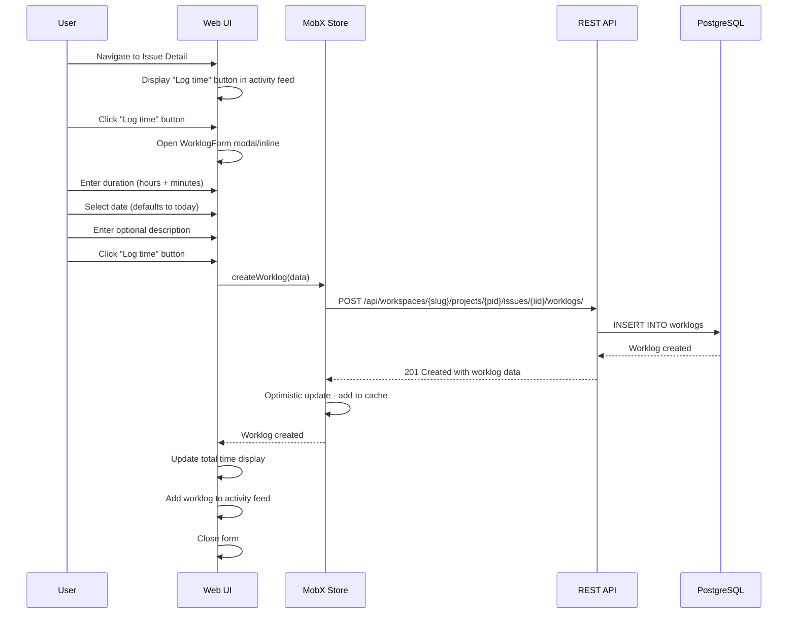
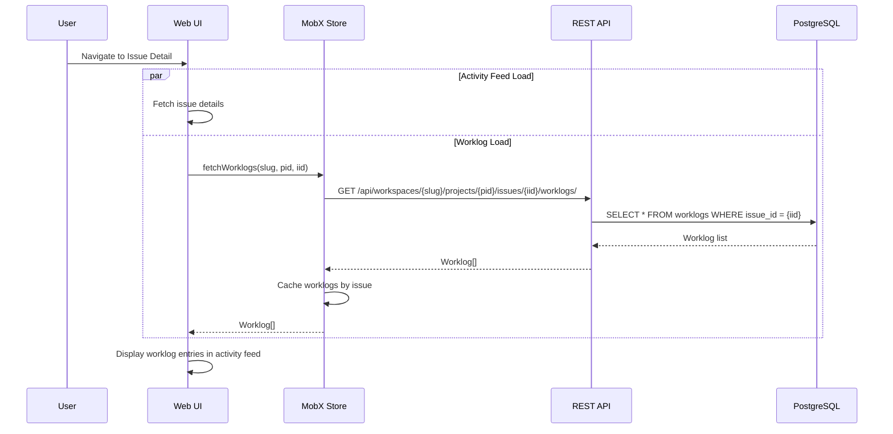
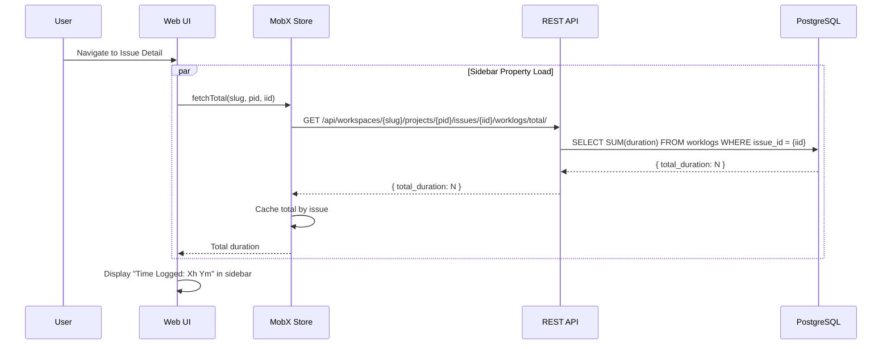
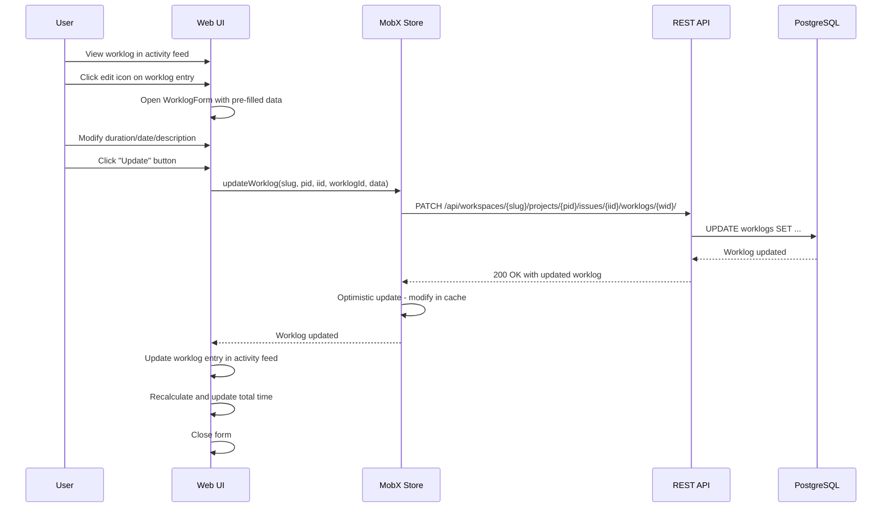
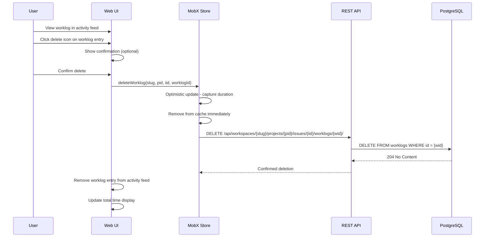
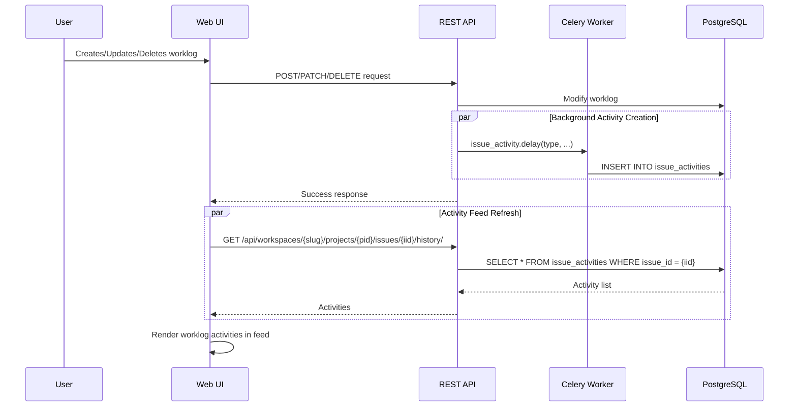
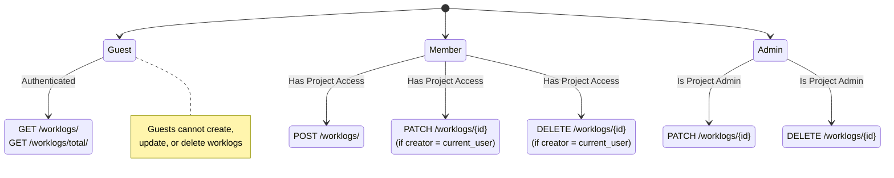

# Time Tracking - User Interaction Diagrams

> **Feature:** Time Tracking / Worklogs for Plane Community Edition
> **Related:** [requirements.md](./requirements.md) · [design.md](./design.md)

---

## User Interaction Flows

### FR-1: Create Worklog Flow



### FR-2: List Worklogs Flow



### FR-3: Total Time Aggregation Flow



### FR-4: Update Worklog Flow



### FR-5: Delete Worklog Flow



### FR-7: Activity Feed Integration



---

## Permission-Based Access Control



---

## Component Interaction Diagram

```mermaid
graph TB
    subgraph "ReactWP[IssueWork Components"
        IlogProperty]
        IAWB[IssueActivityWorklog]
        IWCB[IssueActivityWorklogCreateButton]
        WF[WorklogForm]
    end
    
    subgraph "MobX Store"
        WS[WorklogStore]
    end
    
    subgraph "API Service"
        WSV[WorklogService]
    end
    
    subgraph "Django Backend"
        WV[WorklogViewSet]
        WSER[WorklogSerializer]
        WM[Worklog Model]
    end
    
    IWP --> WS: fetchTotal()
    IAWB --> WS: fetchWorklogs()
    IWCB --> WF: toggle form
    WF --> WS: createWorklog()
    WF --> WS: updateWorklog()
    WF --> WS: deleteWorklog()
    
    WS --> WSV: API calls
    
    WSV --> WV: HTTP requests
    WV --> WSER: Validation
    WSER --> WM: Database operations
```

---

## Error Handling Flow

```mermaid
flowchart TD
    A[User Submits Form] --> B{Valid Input?}
    
    B -->|No| C[Show Inline Validation Errors]
    C --> D[User Corrects Input]
    D --> A
    
    B -->|Yes| E[Submit to API]
    
    E --> F{API Success?}
    
    F -->|No| G{Error Type?}
    
    G -->|401/403| H[Show Permission Error]
    H --> I[Close Form / Show Message]
    
    G -->|400| J[Show Validation Error from API]
    J --> C
    
    G -->|500| K[Show Generic Error Toast]
    K --> I
    
    F -->|Yes| L[Update Local Store]
    L --> M[Refresh UI Components]
    M --> N[Close Form]