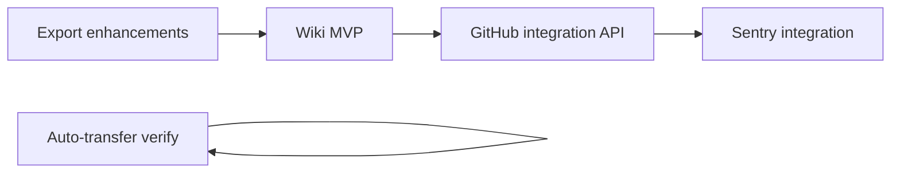

# Implementation Specification: Priority Missing Features

**Based on:** [FEATURE_REVIEW_REPORT.md](./FEATURE_REVIEW_REPORT.md)  
**Audience:** Software engineers implementing features on the Plane AGPL monorepo  
**Scope:** Wiki, GitHub integration, Sentry integration, auto-transfer cycle work items (verification/enhancement), workspace export

---

## Goals and non-goals

### Goals

1. Deliver **workspace Wiki** comparable to [Plane Pro Wiki](https://plane.so/pricing?mode=self-hosted).
2. Deliver **GitHub issue/PR sync** per [GitHub integration docs](https://docs.plane.so/integrations/github).
3. Deliver **Sentry → work item** flows per [Sentry integration docs](https://docs.plane.so/integrations/sentry).
4. Confirm **auto-transfer cycle work items** behavior and document/ gate if required.
5. Provide **reliable full-workspace export** in universal formats (JSON + CSV minimum).

### Non-goals (initial release)

- GitHub Enterprise Server, GitLab, Slack, Draw.io
- Wiki collections, enhanced AI search, queued PDF export farm
- Business-tier workflows, approvals, customer objects
- Replacing Plane’s commercial license server

---

## Cross-cutting architecture

### Edition modules

Continue the `@/plane-web/*` pattern:

| Path                            | Purpose                            |
| ------------------------------- | ---------------------------------- |
| `apps/web/core/`                | Shared routes, stores, API clients |
| `apps/web/extended/` (or `ce/`) | Edition-specific UI                |
| `apps/api/plane/app/`           | REST + Celery                      |
| `apps/api/plane/bgtasks/`       | Async jobs                         |

### Suggested new packages / apps

| Component           | Location                                        | Notes                                        |
| ------------------- | ----------------------------------------------- | -------------------------------------------- |
| Integration service | `apps/api/plane/integrations/` (new Django app) | GitHub + Sentry webhooks, OAuth callbacks    |
| Wiki routes         | `apps/web/app/(all)/[workspaceSlug]/wiki/`      | Mirror projects app structure                |
| Webhook ingress     | `apps/api/plane/integrations/urls.py`           | Public endpoints with signature verification |

### Feature flags

| Flag                         | Env / instance config  | Default (OSS)            |
| ---------------------------- | ---------------------- | ------------------------ |
| `ENABLE_WIKI`                | InstanceConfiguration  | `1` when implementing    |
| `ENABLE_GITHUB_SYNC`         | Already exists         | `0` until App configured |
| `ENABLE_SENTRY_SYNC`         | New                    | `0`                      |
| `ENABLE_CYCLE_AUTO_TRANSFER` | Project field (exists) | User-controlled          |

---

## Feature 1: Workspace Wiki

### Problem

Pro Wiki is a **workspace-scoped** knowledge app. OSS has **project Pages** only (`projects/.../pages/`), `Page.is_global` unused, and broken `/wiki/` links.

### Product requirements

| ID  | Requirement                                                                   |
| --- | ----------------------------------------------------------------------------- |
| W-1 | Workspace admins can open **Wiki** from app switcher                          |
| W-2 | Create/edit/archive pages **without** a project                               |
| W-3 | URL scheme: `/{workspaceSlug}/wiki/{pageId}`                                  |
| W-4 | List view with hierarchy (parent/child via existing `Page.parent`)            |
| W-5 | Reuse existing Page editor (rich text, attachments)                           |
| W-6 | Permissions: workspace member read; creator/admin write (match project pages) |
| W-7 | (Phase 2) Wiki collections, shared pages—out of MVP                           |

### Technical design

#### API

Extend `apps/api/plane/app/views/page/` (or add `wiki.py`):

```python
# Filter: workspace=slug, is_global=True, projects__isnull=True (or no ProjectPage rows)
GET    /api/workspaces/{slug}/wiki-pages/
POST   /api/workspaces/{slug}/wiki-pages/
GET    /api/workspaces/{slug}/wiki-pages/{page_id}/
PATCH  /api/workspaces/{slug}/wiki-pages/{page_id}/
DELETE /api/workspaces/{slug}/wiki-pages/{page_id}/
```

On create: set `is_global=True`, do **not** attach `ProjectPage`.

Reuse serializers from project pages; add `is_global` to read/write where safe.

#### Web

1. **Routes:** `apps/web/app/(all)/[workspaceSlug]/wiki/(list)/page.tsx`, `wiki/(detail)/[pageId]/page.tsx`
2. **Implement `WorkspaceAppSwitcher`** in `extended/components/workspace/app-switcher.tsx` (toggle Projects ↔ Wiki).
3. **Store:** extend `PageStore` or add `WikiPageStore` filtering `is_global`.
4. **Fix dead links:** `command-palette/helpers.tsx`, `search-results-map.tsx` already point to `/wiki/`—will work once routes exist.
5. **Navigation pane:** wire `extended/components/pages/navigation-pane/` empty states (assets already under `empty-state/wiki/`).

#### Real-time (optional phase 2)

- Remove `collaboration-cursor` from `DISABLED_EXTENSIONS` when `apps/live` is configured.
- Document dependency on `LIVE_SERVER_URL` in self-hosting docs.

### Data migration

- No schema change required (`is_global` exists).
- Optional backfill: none.

### Acceptance criteria

- [ ] User creates wiki page; it does not appear under any project’s Pages list.
- [ ] Direct URL and command palette open the page.
- [ ] App switcher visible and functional.
- [ ] E2E: create → edit → archive wiki page.

### Effort estimate

| Area                          | Days           |
| ----------------------------- | -------------- |
| API                           | 3–5            |
| Web routes + switcher + store | 5–8            |
| QA + docs                     | 2–3            |
| **Total MVP**                 | **~2–3 weeks** |

---

## Feature 2: GitHub integration

### Problem

DB models and UI exist; **REST API and sync workers are missing** from `apps/api/plane/app/urls/`. Frontend calls fail at runtime.

### Product requirements (MVP = docs parity, simplified)

| ID   | Requirement                                                    |
| ---- | -------------------------------------------------------------- |
| GH-1 | Workspace admin installs GitHub App; org appears connected     |
| GH-2 | Per-project mapping: Plane project ↔ GitHub repo               |
| GH-3 | State mapping: open/closed → Plane states                      |
| GH-4 | Unidirectional sync GitHub → Plane via `Plane` label on issues |
| GH-5 | Plane → GitHub via `GitHub` label on work items (phase 1.5)    |
| GH-6 | Webhook handler for issues, comments, state changes            |
| GH-7 | (Phase 2) PR state automation                                  |

### Technical design

#### New Django app: `plane.integrations`

```
integrations/
  github/
    oauth.py          # App installation callback
    webhooks.py       # POST /webhooks/github/
    sync.py           # create/update issue, comment sync
    serializers.py
    views.py          # workspace-integrations, github-repositories
  urls.py
```

#### API endpoints (match existing frontend)

Implement routes already called by `IntegrationService` / `GithubIntegrationService`:

```
GET    /api/integrations/
GET    /api/workspaces/{slug}/workspace-integrations/
DELETE /api/workspaces/{slug}/workspace-integrations/{id}/provider/
GET    /api/workspaces/{slug}/workspace-integrations/{id}/github-repositories/
POST   /api/workspaces/{slug}/workspace-integrations/{id}/github-repositories/   # link repo
POST   /api/workspaces/{slug}/projects/{project_id}/github-sync/                # start sync config
```

Use existing models in `apps/api/plane/db/models/integration/github.py`.

#### GitHub App setup (self-hosted)

Document in `docs/self-hosting/integrations/github.md`:

1. Create GitHub App (permissions: issues R/W, pull requests R, metadata).
2. Set `GITHUB_CLIENT_ID`, `GITHUB_CLIENT_SECRET`, `ENABLE_GITHUB_SYNC=1`, webhook secret.
3. Webhook URL: `https://<plane>/api/webhooks/github/`

#### Sync algorithm (issue created/updated)

```text
Webhook (issues.opened|edited|closed|labeled)
  → verify signature
  → find GithubRepositorySync by repo_id
  → if label "Plane" or bidirectional rules match:
       upsert Issue + GithubIssueSync
       map state via project config JSON
  → record GithubCommentSync for comment events
```

#### Celery tasks

- `sync_github_issue_task(issue_sync_id, event_payload)`
- `sync_plane_issue_to_github_task(issue_id)` (bidirectional)

#### Security

- HMAC webhook verification
- Encrypt `GithubRepositorySync.credentials` at rest (use existing encryption utils from license app if available)
- Scoped bot user per `WorkspaceIntegration.actor`

### Acceptance criteria

- [ ] Connect GitHub from workspace settings without 404.
- [ ] Label `Plane` on GitHub issue creates linked work item.
- [ ] Close issue in GitHub moves Plane work item to mapped state.
- [ ] Comment sync appears on both sides (with bot user if unmapped).
- [ ] Integration tests with GitHub webhook fixtures.

### Effort estimate

| Area                           | Days           |
| ------------------------------ | -------------- |
| API + webhooks + Celery        | 15–25          |
| UI wiring (mostly exists)      | 3–5            |
| GitHub App docs + test harness | 3–5            |
| **Total MVP**                  | **~4–6 weeks** |

---

## Feature 3: Sentry integration

### Problem

**Zero** implementation—only i18n strings.

### Product requirements (MVP)

| ID  | Requirement                                                                          |
| --- | ------------------------------------------------------------------------------------ |
| S-1 | Workspace admin connects Sentry via OAuth                                            |
| S-2 | Per-project state mapping: unresolved/resolved → Plane states                        |
| S-3 | Sentry **alert action** creates Plane work item (title, description, link, priority) |
| S-4 | Manual link from Sentry issue to existing work item (API for Sentry UI extension)    |
| S-5 | Bi-directional resolve: Plane state → Sentry resolved (and reverse)                  |

### Technical design

#### Data model (new)

```python
class SentryWorkspaceConnection(BaseModel):
    workspace = FK(Workspace)
    sentry_org_slug = CharField
    access_token = EncryptedField
    refresh_token = EncryptedField
    metadata = JSONField

class SentryProjectMapping(BaseModel):
    workspace = FK(Workspace)
    project = FK(Project)
    sentry_project_slug = CharField
    unresolved_state = FK(State)
    resolved_state = FK(State)

class SentryIssueLink(BaseModel):
    issue = FK(Issue)
    sentry_issue_id = CharField
    sentry_project_slug = CharField
    webhook_secret = CharField  # optional per-link
```

#### API

```
POST   /api/workspaces/{slug}/integrations/sentry/install/     # OAuth start/callback
GET    /api/workspaces/{slug}/integrations/sentry/
POST   /api/workspaces/{slug}/integrations/sentry/mappings/
POST   /api/webhooks/sentry/                                    # issue created/resolved
POST   /api/integrations/sentry/issues/{id}/link/               # link to work item (Sentry UI)
```

#### Sentry alert action

Sentry sends configured webhook when alert fires → Plane creates `Issue` with:

- `name`: `[Sentry] {title}`
- `description_html`: stack trace summary + link
- `external_source`: `sentry`, `external_id`: issue id

Register **Sentry Integration** (public integration) or document Internal Integration webhook URL for self-hosted.

#### State sync

On Plane `Issue.state` → resolved mapping state: call Sentry API `PUT /issues/{id}/` resolved.  
On Sentry `resolved` webhook: update Plane issue state.

### UI

Add Sentry card to `integrations/page.tsx` (mirror GitHub card).  
Configuration page: state mapping table (reuse i18n `sentry_integration.state_mapping.*`).

### Acceptance criteria

- [ ] Alert rule in Sentry creates work item in chosen Plane project.
- [ ] Resolve in Plane resolves Sentry issue.
- [ ] Resolve in Sentry updates Plane work item state.
- [ ] Contract tests with Sentry webhook payload samples.

### Effort estimate

| Area                         | Days           |
| ---------------------------- | -------------- |
| OAuth + models + webhooks    | 12–18          |
| UI                           | 4–6            |
| Sentry app registration docs | 2–3            |
| **Total MVP**                | **~3–5 weeks** |

---

## Feature 4: Auto-transfer cycle work items

### Status

**Already implemented.** See:

- `apps/api/plane/db/models/project.py` — `auto_transfer_cycle_issues`
- `apps/api/plane/bgtasks/cycle_automation_task.py`
- `apps/web/core/components/automation/auto-transfer-cycle-issues.tsx`
- `e2e/tests/cycle-automation.spec.ts`

### Engineering tasks (if product requires Free-tier access)

| Task           | Action                                                                                         |
| -------------- | ---------------------------------------------------------------------------------------------- |
| License gating | If instance is Free edition, hide toggle or show upgrade—wire to `useInstance()` / license API |
| Observability  | Add structured logs when transfer skipped (no upcoming cycle)                                  |
| Docs           | Document interaction with `auto_create_cycles` and cooldown                                    |
| QA             | Run existing e2e on CI                                                                         |

### Acceptance criteria

- [ ] With both toggles on, ending a cycle moves incomplete issues to next auto-created cycle.
- [ ] With auto-create off, auto-transfer toggle disabled (already enforced in UI).

### Effort estimate

**0–3 days** (verification + gating only).

---

## Feature 5: Universal workspace export

### Status

**Work item export exists** (`export-issues/`, CSV/XLSX/JSON). Gaps: all projects in one bundle, project metadata, view filters.

### Product requirements

| ID  | Requirement                                                              |
| --- | ------------------------------------------------------------------------ |
| E-1 | Export **all** accessible projects’ work items in one job                |
| E-2 | Formats: **JSON** (canonical), **CSV** (flat), optional **XLSX**         |
| E-3 | Include **project list** manifest (id, name, identifier, states summary) |
| E-4 | Download via presigned URL (existing `ExporterHistory` pattern)          |
| E-5 | JSON schema documented for importers (Jira/Linear/etc.)                  |

### Technical design

#### API extension

```python
POST /api/workspaces/{slug}/export-issues/
{
  "provider": "json",           # json | csv | xlsx
  "project": [],                # empty = all member projects (already supported)
  "multiple": true,             # single zip with per-project files
  "include_project_manifest": true,
  "filters": { ... }            # optional: reuse rich filter AST (phase 2)
}
```

#### Export manifest (`manifest.json`)

```json
{
  "workspace_slug": "acme",
  "exported_at": "2026-05-29T12:00:00Z",
  "plane_version": "1.x.x",
  "projects": [{ "id": "...", "identifier": "WEB", "name": "Web", "state_count": 5 }],
  "files": [{ "project_id": "...", "path": "WEB-issues.json", "issue_count": 120 }]
}
```

#### Implementation steps

1. Extend `issue_export_task` to write `manifest.json` into ZIP.
2. Add `ProjectExportSerializer` (lightweight) in `plane.utils.porters`.
3. Uncomment / implement filter pipeline in `export-form.tsx` when `filters` provided.
4. Add **“Export all projects”** preset in `ExportGuide` UI.
5. Document JSON field list in `docs/feature-review/export-schema.md`.

#### Universal format notes

| Format   | Use case                                                     |
| -------- | ------------------------------------------------------------ |
| **JSON** | Machine import, preserves relations (parent, labels, cycles) |
| **CSV**  | Excel/Sheets; one row per issue; denormalized assignees      |
| **XLSX** | Business users; multiple sheets per project (optional)       |

### Acceptance criteria

- [ ] Empty project list exports all non-archived member projects.
- [ ] ZIP contains manifest + per-project JSON files.
- [ ] 10k issues completes via Celery without timeout (batch queryset).
- [ ] Export history list shows job status (existing UI).

### Effort estimate

| Area                            | Days             |
| ------------------------------- | ---------------- |
| Backend manifest + all-projects | 3–5              |
| UI + filters                    | 3–5              |
| Docs + load test                | 2–3              |
| **Total**                       | **~1.5–2 weeks** |

---

## Recommended implementation order



| Phase | Deliverable                            | Rationale                                 |
| ----- | -------------------------------------- | ----------------------------------------- |
| **0** | Auto-transfer QA + license gating      | Low effort; already coded                 |
| **1** | Workspace export manifest + export all | High user value; uses existing stack      |
| **2** | Wiki MVP                               | Independent; unblocks knowledge workflows |
| **3** | GitHub API + webhooks                  | Largest integration; models exist         |
| **4** | Sentry integration                     | Similar patterns to GitHub                |

---

## Testing strategy

| Feature       | Unit                             | Contract           | E2E                                 |
| ------------- | -------------------------------- | ------------------ | ----------------------------------- |
| Wiki          | Page serializers `is_global`     | API CRUD           | Playwright: create wiki page        |
| GitHub        | Webhook signature, state map     | Webhook fixtures   | Mock GitHub App install             |
| Sentry        | State sync service               | Webhook payloads   | Alert → work item                   |
| Export        | `issue_export_task` zip contents | POST export-issues | Download ZIP                        |
| Auto-transfer | `cycle_automation_task`          | —                  | Existing `cycle-automation.spec.ts` |

Run API tests: `docker compose -f docker-compose-test.yml run --rm api-tests pytest -m unit`

---

## Observability & operations

- Log integration webhook IDs (not tokens).
- Metrics: `integration_webhook_received_total{provider}`, `export_job_duration_seconds`.
- Celery queue: dedicated `integrations` queue to isolate from `issue_export_task`.

---

## Documentation deliverables

| Doc                    | Path                                       |
| ---------------------- | ------------------------------------------ |
| Wiki user guide        | `docs/wiki/README.md`                      |
| GitHub self-host setup | `docs/self-hosting/integrations/github.md` |
| Sentry self-host setup | `docs/self-hosting/integrations/sentry.md` |
| Export JSON schema     | `docs/feature-review/export-schema.md`     |

---

## Open questions for product

1. Should OSS builds enable Wiki/GitHub/Sentry without license, or remain upgrade-gated?
2. Is bidirectional GitHub sync required for MVP or GitHub→Plane only?
3. Export: include attachments and comments in JSON binary fields?
4. Sentry: Plane Cloud public integration vs self-hosted webhook-only?

---

## Reference links

- [Feature review](./FEATURE_REVIEW_REPORT.md)
- [Plane pricing (self-hosted)](https://plane.so/pricing?mode=self-hosted)
- [GitHub integration docs](https://docs.plane.so/integrations/github)
- [Sentry integration docs](https://docs.plane.so/integrations/sentry)
