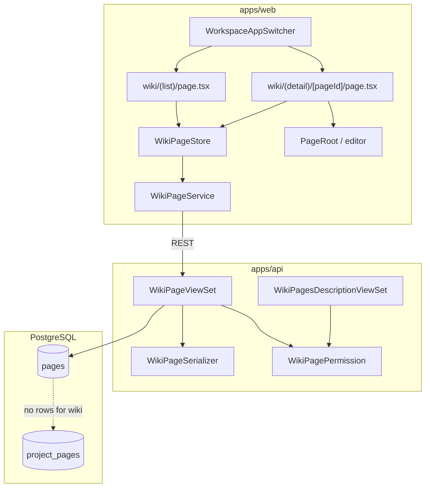
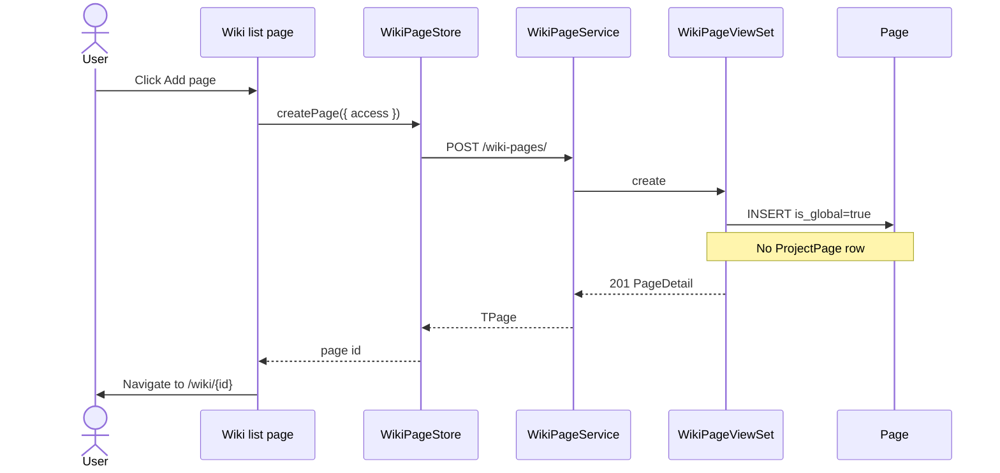

# Workspace Wiki — Software Design Specification

**Status:** MVP implementation  
**Related:** [IMPLEMENTATION_SPEC.md](../IMPLEMENTATION_SPEC.md) Feature 1  
**Audience:** Engineers implementing or reviewing the Wiki feature

---

## Context

Plane Pro provides a **workspace-scoped Wiki** for knowledge bases without tying pages to a project. The AGPL monorepo already has:

- `Page.is_global` on `apps/api/plane/db/models/page.py` (unused in CRUD views)
- Project-scoped Pages API and UI under `/projects/:projectId/pages/`
- Dead links to `/{workspaceSlug}/wiki/{pageId}` in command palette and Power K search
- Stub `WorkspaceAppSwitcher` in `apps/web/extended/components/workspace/app-switcher.tsx`
- i18n keys under `workspace_pages.*` and wiki empty-state assets

This spec defines the MVP: global wiki pages (`is_global=True`, no `ProjectPage` rows), CRUD API, list/detail routes, MobX store, and Projects ↔ Wiki switcher.

### Non-goals (MVP)

- Wiki collections, shared pages, real-time collaboration (`apps/live`)
- Favorites, duplicate, move-to-project, version history UI (API stubs optional later)
- `ENABLE_WIKI` instance flag gating (can be added in settings)

---

## Requirements traceability

| ID  | Requirement                              | MVP approach                                                       |
| --- | ---------------------------------------- | ------------------------------------------------------------------ |
| W-1 | Wiki in app switcher                     | `WorkspaceAppSwitcher` in extended top nav                         |
| W-2 | CRUD without project                     | `is_global=True`, no `ProjectPage` on create                       |
| W-3 | URL `/{slug}/wiki/{pageId}`              | React Router routes under `wiki/`                                  |
| W-4 | Hierarchy via `Page.parent`              | Same as project pages; list shows root pages                       |
| W-5 | Reuse page editor                        | `PageRoot` + existing editor components                            |
| W-6 | Workspace member read; owner/admin write | `WikiPagePermission` mirrors project page rules at workspace level |
| W-7 | Collections (phase 2)                    | Out of scope                                                       |

---

## Architecture



---

## API contract

Base path: `/api/workspaces/{slug}/wiki-pages/`

| Method   | Path                      | Description                                                                             |
| -------- | ------------------------- | --------------------------------------------------------------------------------------- |
| `GET`    | `/`                       | List root wiki pages (`parent__isnull=True`, `is_global=True`, no active `ProjectPage`) |
| `POST`   | `/`                       | Create wiki page (`is_global=True`, no `ProjectPage`)                                   |
| `GET`    | `/{page_id}/`             | Retrieve page (`?track_visit=true` optional)                                            |
| `PATCH`  | `/{page_id}/`             | Partial update (name, parent, access, description_html, etc.)                           |
| `DELETE` | `/{page_id}/`             | Soft-delete (must be archived first, same as project pages)                             |
| `POST`   | `/{page_id}/archive/`     | Archive page + descendants                                                              |
| `DELETE` | `/{page_id}/archive/`     | Unarchive                                                                               |
| `GET`    | `/{page_id}/description/` | Binary description stream                                                               |
| `PATCH`  | `/{page_id}/description/` | Update binary/json/html description                                                     |

### Query filters (list)

- Implicit: `workspace__slug=slug`, `is_global=True`, `project_pages` absent (via `~Exists(ProjectPage)`)
- Access: `Q(owned_by=user) | Q(access=0)` (public)
- Roots only: `parent__isnull=True` (children loaded on detail / editor)
- Guest restriction: guests without `guest_view_all_features` see only own pages (N/A at workspace level — workspace guests see public + own private, matching workspace membership role)

### Request/response shape

Reuses `PageSerializer` / `PageDetailSerializer` fields. Wiki pages return `project_ids: []` and include `is_global: true` in response (serializer field added for wiki endpoints).

**Create body (minimal):**

```json
{
  "name": "Untitled",
  "access": 0,
  "description_html": "<p></p>",
  "parent": null
}
```

**Response:** Same as project `PageDetailSerializer` plus `is_global`.

### Errors

- `400` — locked page, invalid parent, access change by non-owner
- `403` — permission denied
- `404` — page not found or not a wiki page

---

## Data model

No migration required.

| Field              | Wiki usage                                               |
| ------------------ | -------------------------------------------------------- |
| `Page.workspace`   | FK to workspace                                          |
| `Page.is_global`   | `True` for all wiki pages                                |
| `Page.parent`      | Optional self-FK for hierarchy                           |
| `Page.access`      | `0` public (workspace-visible), `1` private (owner only) |
| `Page.archived_at` | Archive flow identical to project pages                  |
| `ProjectPage`      | **Must not exist** for wiki pages                        |

**Invariant:** A wiki page satisfies `is_global=True` AND no non-deleted `ProjectPage` for that `page_id`.

---

## Permissions

`WikiPagePermission` (workspace-scoped, mirrors `ProjectPagePermission`):

| Action                      | Guest          | Member         | Admin          |
| --------------------------- | -------------- | -------------- | -------------- |
| List / retrieve public      | Yes            | Yes            | Yes            |
| List / retrieve own private | Yes            | Yes            | Yes            |
| Create (POST)               | No             | Yes            | Yes            |
| Update (PATCH)              | No             | Yes\*          | Yes\*          |
| Delete                      | No             | Owner or admin | Owner or admin |
| Archive                     | Owner or admin | Owner or admin | Owner or admin |

\*Public pages: member+ can edit; private pages: owner only (same as project pages).

Workspace membership via `WorkspaceMember` with `is_active=True`.

---

## Web routes

Registered in `apps/web/app/routes/extended.ts`:

| Route                         | File                              |
| ----------------------------- | --------------------------------- |
| `:workspaceSlug/wiki`         | `wiki/(list)/page.tsx`            |
| `:workspaceSlug/wiki/:pageId` | `wiki/(detail)/[pageId]/page.tsx` |

Layouts mirror project pages list/detail (app header + content wrapper).

### Component / route map

```mermaid
flowchart LR
  subgraph Nav
    WAS[WorkspaceAppSwitcher]
    WM[WorkspaceMenuRoot]
  end

  subgraph WikiList["GET /wiki"]
    LH[WikiPagesListHeader]
    PLV[PagesListView]
    PLR[PagesListRoot]
    WAS --> WikiList
    LH --> PLV --> PLR
  end

  subgraph WikiDetail["GET /wiki/:pageId"]
    PD[WikiPageDetailPage]
    PR[PageRoot]
    NPane[NavigationPane]
    PD --> PR
    PD --> NPane
  end

  WikiList -->|navigate| WikiDetail
```

---

## Stores and services

| Layer                     | Location                                           | Responsibility                                    |
| ------------------------- | -------------------------------------------------- | ------------------------------------------------- |
| `WikiPageService`         | `apps/web/core/services/page/wiki-page.service.ts` | HTTP client for wiki-pages API                    |
| `WikiPageStore`           | `apps/web/core/store/pages/wiki-page.store.ts`     | MobX list/detail/create/delete                    |
| `WikiPage`                | `apps/web/core/store/pages/wiki-page.ts`           | Per-page mutations (update, archive, description) |
| `EPageStoreType.WIKI`     | `apps/web/extended/hooks/store/use-page-store.ts`  | Store selector                                    |
| `CoreRootStore.wikiPages` | `apps/web/core/store/root.store.ts`                | Root registration                                 |

`WikiPageStore` implements the same surface as `IProjectPageStore` so list components (`PagesListView`, `PagesListRoot`) work with `storeType={EPageStoreType.WIKI}`.

---

## Sequence: create wiki page



---

## Integration points

| Consumer                  | Change                                                                  |
| ------------------------- | ----------------------------------------------------------------------- |
| Command palette / Power K | Already link to `/wiki/{id}` when `project_ids` empty                   |
| `useWorkspacePaths`       | `isWikiPath` already defined                                            |
| Search API                | Already returns `is_global=True` pages; links now resolve               |
| Editor assets             | `useEditorConfig` supports optional `projectId`; workspace asset upload |
| Live / realtime           | `documentType: "workspace_page"` in webhook params for detail page      |

---

## Acceptance criteria (MVP)

| Criterion                           | Verification                                                |
| ----------------------------------- | ----------------------------------------------------------- |
| Wiki page not in project Pages list | Create wiki page; confirm absent from `/projects/:id/pages` |
| Direct URL works                    | Open `/{slug}/wiki/{id}`                                    |
| Command palette opens wiki page     | Search global page, follow link                             |
| App switcher works                  | Toggle Projects ↔ Wiki                                      |
| Create → edit → archive             | Manual or E2E                                               |

---

## Testing

- **API:** `pytest` tests for wiki CRUD, isolation from project pages, permission matrix
- **Web:** Typecheck touched packages; manual smoke on list/detail/switcher
- **Command:** `pnpm check:types` on `@plane/web` if feasible

---

## Future work

- Wiki description versions endpoint parity
- Favorites without `project_id` on `UserFavorite`
- `ENABLE_WIKI` instance configuration
- Collections UI (i18n already present)
- Real-time editing via `apps/live` + `workspace_page` document type
