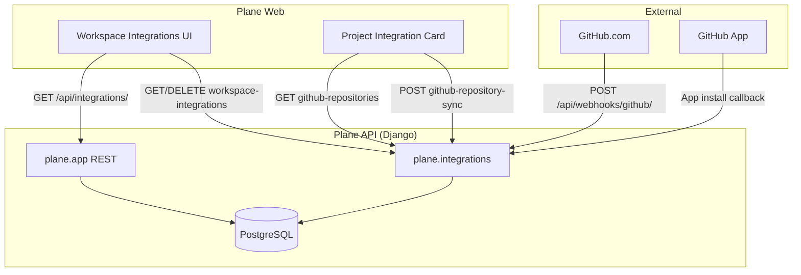
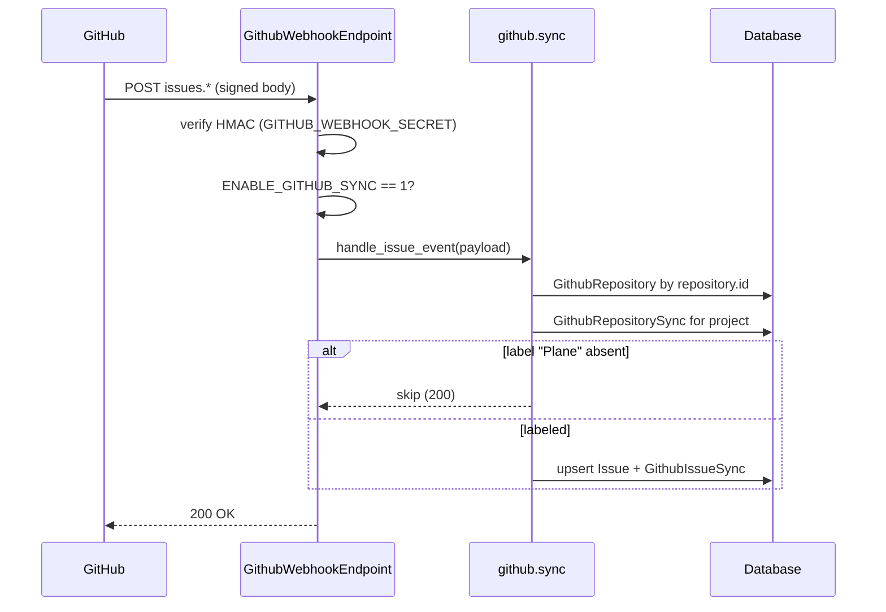
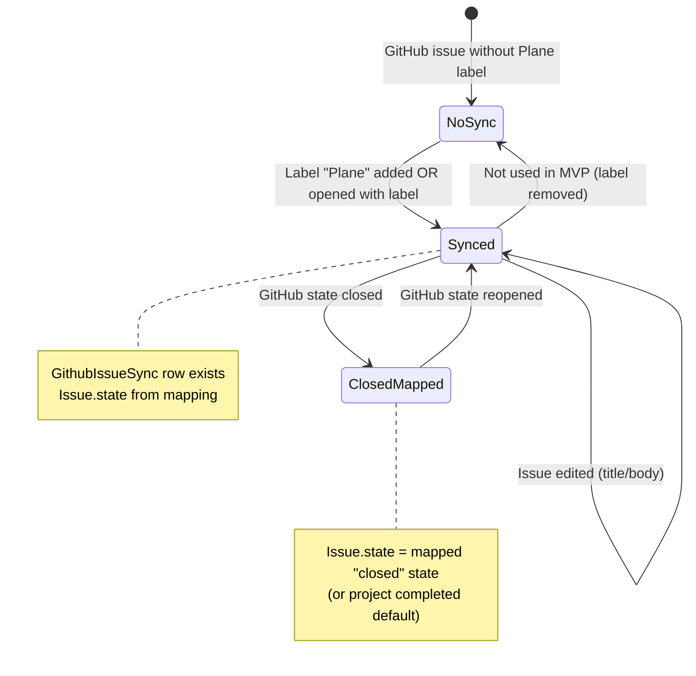

# GitHub Integration — Software Design (Goal 2)

**Status:** MVP implementation  
**Spec:** [IMPLEMENTATION_SPEC.md](../IMPLEMENTATION_SPEC.md) Feature 2  
**Models:** `apps/api/plane/db/models/integration/github.py` (existing)

---

## 1. Problem statement

Plane ships GitHub integration **database models** and **frontend** (`IntegrationService`, `GithubIntegrationService`, project integration UI), but the AGPL API has **no routes** under `plane.app.urls`. Workspace settings and project repo linking return **404**, and GitHub webhooks cannot create or update work items.

This design adds a minimal **GitHub → Plane** sync path gated by `ENABLE_GITHUB_SYNC`, matching existing `Integration` / `WorkspaceIntegration` models.

---

## 2. System context



| Actor                        | Responsibility                             |
| ---------------------------- | ------------------------------------------ |
| Workspace admin              | Install GitHub App, uninstall integration  |
| Project admin                | Link GitHub repo to Plane project          |
| GitHub                       | Deliver signed webhooks for labeled issues |
| `WorkspaceIntegration.actor` | Bot user attributed on synced work items   |

---

## 3. Environment variables

| Variable                 | Required             | Purpose                                                     |
| ------------------------ | -------------------- | ----------------------------------------------------------- |
| `ENABLE_GITHUB_SYNC`     | Yes (MVP)            | Instance flag; must be `1` for integration API + webhooks   |
| `GITHUB_APP_NAME`        | Yes (UI install URL) | Slug for `https://github.com/apps/{name}/installations/new` |
| `GITHUB_APP_ID`          | Yes (API)            | GitHub App ID for JWT → installation token                  |
| `GITHUB_PRIVATE_KEY`     | Yes (API)            | PEM (or `\n`-escaped) RSA key for app JWT                   |
| `GITHUB_WEBHOOK_SECRET`  | Yes (webhooks)       | HMAC secret from GitHub App webhook settings                |
| `GITHUB_CLIENT_ID`       | Optional             | OAuth sign-in (separate from issue sync)                    |
| `GITHUB_CLIENT_SECRET`   | Optional             | OAuth sign-in                                               |
| `GITHUB_ORGANIZATION_ID` | Optional             | Restrict OAuth org membership                               |

Webhook URL (self-hosted): `https://<host>/api/webhooks/github/`

---

## 4. API surface

All authenticated routes use `BaseAPIView`, session auth, and `@allow_permission` with workspace **ADMIN** unless noted.

| Method   | Path                                                                                               | Handler                               | Notes                                            |
| -------- | -------------------------------------------------------------------------------------------------- | ------------------------------------- | ------------------------------------------------ |
| `GET`    | `/api/integrations/`                                                                               | `IntegrationListEndpoint`             | Catalog; ensures `github` (+ `slack`) rows exist |
| `GET`    | `/api/workspaces/{slug}/workspace-integrations/`                                                   | `WorkspaceIntegrationListEndpoint`    | Lists workspace connections                      |
| `POST`   | `/api/workspaces/{slug}/workspace-integrations/{provider}/`                                        | `WorkspaceIntegrationInstallEndpoint` | Body: `{ "installation_id": number }`            |
| `DELETE` | `/api/workspaces/{slug}/workspace-integrations/{id}/provider/`                                     | `WorkspaceIntegrationDeleteEndpoint`  | Soft-deletes workspace integration               |
| `GET`    | `/api/workspaces/{slug}/workspace-integrations/{id}/github-repositories/`                          | `GithubRepositoriesEndpoint`          | Paginated; query `page`, `per_page`              |
| `GET`    | `/api/workspaces/{slug}/projects/{project_id}/workspace-integrations/{id}/github-repository-sync/` | `GithubRepositorySyncEndpoint`        | Current project link                             |
| `POST`   | `/api/workspaces/{slug}/projects/{project_id}/workspace-integrations/{id}/github-repository-sync/` | `GithubRepositorySyncEndpoint`        | Link repo + create sync row                      |
| `POST`   | `/api/webhooks/github/`                                                                            | `GithubWebhookEndpoint`               | **No auth**; `X-Hub-Signature-256`               |

Response shapes align with `@plane/types` (`IAppIntegration`, `IWorkspaceIntegration`, `GithubRepositoriesResponse`).

---

## 5. Webhook flow



**Events handled (MVP):** `issues.opened`, `issues.edited`, `issues.closed`, `issues.reopened`, `issues.labeled`, `issues.unlabeled`.

**Label rule:** Issue must include label name **`Plane`** (exact match) to sync. Removing the label does not delete the Plane work item (MVP).

---

## 6. Sync state machine



**State mapping** (stored on `GithubRepository.config`):

```json
{
  "issue_state_mapping": {
    "open": "<state_uuid|null>",
    "closed": "<state_uuid|null>"
  }
}
```

If `null` or missing: `open` → project default state; `closed` → first `State` with `group=completed`.

**Issue fields:**

| GitHub     | Plane `Issue`                                    |
| ---------- | ------------------------------------------------ |
| `title`    | `name`                                           |
| `body`     | `description_html`                               |
| `html_url` | link via `GithubIssueSync.issue_url`             |
| `id`       | `GithubIssueSync.github_issue_id`, `external_id` |
| `state`    | `state_id` via mapping                           |

`created_by` / `updated_by` = `GithubRepositorySync.actor` (bot).

---

## 7. Module layout

```
apps/api/plane/integrations/
  apps.py
  urls.py                    # webhook routes
  serializers.py
  ensure.py                  # Integration catalog seed
  config.py                  # ENABLE_GITHUB_SYNC helper
  github/
    client.py                # App JWT, installation token, list repos
    sync.py                  # issue upsert
    views.py                 # REST endpoints
    webhooks.py              # ingress
apps/api/plane/app/urls/integrations.py   # workspace/project routes
```

Registered in:

- `plane.settings.common.INSTALLED_APPS` → `plane.integrations`
- `plane.urls` → `api/webhooks/`
- `plane.app.urls` → integration REST paths

---

## 8. Security

| Control              | Implementation                                                                |
| -------------------- | ----------------------------------------------------------------------------- |
| Webhook authenticity | HMAC-SHA256 `X-Hub-Signature-256`                                             |
| Feature gate         | `ENABLE_GITHUB_SYNC=1` on all integration + webhook paths                     |
| Workspace scope      | Admin-only install/delete; member+ for project repo link (project permission) |
| Secrets              | `GITHUB_PRIVATE_KEY`, `GITHUB_WEBHOOK_SECRET` via instance config / env       |
| Logging              | Log `X-GitHub-Delivery`, event action; never log tokens                       |

**Phase 2:** Encrypt `GithubRepositorySync.credentials`; Plane → GitHub via `GitHub` label; Celery queue `integrations`.

---

## 9. Testing

| Layer  | Command / approach                                                                              |
| ------ | ----------------------------------------------------------------------------------------------- |
| Unit   | `pytest apps/api/plane/tests/unit/integrations/test_github_webhook.py` — signature + label gate |
| Manual | Install app → POST installation → link repo → webhook fixture with `Plane` label                |
| Docker | `docker compose -f docker-compose-test.yml run --rm api-tests pytest -m unit -k github`         |

---

## 10. Acceptance criteria (MVP)

| ID   | Criterion                                      | MVP status                               |
| ---- | ---------------------------------------------- | ---------------------------------------- |
| GH-1 | Connect GitHub without 404 on integration list | Implemented (catalog + workspace routes) |
| GH-2 | Per-project repo mapping                       | Implemented (`github-repository-sync`)   |
| GH-3 | State mapping open/closed                      | Implemented (config + defaults)          |
| GH-4 | GitHub → Plane via `Plane` label               | Implemented (webhook + sync)             |
| GH-5 | Plane → GitHub                                 | **Deferred** (phase 1.5)                 |
| GH-6 | Webhook issues/comments                        | Issues **yes**; comments **deferred**    |
| GH-7 | PR automation                                  | **Deferred**                             |

---

## 11. Open items / blockers

1. **GitHub App registration** — Operators must create an app and set env vars; no Cloud Plane license server in OSS.
2. **Install callback UI** — Frontend may POST `installation_id` manually until `/installations` route is wired to `AppInstallationService`.
3. **Comment sync** — Requires `GithubCommentSync` handler and bot user mapping (not in MVP scope).
4. **Bidirectional sync** — Requires outbound GitHub API + `GitHub` label on work items.
