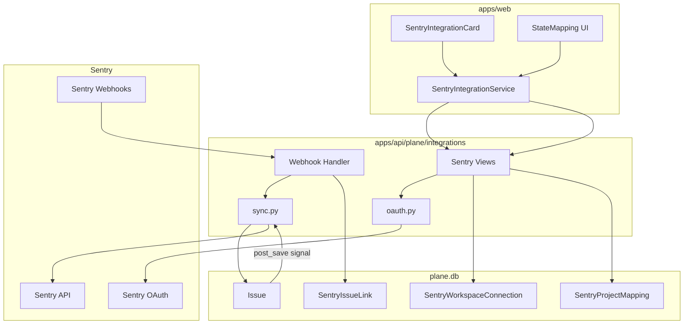
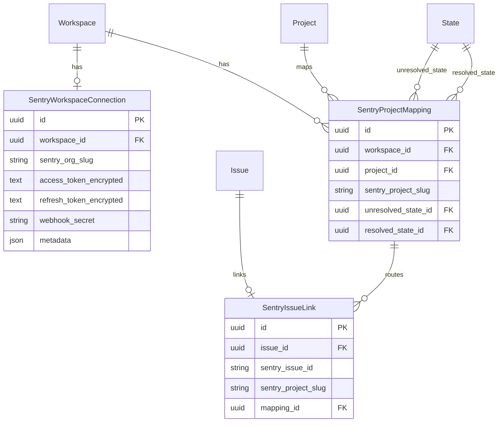
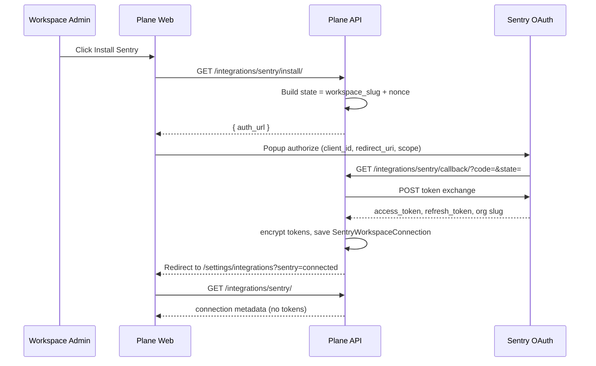
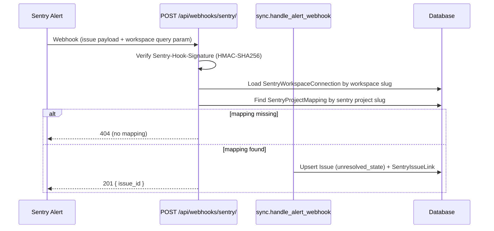
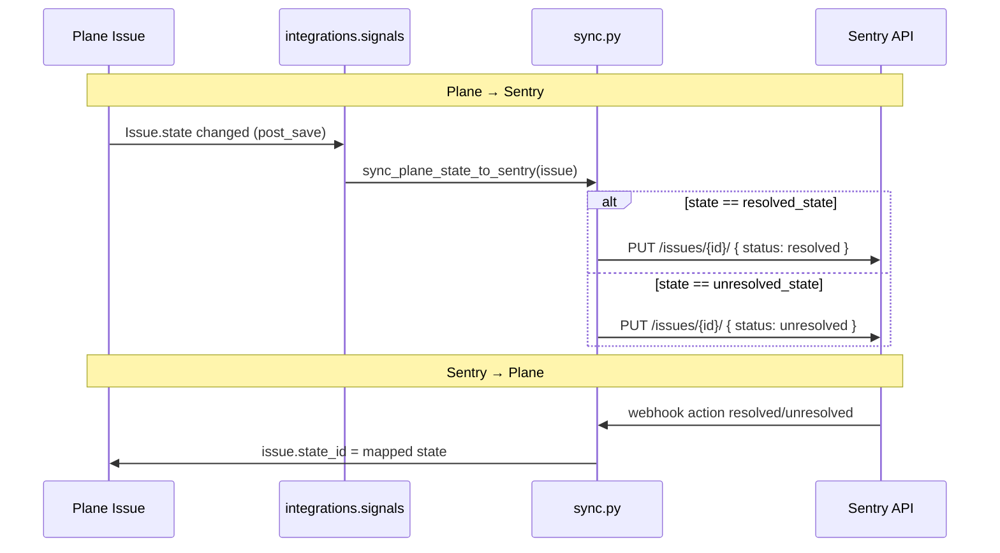

# Sentry Integration — Software Design Specification

**Goal:** Feature 3 from [IMPLEMENTATION_SPEC.md](../IMPLEMENTATION_SPEC.md)  
**Status:** MVP implementation  
**Audience:** Engineers implementing and operating Sentry ↔ Plane sync

---

## 1. Overview

Plane connects to a Sentry organization via OAuth, maps Sentry project slugs to Plane projects with resolve/unresolve state pairs, ingests Sentry alert webhooks to create work items, and synchronizes resolution state in both directions.

### 1.1 MVP scope (P0)

| ID  | Requirement                                                    | MVP       |
| --- | -------------------------------------------------------------- | --------- |
| S-1 | Workspace admin connects Sentry via OAuth                      | Yes       |
| S-2 | Per-project state mapping (unresolved/resolved → Plane states) | Yes       |
| S-3 | Sentry alert webhook creates Plane work item                   | Yes (P0)  |
| S-4 | Manual link Sentry issue → existing work item                  | Yes (API) |
| S-5 | Bi-directional resolve sync                                    | Yes       |

### 1.2 Non-goals (MVP)

- Sentry Cloud public integration marketplace submission
- Comment or assignee sync
- Multiple Sentry orgs per workspace (one connection per workspace)
- Celery offload for webhook processing (sync in request for MVP)

---

## 2. Architecture

### 2.1 Module layout

| Component       | Path                                                                                      |
| --------------- | ----------------------------------------------------------------------------------------- |
| Models          | `apps/api/plane/db/models/integration/sentry.py`                                          |
| Integration app | `apps/api/plane/integrations/`                                                            |
| Sentry logic    | `apps/api/plane/integrations/sentry/`                                                     |
| URL wiring      | `apps/api/plane/app/urls/integration.py`                                                  |
| Web UI          | `apps/web/core/components/integration/sentry/`                                            |
| Instance config | `ENABLE_SENTRY_SYNC`, `SENTRY_CLIENT_ID`, `SENTRY_CLIENT_SECRET`, `SENTRY_WEBHOOK_SECRET` |

---

## 3. Data model

### 3.1 Entity relationship

### 3.2 Token storage

Access and refresh tokens use `plane.license.utils.encryption.encrypt_data` / `decrypt_data` (Fernet derived from `SECRET_KEY`), matching `AgentConfiguration.api_key_encrypted` and instance configuration secrets.

Tokens are never returned in API responses.

### 3.3 Issue external fields

New issues from Sentry alerts set:

- `external_source = "sentry"`
- `external_id = <sentry_issue_id>`
- `name = "[Sentry] {title}"`
- `description_html` = summary + permalink

---

## 4. OAuth flow

### 4.1 Configuration

| Key                     | Encrypted | Default                             |
| ----------------------- | --------- | ----------------------------------- |
| `SENTRY_CLIENT_ID`      | No        | env                                 |
| `SENTRY_CLIENT_SECRET`  | Yes       | env                                 |
| `ENABLE_SENTRY_SYNC`    | No        | `0`                                 |
| `SENTRY_WEBHOOK_SECRET` | Yes       | env (fallback for signature verify) |

OAuth base URL defaults to `https://sentry.io` (override via `SENTRY_API_BASE_URL` for self-hosted Sentry).

### 4.2 Scopes

`project:read org:read event:read event:write` — sufficient for issue resolve API and project listing.

---

## 5. Alert → work item sequence

### 5.1 Webhook contract

**URL:** `POST /api/webhooks/sentry/?workspace={workspaceSlug}`

**Headers:**

- `Sentry-Hook-Signature`: `sha256=<hex>` of body using connection `webhook_secret` or instance `SENTRY_WEBHOOK_SECRET`
- `Sentry-Hook-Resource`: `issue` | `event` (optional)

**Supported actions:** `created`, `triggered`, `unresolved`, `resolved`, `assigned`

**Payload (normalized):** Accepts Sentry issue webhooks and alert action payloads with `data.issue` or top-level `issue`.

### 5.2 Idempotency

If `SentryIssueLink` exists for `(sentry_issue_id, mapping)`, update existing `Issue` instead of creating duplicate.

---

## 6. State sync (bidirectional)

### 6.1 Loop prevention

`SentryIssueLink` updates set `Issue` with `update_fields` and a thread-local `_sentry_sync_in_progress` flag so the post_save signal does not call Sentry API when the change originated from Sentry.

### 6.2 Mapping rules

| Sentry status                 | Plane `state_id`      |
| ----------------------------- | --------------------- |
| resolved / ignored / archived | `resolved_state_id`   |
| unresolved / regressed        | `unresolved_state_id` |

---

## 7. REST API

| Method       | Path                                                        | Auth      | Description                                                   |
| ------------ | ----------------------------------------------------------- | --------- | ------------------------------------------------------------- |
| GET          | `/api/integrations/`                                        | Admin     | List enabled integrations (includes `sentry` when configured) |
| GET          | `/api/workspaces/{slug}/integrations/sentry/install/`       | Admin     | OAuth start → `{ auth_url }`                                  |
| GET          | `/api/workspaces/{slug}/integrations/sentry/callback/`      | AllowAny  | OAuth callback                                                |
| GET          | `/api/workspaces/{slug}/integrations/sentry/`               | Admin     | Connection status                                             |
| DELETE       | `/api/workspaces/{slug}/integrations/sentry/`               | Admin     | Disconnect                                                    |
| GET/POST     | `/api/workspaces/{slug}/integrations/sentry/mappings/`      | Admin     | List/create mappings                                          |
| PATCH/DELETE | `/api/workspaces/{slug}/integrations/sentry/mappings/{id}/` | Admin     | Update/delete mapping                                         |
| POST         | `/api/webhooks/sentry/`                                     | Signature | Ingest Sentry events                                          |
| POST         | `/api/integrations/sentry/issues/{sentry_issue_id}/link/`   | Token/API | Link to existing issue                                        |

---

## 8. Web UI

- **Card:** `SentryIntegrationCard` on workspace integrations settings page when `ENABLE_SENTRY_SYNC=1` and instance exposes `is_sentry_enabled`.
- **i18n:** Reuse `sentry_integration.*` keys from `packages/i18n`.
- **State mapping:** Inline table + modal to pick Plane project and unresolved/resolved states.
- **OAuth:** Extend `useIntegrationPopup` with `sentry` provider calling install endpoint.

---

## 9. Security

| Risk                   | Mitigation                                            |
| ---------------------- | ----------------------------------------------------- |
| Token leakage          | Encrypt at rest; never serialize tokens               |
| Webhook spoofing       | HMAC signature verification                           |
| Cross-workspace access | Workspace slug + admin permission on config endpoints |
| XSS in issue body      | `validate_html_content` on description_html           |

---

## 10. Testing

| Test                      | Location                                    |
| ------------------------- | ------------------------------------------- |
| Webhook signature verify  | `integrations/tests/test_sentry_webhook.py` |
| Alert creates issue       | `integrations/tests/test_sentry_webhook.py` |
| Resolve sync Plane→Sentry | `integrations/tests/test_sentry_sync.py`    |
| Resolve sync Sentry→Plane | `integrations/tests/test_sentry_sync.py`    |

Run: `docker compose -f docker-compose-test.yml run --rm api-tests pytest plane/integrations/tests -m unit`

---

## 11. Operations

Document self-host setup in `docs/self-hosting/integrations/sentry.md` (follow-up):

1. Create Sentry OAuth application
2. Set `ENABLE_SENTRY_SYNC=1`, client id/secret, webhook secret
3. Configure alert rule webhook: `{APP_BASE_URL}/api/webhooks/sentry/?workspace={slug}`
4. Map projects in Plane integrations UI

---

## 12. Acceptance criteria

| Criterion                                                 | Status      |
| --------------------------------------------------------- | ----------- |
| Alert in Sentry creates work item in mapped Plane project | Implemented |
| Resolve in Plane resolves Sentry issue                    | Implemented |
| Resolve in Sentry updates Plane work item state           | Implemented |
| Contract tests with webhook payload samples               | Implemented |
| OAuth connect/disconnect                                  | Implemented |

---

## 13. Open items / blockers

1. **Sentry marketplace app** — OSS uses instance OAuth credentials; Plane Cloud may use a shared public integration (product decision).
2. **Self-hosted Sentry** — Requires `SENTRY_API_BASE_URL` env (documented in ops guide).
3. **GitHub parity** — `GET /api/workspaces/.../workspace-integrations/` still not implemented; Sentry uses dedicated endpoints.
