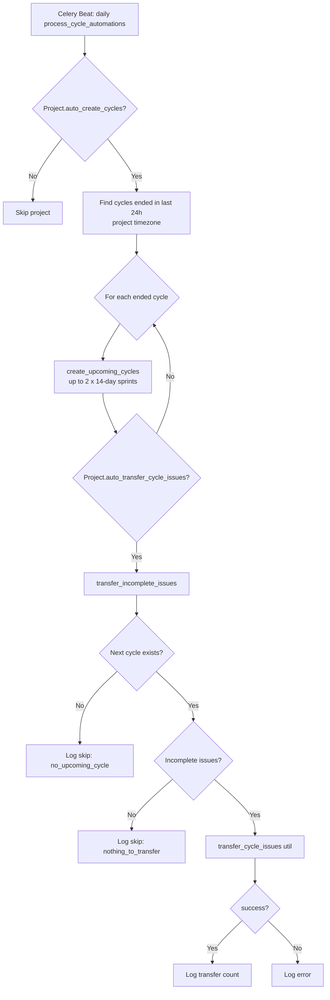
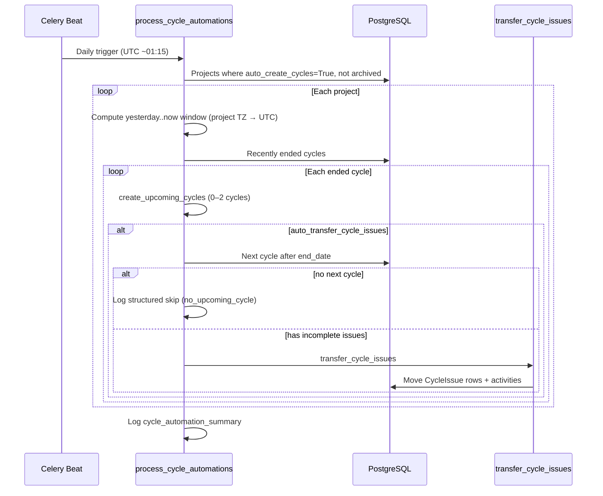
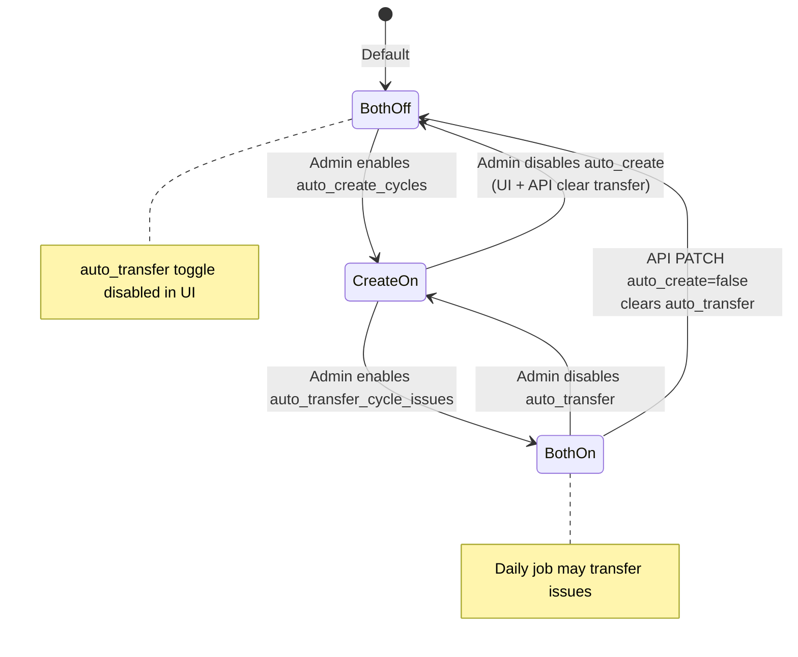

# Design: Auto-transfer cycle work items (Feature 4)

**Status:** Implemented in OSS — verification, observability, and scheduling polish  
**Spec:** [IMPLEMENTATION_SPEC.md](../IMPLEMENTATION_SPEC.md) § Feature 4  
**Review:** [FEATURE_REVIEW_REPORT.md](../FEATURE_REVIEW_REPORT.md) § Auto-transfer cycle work items

---

## Summary

When **auto-create cycles** and **auto-transfer cycle work items** are enabled on a project, a daily Celery job:

1. Detects cycles that ended in the last 24 hours (project-local timezone).
2. Creates up to two consecutive 14-day “Sprint N” cycles after the ended cycle (if no overlap).
3. Moves incomplete work items (backlog / unstarted / started, non-draft, non-archived) into the nearest upcoming cycle.

The feature is **project-scoped** (boolean fields on `Project`), not workspace-scoped. OSS ships the full code path; commercial **Free** tier may hide the toggle in Cloud via license UI — that is product policy, not an AGPL code gap.

---

## Components

| Layer          | Path                                                                                       | Role                                               |
| -------------- | ------------------------------------------------------------------------------------------ | -------------------------------------------------- |
| Schema         | `apps/api/plane/db/models/project.py`                                                      | `auto_create_cycles`, `auto_transfer_cycle_issues` |
| Celery         | `apps/api/plane/bgtasks/cycle_automation_task.py`                                          | `process_cycle_automations`                        |
| Transfer util  | `apps/api/plane/utils/cycle_transfer_issues.py`                                            | Shared transfer + activity logging                 |
| API validation | `apps/api/plane/app/serializers/project.py`, `api/serializers/project.py`                  | Dependency + auto-clear on disable                 |
| UI             | `apps/web/core/components/automation/auto-*.tsx`                                           | Project → Settings → Automations                   |
| Tests          | `apps/api/plane/tests/unit/test_cycle_automation.py`, `e2e/tests/cycle-automation.spec.ts` | Unit + Playwright                                  |

---

## Automation flow



---

## Celery task sequence



**Scheduling:** `plane/plane/celery.py` — `check-every-day-for-cycle-automations` → `plane.bgtasks.cycle_automation_task.process_cycle_automations`. Task module must remain in `CELERY_IMPORTS` (`settings/common.py`).

**Cooldown / window:** Only cycles with `end_date` in `[now - 24h, now)` are processed. Re-running the job the next day does not re-process older ended cycles. Idempotent cycle creation uses `has_overlapping_cycle` to avoid duplicate date ranges.

---

## Project settings state diagram



**Rules:**

- `auto_transfer_cycle_issues` ⇒ requires `auto_create_cycles` (API `ValidationError` if violated).
- Disabling `auto_create_cycles` clears `auto_transfer_cycle_issues` in API and in the auto-create UI toggle handler.
- UI disables the transfer toggle when auto-create is off.

---

## Interaction with `auto_create_cycles`

| Setting                               | Effect                                                                          |
| ------------------------------------- | ------------------------------------------------------------------------------- |
| `auto_create_cycles` off              | No Celery processing for project; transfer toggle disabled                      |
| `auto_create_cycles` on, transfer off | Creates upcoming sprints only                                                   |
| Both on                               | Creates sprints **then** transfers incomplete issues to earliest upcoming cycle |

Transfer runs **after** `create_upcoming_cycles` in the same loop iteration, so a newly created “Sprint N+1” is usually the destination when no manual cycle existed.

**Incomplete issue definition:** `state.group` ∈ `backlog`, `unstarted`, `started`; issue not draft/archived/deleted.

---

## Observability

Structured logs use `extra` payloads for skip and success paths:

| `skip_reason` / event  | Meaning                                               |
| ---------------------- | ----------------------------------------------------- |
| `no_upcoming_cycle`    | No cycle with `start_date > ended_cycle.end_date`     |
| `no_owner`             | No `created_by` or workspace admin for transfer actor |
| `no_incomplete_issues` | Nothing to move (info)                                |
| `transfer_failed`      | `transfer_cycle_issues` returned `success: false`     |

End-of-run summary: `cycle_automation_summary` with counts (`projects_processed`, `cycles_created`, `transfers_succeeded`, `transfers_skipped`, etc.).

---

## License / edition gating (optional)

| Edition        | OSS (this repo)                     | Plane Cloud Free (commercial)                                                                             |
| -------------- | ----------------------------------- | --------------------------------------------------------------------------------------------------------- |
| Code           | Feature enabled via project toggles | May show “—” on pricing matrix                                                                            |
| Gating pattern | None required for AGPL              | `UpgradeBadge` / `PaidPlanUpgradeModal` on other Pro features — **not wired** for cycle automation in OSS |

**Recommendation:** Keep OSS ungated. For Cloud, gate in `extended/` automation UI only if product requires; backend should remain functional for self-hosted instances regardless of plan.

---

## Acceptance criteria

| Criterion                                                                        | Status                                       |
| -------------------------------------------------------------------------------- | -------------------------------------------- |
| Both toggles on → ended cycle moves incomplete issues to next auto-created cycle | ✅ (unit: `test_transfer_only_when_enabled`) |
| Auto-create off → transfer toggle disabled                                       | ✅ (UI + e2e)                                |
| API rejects transfer without auto-create                                         | ✅ (serializer validation + unit tests)      |
| Daily beat runs `process_cycle_automations`                                      | ✅ (`celery.py` schedule)                    |
| Skip paths emit structured logs                                                  | ✅                                           |

---

## Test plan

```bash
# Unit (Docker)
docker compose -f docker-compose-test.yml run --rm api-tests \
  pytest apps/api/plane/tests/unit/test_cycle_automation.py -m unit -v

# E2E (stack at BASE_URL, default http://localhost:8081)
pnpm exec playwright test e2e/tests/cycle-automation.spec.ts
```

---

## References

- Migration: `0125_add_cycle_automation_fields_to_project`
- E2E: `e2e/tests/cycle-automation.spec.ts`
- Celery imports fix: `docs/e2e-test-results.md` (Issue 3)
