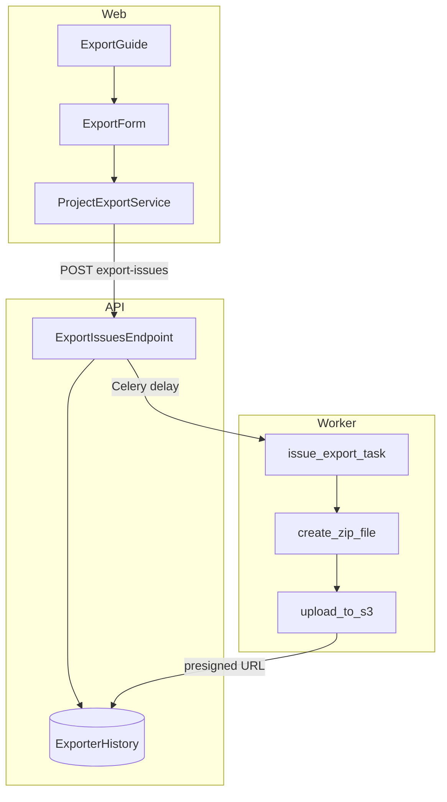
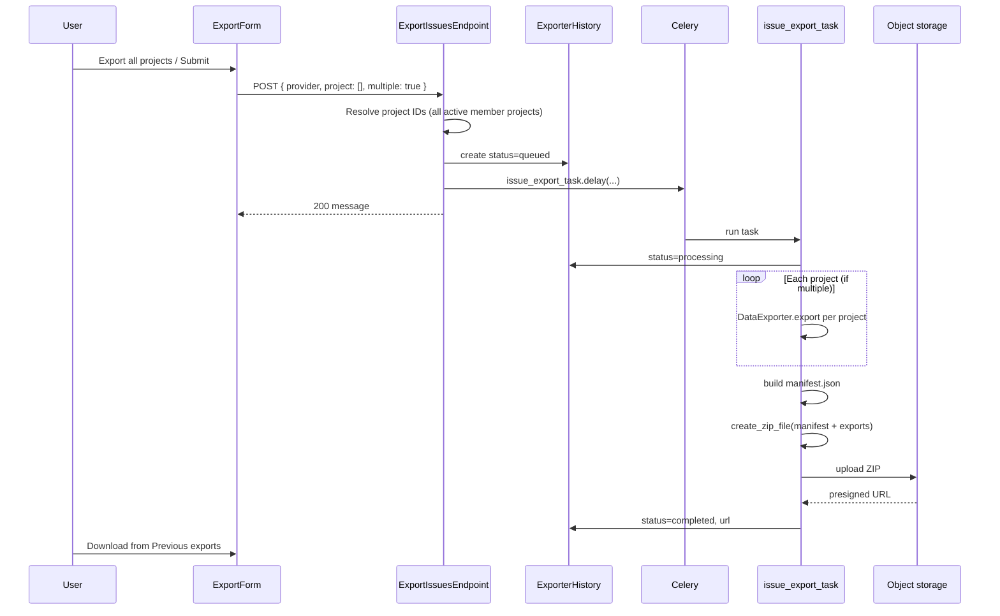
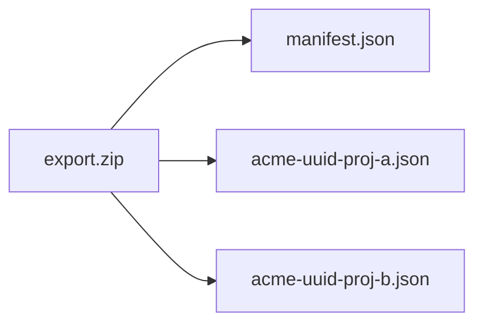

# Workspace Export — Software Design (Goal 5)

**Status:** MVP implementation  
**Spec:** [IMPLEMENTATION_SPEC.md](../IMPLEMENTATION_SPEC.md) — Feature 5  
**Related:** [export-schema.md](../export-schema.md) (JSON field reference)

---

## Problem

Work item export exists (`POST /api/workspaces/{slug}/export-issues/`) with CSV, JSON, and XLSX. Users need a **single ZIP** that bundles **all accessible projects**, with a machine-readable **manifest** describing workspace, projects, and file layout for importers (Jira, Linear, custom tools).

## Goals (MVP)

| ID  | Requirement                                                                           |
| --- | ------------------------------------------------------------------------------------- |
| E-1 | Export all accessible member projects in one job                                      |
| E-2 | Formats: JSON, CSV, XLSX (unchanged)                                                  |
| E-3 | `manifest.json` in ZIP: project list (id, name, identifier, state count) + file index |
| E-4 | Presigned download via existing `ExporterHistory`                                     |
| E-5 | Documented JSON issue schema (optional `export-schema.md`)                            |

## Non-goals (MVP)

- Rich filter AST on export (`filters` / `rich_filters` — phase 2)
- Attachments and comments as binary blobs in export
- Dedicated Celery queue / metrics (see spec observability section)

---

## Architecture



### Components

| Layer  | File                                                       | Responsibility                                              |
| ------ | ---------------------------------------------------------- | ----------------------------------------------------------- |
| Web    | `apps/web/core/components/exporter/export-form.tsx`        | Project selection, format, “Export all projects” preset     |
| Web    | `apps/web/core/components/exporter/guide.tsx`              | Hosts form + previous exports                               |
| Web    | `apps/web/core/services/project/project-export.service.ts` | POST client                                                 |
| API    | `apps/api/plane/app/views/exporter/base.py`                | Resolve empty `project` → all member projects; enqueue task |
| Worker | `apps/api/plane/bgtasks/export_task.py`                    | Serialize issues, build manifest, ZIP, S3                   |
| Porter | `apps/api/plane/utils/porters/serializers/project.py`      | Lightweight project metadata for manifest                   |

---

## Export job flow



---

## ZIP structure

Every completed export is a **single ZIP** regardless of format. Layout depends on `multiple`:

| `multiple`                       | Contents                                                                 |
| -------------------------------- | ------------------------------------------------------------------------ |
| `true` (default when >1 project) | `manifest.json` + `{slug}-{project_id}.{csv\|json\|xlsx}` per project    |
| `false`                          | `manifest.json` + `{slug}-{workspace_id}.{ext}` (all issues in one file) |



### `manifest.json` shape

```json
{
  "workspace_slug": "acme",
  "exported_at": "2026-05-29T12:00:00+00:00",
  "plane_version": "v0.27.1",
  "format": "json",
  "projects": [
    {
      "id": "550e8400-e29b-41d4-a716-446655440000",
      "identifier": "WEB",
      "name": "Web",
      "state_count": 5
    }
  ],
  "files": [
    {
      "project_id": "550e8400-e29b-41d4-a716-446655440000",
      "path": "acme-550e8400-e29b-41d4-a716-446655440000.json",
      "issue_count": 120
    }
  ]
}
```

When `multiple` is false, `files[0].project_id` is `null` and `issue_count` is the total across projects.

---

## API

### `POST /api/workspaces/{slug}/export-issues/`

**Existing body (unchanged fields):**

| Field          | Type                      | Default                       | Notes                                                             |
| -------------- | ------------------------- | ----------------------------- | ----------------------------------------------------------------- |
| `provider`     | `csv` \| `json` \| `xlsx` | required                      |                                                                   |
| `project`      | `string[]`                | `[]`                          | **Empty = all** non-archived projects where user is active member |
| `multiple`     | `boolean`                 | `len(project) > 1` if omitted | One file per project vs single combined file                      |
| `rich_filters` | object                    | —                             | Stored on history; filter pipeline phase 2                        |

**Response:** `200` with message; poll `GET` export history for presigned URL.

### Empty project list behavior

Already implemented in `ExportIssuesEndpoint`: when `project` is empty, query:

- `workspace__slug=slug`
- `project_projectmember__member=request.user`, `is_active=True`
- `archived_at__isnull=True`

MVP enhancement: default `multiple=true` when resolved project count > 1 and client did not send `multiple`.

---

## Manifest builder (worker)

1. After exporting issues, collect `files` metadata: `path`, `project_id`, `issue_count`.
2. Load `Project` rows for `project_ids` with `Count("project_state")` for `state_count`.
3. Serialize manifest with `json.dumps(..., default=str)`.
4. Prepend `manifest.json` to ZIP entries (always included for MVP).

`plane_version` from `APP_RELEASE_VERSION` or `APP_VERSION` env, else `"unknown"`.

---

## Web UX

### Export all projects preset

- Secondary button on `ExportForm`: clears project selection, sets `multiple: true`, submits with current format.
- Project selector label remains **“All projects”** when selection is empty (existing copy).

### Per-project vs all

| User action                            | `project`   | `multiple`                         |
| -------------------------------------- | ----------- | ---------------------------------- |
| Export all projects button             | `[]`        | `true`                             |
| Multi-select ≥2 projects               | `[id, ...]` | `true`                             |
| Single project                         | `[id]`      | `false`                            |
| All projects via empty select + Export | `[]`        | `true` (API default if >1 project) |

---

## Security & permissions

- Unchanged: `ROLE.ADMIN` and `ROLE.MEMBER` at workspace level.
- Issue queryset filtered by initiator’s active project membership (worker mirrors endpoint resolution).

---

## Testing

| Test         | Scope                                                  |
| ------------ | ------------------------------------------------------ |
| Unit         | `build_export_manifest` / ZIP contains `manifest.json` |
| Contract     | POST empty `project` returns 200 and enqueues job      |
| E2E (future) | Settings → Export all → download ZIP                   |

Run API unit tests: `docker compose -f docker-compose-test.yml run --rm api-tests pytest -m unit`

---

## Acceptance criteria

| Criterion                                                           | MVP                                                      |
| ------------------------------------------------------------------- | -------------------------------------------------------- |
| Empty project list exports all non-archived member projects         | Yes (existing + verified)                                |
| ZIP contains `manifest.json` + per-project files when multi-project | Yes                                                      |
| JSON/CSV/XLSX formats work                                          | Yes (unchanged)                                          |
| Export history + presigned URL                                      | Yes (unchanged)                                          |
| 10k issues / batching                                               | No change in MVP (existing queryset; load test deferred) |
| UI “Export all projects”                                            | Yes                                                      |

---

## Future work

- Apply `rich_filters` / `ExporterHistory.filters` in worker queryset
- `include_project_manifest` flag if consumers need legacy ZIPs without manifest
- State summary array in manifest (not just `state_count`)
- Dedicated metrics and export queue
