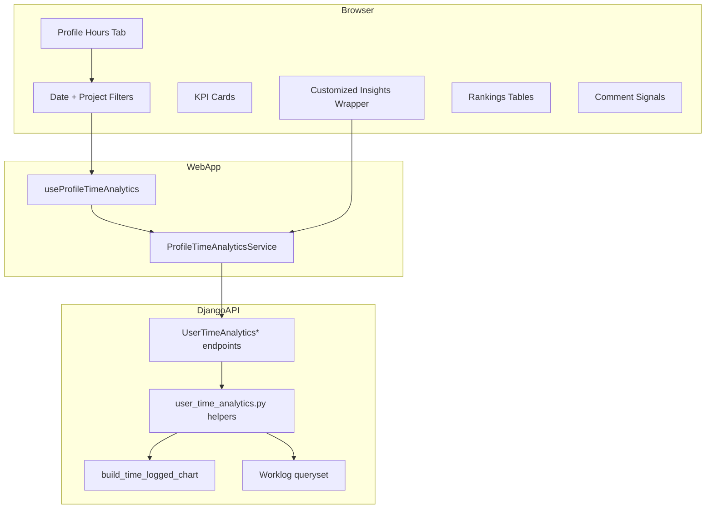
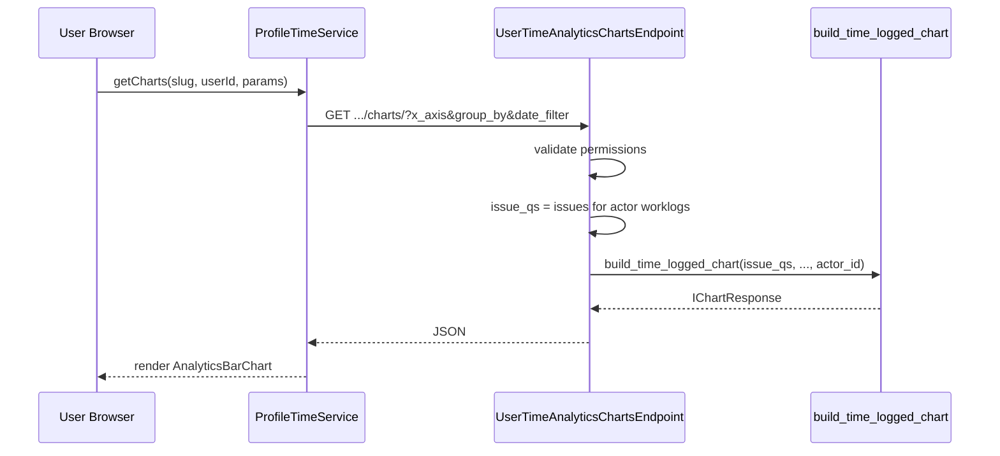
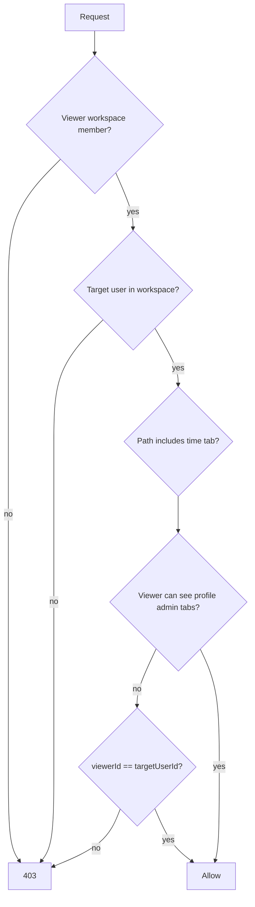

# Design: Your Work — Hours Logged Analytics

**Version:** 1.0  
**Date:** 2026-05-29  
**Status:** Draft

---

## Table of contents

1. [Context & goals](#1-context--goals)
2. [Current system](#2-current-system)
3. [Proposed architecture](#3-proposed-architecture)
4. [API design](#4-api-design)
5. [Frontend design](#5-frontend-design)
6. [Data & aggregation](#6-data--aggregation)
7. [Comment signals](#7-comment-signals)
8. [Diagrams](#8-diagrams)
9. [Trade-offs](#9-trade-offs)
10. [File reference](#10-file-reference)

---

## 1. Context & goals

Users need a **personal** time-tracking dashboard on **Your work**, not only project-level Analytics. The dashboard should answer:

- How much did I log this week vs last week?
- Which projects/modules/cycles/tasks absorbed my time?
- How is my effort distributed by day, type, and priority?
- Are there discussions on items I touched that need attention?

**Design principle:** Maximize reuse of `build_time_logged_chart`, analytics UI components, and export logic; add a thin **user-scoped** API layer and profile-specific layout.

---

## 2. Current system

### 2.1 Profile (“Your work”)

| Piece        | Location                                                                         |
| ------------ | -------------------------------------------------------------------------------- |
| Tabs         | `packages/constants/src/profile.ts` — `PROFILE_VIEWER_TAB`, `PROFILE_ADMINS_TAB` |
| Routes       | `apps/web/app/routes/core.ts`                                                    |
| Summary page | `profile/[userId]/page.tsx` + `components/profile/overview/*`                    |
| Stats API    | `WorkspaceUserProfileStatsEndpoint` — issue counts, no worklogs                  |

### 2.2 Workspace analytics (hours logged)

| Piece         | Location                                                                              |
| ------------- | ------------------------------------------------------------------------------------- |
| Chart API     | `AdvanceAnalyticsChartEndpoint` — `y_axis=HOURS_LOGGED` → `build_time_logged_chart()` |
| Chart builder | `apps/api/plane/utils/build_chart.py`                                                 |
| Export        | `TimeLoggedExportEndpoint`                                                            |
| UI            | `CustomizedInsights`, `AnalyticsBarChart`, `AnalyticsSelectParams`                    |
| Store         | `useAnalytics()` — duration, projects, cycle, module (workspace context)              |

**Gap:** Analytics filters issues by workspace/project, **not** by worklog `actor`. Profile hours tab requires **actor-centric** filtering first, then issue dimensions.

### 2.3 Data model

```text
Worklog
  - issue_id → Issue (project, type, priority, state, modules, cycles)
  - actor_id → User (profile subject)
  - duration (minutes; 0 = active timer)
  - logged_at (date)
  - description
```

---

## 3. Proposed architecture



### 3.1 Layer responsibilities

| Layer                         | Responsibility                                                               |
| ----------------------------- | ---------------------------------------------------------------------------- |
| `user_time_analytics.py`      | Build base worklog/issue querysets: actor, date range, viewer project access |
| Views                         | HTTP, permissions, serializers, pagination                                   |
| `build_time_logged_chart`     | Dimensional chart payloads (unchanged contract)                              |
| `ProfileTimeAnalyticsService` | SWR keys, API calls (mirror `AnalyticsService`)                              |
| `ProfileTimeDashboard`        | Compose sections; local filter state (not global analytics store)            |

---

## 4. API design

### 4.1 URL module

Add to `apps/api/plane/app/urls/workspace.py`:

```python
path(
    "workspaces/<str:slug>/user-time-analytics/<uuid:user_id>/summary/",
    UserTimeAnalyticsSummaryEndpoint.as_view(),
),
# ... charts, rankings, worklogs, comment-signals, export
```

### 4.2 Permission class

Extend pattern from `WorkspaceUserProfileStatsEndpoint`:

1. Request user is active `WorkspaceMember`.
2. Target `user_id` is active member of workspace.
3. Querysets filter `project__project_projectmember__member=request.user` (viewer access).

Optional: allow user to always read **own** `user_id` even with reduced role (align with product policy for Summary tab).

### 4.3 Summary endpoint

**GET** `.../summary/?date_filter=last_7_days&project_ids=uuid1,uuid2`

Response shape (proposed TypeScript `IUserTimeAnalyticsSummary`):

```typescript
{
  total_hours: number;
  previous_period_hours: number;
  delta_percent: number | null;
  worklog_count: number;
  active_timer_count: number;
  avg_hours_per_day: number;
  period: { start: string; end: string };
  previous_period: { start: string; end: string } | null;
}
```

Implementation notes:

- Use `get_chart_period_range(date_filter)` from `plane.utils.date_utils`.
- Aggregate minutes with same `Case(When(duration=0, ...))` as `build_time_logged_chart`.
- Previous period from `get_analytics_date_range()` → `previous` key when available.

### 4.4 Charts endpoint

**GET** `.../charts/?x_axis=LOGGED_DAY_OF_WEEK&group_by=WORK_ITEMS&date_filter=...`

Algorithm:

```python
def get_user_issue_queryset_for_time_analytics(slug, target_user_id, viewer, date_filter, project_ids):
    # 1. Issues in workspace where viewer is project member
    # 2. That have worklogs by target_user in date range (subquery or filter on worklog)
    # 3. Optional project_ids intersection
    return issue_qs

# In view:
return Response(build_time_logged_chart(issue_qs, x_axis, group_by, chart_period_range))
```

**Important:** `build_time_logged_chart` aggregates **all** worklogs on those issues, not only target user’s.

**Fix (required):** Filter worklogs in chart builder OR pre-filter: only pass issues where **all** relevant worklogs are from target user — preferred approach: **add optional `actor_id` parameter** to `build_time_logged_chart` and `TimeLoggedExportEndpoint` to filter `Worklog.objects.filter(actor_id=...)`.

| Approach                                       | Pros                                             | Cons                          |
| ---------------------------------------------- | ------------------------------------------------ | ----------------------------- |
| A. Add `actor_id` to `build_time_logged_chart` | Correct, reusable for profile                    | Touches shared analytics code |
| B. Separate `build_user_time_logged_chart`     | No risk to workspace analytics                   | Duplication                   |
| **Recommendation**                             | **A** — optional `actor_id: UUID \| None = None` |                               |

### 4.5 Rankings endpoint

**GET** `.../rankings/?dimension=project&limit=10&date_filter=...`

Response:

```typescript
{
  dimension: "project" | "module" | "cycle" | "work_item";
  items: Array<{
    id: string;
    name: string;
    hours: number;
    percent_of_total: number;
    meta?: { project_id?: string; identifier?: string };
  }>;
}
```

SQL pattern: worklogs → join issue → group by dimension id, sum minutes, order desc, limit.

### 4.6 Worklogs list

**GET** `.../worklogs/?cursor=...&per_page=20`

Paginated serializer: `logged_at`, `duration`, `description`, `issue` (id, name, identifier), `project` (id, name).

### 4.7 Comment signals

**GET** `.../comment-signals/?date_filter=...&limit=20`

Logic:

1. Issue IDs with target user worklogs in period.
2. `IssueComment` (or equivalent) on those issues where `created_at` in period and `actor_id != target_user`.
3. Optional: `Q(comment__icontains=keyword)` for keyword list from settings constant.
4. Return issue summary + latest comment snippet + matched keywords.

### 4.8 Export

**GET** `.../export/?date_filter=...&project_ids=...`

Reuse `TimeLoggedExportEndpoint._build_export_response` with user-filtered queryset + `actor_id` filter.

---

## 5. Frontend design

### 5.1 Component tree

```text
profile/[userId]/time/page.tsx
└── ProfileTimeAnalyticsDashboard
    ├── ProfileTimeFilters (date, projects)
    ├── ProfileTimeKpis
    ├── ProfileTimeCustomizedInsights
    │   ├── AnalyticsSelectParams (props: hide workspace-only options if needed)
    │   └── ProfileTimeAnalyticsBarChart (wraps AnalyticsBarChart logic, profile API)
    ├── ProfileTimeRankingsGrid
    │   ├── ProfileTimeRankingCard (project | module | cycle)
    │   └── ProfileTimeTopWorkItemsTable
    ├── ProfileTimeTrendChart (week/month — may use charts endpoint with x_axis=CREATED_AT or dedicated API)
    ├── ProfileTimeBreakdownRow (type, priority)
    ├── ProfileTimeRecentWorklogs
    └── ProfileTimeCommentSignals
```

### 5.2 State management

**Do not** mount profile tab on global `useAnalytics()` store (workspace/project modal context).

Use:

- Local `react-hook-form` or `useState` for `date_filter` + `project_ids`
- SWR with keys: `profile-time-${workspaceSlug}-${userId}-${dateFilter}-${projects}-...`
- New `ProfileTimeAnalyticsService` in `apps/web/core/services/profile-time-analytics.service.ts`

### 5.3 Reuse strategy for Customized Insights

| Option                            | Description                            | Decision       |
| --------------------------------- | -------------------------------------- | -------------- |
| Fork `AnalyticsBarChart`          | Copy-paste with different service      | Avoid          |
| Parameterize `AnalyticsBarChart`  | `analyticsService` + `getChart` inject | **Preferred**  |
| Shared hook `useHoursLoggedChart` | Extract SWR + export                   | Good follow-up |

Inject:

```typescript
<AnalyticsBarChart
  fetchChart={(params) => profileTimeService.getCharts(workspaceSlug, userId, params)}
  exportCsv={(params) => profileTimeService.exportCsv(...)}
/>
```

### 5.4 Tab placement

Add to `PROFILE_ADMINS_TAB` after `activity` (or before):

```typescript
{
  key: "time",
  route: "time",
  i18n_label: "profile.tabs.time",
  selected: "/time/",
}
```

Show tab when `isAuthorized || currentUserId === userId` if product wants owners to see own hours without admin role — **confirm with PM**; default: same as Activity tab (authorized members only).

---

## 6. Data & aggregation

### 6.1 Base worklog queryset

```python
def base_worklogs(slug, target_user_id, viewer, date_range, project_ids=None):
    qs = Worklog.objects.filter(
        deleted_at__isnull=True,
        actor_id=target_user_id,
        issue__workspace__slug=slug,
        issue__project__project_projectmember__member=viewer,
        issue__project__project_projectmember__is_active=True,
    )
    if date_range:
        qs = qs.filter(logged_at__gte=start, logged_at__lte=end)
    if project_ids:
        qs = qs.filter(project_id__in=project_ids)
    return qs
```

### 6.2 Issue queryset for charts

Distinct issues from `base_worklogs().values_list("issue_id", flat=True)`.

### 6.3 WORK_ITEM_TYPES axis

Verify `get_x_axis_field()` includes `WORK_ITEM_TYPES`; if missing, add mapping to issue type for hours logged charts (parity with work item count analytics).

---

## 7. Comment signals

Heuristic only (v1):

- **Keywords** (constant): `blocked`, `blocker`, `bug`, `regression`, `urgent`, `help`, `stuck`, `waiting`
- Score = keyword match count in last comment (case-insensitive)
- Sort by recency, then score
- UI: badge “Possible attention” + excerpt (max 120 chars)

**Not** sentiment analysis; document limitation in UI tooltip.

---

## 8. Diagrams

### 8.1 Request flow (chart)



### 8.2 Permission check



---

## 9. Real-time WebSocket (active timers)

### 9.1 Channel & scope

| Item        | Value                                                                                     |
| ----------- | ----------------------------------------------------------------------------------------- |
| URL         | `ws(s)://{api-host}/ws/workspaces/{slug}/user-time-analytics/{user_id}/`                  |
| Group name  | `user_time_analytics_{workspace_id}_{target_user_id}`                                     |
| Subscribers | Authenticated workspace members who pass the same permission checks as the REST endpoints |
| Publisher   | Django API on worklog `start` / `stop` tracking actions                                   |

### 9.2 Event types

```typescript
type TWorklogTimerEvent =
  | { type: "worklog_timer_started"; worklog_id: string; issue_id: string; actor_id: string; created_at: string }
  | { type: "worklog_timer_stopped"; worklog_id: string; issue_id: string; actor_id: string; duration: number }
  | { type: "worklog_timer_tick"; actor_id: string; active_timer_count: number; elapsed_minutes: number };
```

- **started / stopped:** Emitted from `WorklogViewSet.start` / `stop` via Django Channels `group_send`.
- **tick:** Optional lightweight broadcast (or client-derived): while `active_timer_count > 0`, the web client runs a 60s local tick to refetch `summary/`; server may emit `tick` on a debounced schedule in a follow-up if needed.

### 9.3 Client behavior

| Layer                             | Responsibility                                                                                         |
| --------------------------------- | ------------------------------------------------------------------------------------------------------ |
| `useProfileTimeAnalyticsRealtime` | Connect WebSocket when Hours logged tab is mounted; parse events; `mutate` SWR keys for summary/charts |
| Fallback                          | If connection fails, poll `summary/` every 60s while tab is visible                                    |
| MobX worklog store                | Unchanged; profile tab does not depend on global active-worklog state                                  |

### 9.4 Infrastructure

- **Backend:** `channels` + `channels_redis` (Redis channel layer using `REDIS_URL`); `InMemoryChannelLayer` in unit tests when Redis is unavailable.
- **ASGI:** Extend `plane.asgi.application` with `AuthMiddlewareStack` + `URLRouter` for the consumer above.

---

## 10. Trade-offs

| Decision                                 | Pros                   | Cons                                                |
| ---------------------------------------- | ---------------------- | --------------------------------------------------- |
| Add `actor_id` to shared chart builder   | Single source of truth | Regression risk for workspace analytics — add tests |
| New API namespace vs extend `user-stats` | Clear separation       | More endpoints to maintain                          |
| Heuristic comment signals                | Fast to ship           | False positives/negatives                           |
| Reuse AnalyticsBarChart via injection    | Less UI drift          | Refactor touch to core component                    |
| Dedicated profile filter state           | No store coupling      | Some duplicated filter UI                           |

---

## 11. File reference

### New backend

| File                                                          | Purpose          |
| ------------------------------------------------------------- | ---------------- |
| `apps/api/plane/utils/user_time_analytics.py`                 | Queryset helpers |
| `apps/api/plane/app/views/workspace/user_time_analytics.py`   | Endpoints        |
| `apps/api/plane/app/serializers/user_time_analytics.py`       | Response shapes  |
| `apps/api/plane/tests/unit/views/test_user_time_analytics.py` | Unit tests       |

### Modified backend

| File                                   | Change                                   |
| -------------------------------------- | ---------------------------------------- |
| `apps/api/plane/utils/build_chart.py`  | Optional `actor_id` on time logged paths |
| `apps/api/plane/app/urls/workspace.py` | Register routes                          |
| `apps/api/plane/app/views/__init__.py` | Exports                                  |

### New frontend

| File                                                       | Purpose            |
| ---------------------------------------------------------- | ------------------ |
| `apps/web/.../profile/[userId]/time/page.tsx`              | Route page         |
| `apps/web/core/components/profile/time-analytics/*`        | Dashboard sections |
| `apps/web/core/services/profile-time-analytics.service.ts` | API client         |
| `packages/types/src/profile-time-analytics.ts`             | Types              |

### Modified frontend

| File                                                                    | Change                               |
| ----------------------------------------------------------------------- | ------------------------------------ |
| `packages/constants/src/profile.ts`                                     | Tab entry                            |
| `apps/web/app/routes/core.ts`                                           | Route                                |
| `profile/[userId]/layout.tsx`                                           | Auth path                            |
| `packages/i18n/src/locales/en/translations.ts`                          | Strings                              |
| `apps/web/core/components/analytics/work-items/analytics-bar-chart.tsx` | Injectable fetch (optional refactor) |

### Tests

| File                                                          | Purpose           |
| ------------------------------------------------------------- | ----------------- |
| `apps/api/plane/tests/unit/views/test_user_time_analytics.py` | API               |
| `e2e/tests/profile-time-analytics.spec.ts`                    | Tab + chart smoke |
