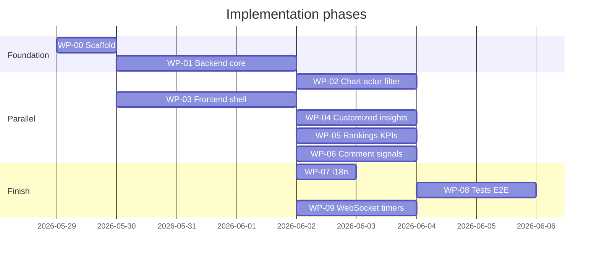

# Plan: Your Work — Hours Logged Analytics

**Version:** 1.0  
**Date:** 2026-05-29  
**Status:** Ready for parallel agent execution

**Specs:** [requirements.md](./requirements.md) · [design.md](./design.md)

Mark tasks `[x]` as completed. Work packages **WP-\*** are designed for **one specialized agent each** with minimal merge conflicts.

---

## Execution overview



**Critical path:** WP-00 → WP-01 → WP-04 / WP-05 / WP-09 (parallel) → WP-08

---

## WP-00: Scaffold & contracts (owner: platform agent)

**Goal:** Land tab, route, types, and stub API so other agents can integrate without touching routing again.

**Branch suggestion:** `feat/profile-time-analytics-scaffold`

### Tasks

- [x] Create spec docs (`docs/profile-time-analytics/*`)
- [x] Add `profile.tabs.time` to `packages/i18n/src/locales/en/translations.ts` (+ `settings.json` if duplicated)
- [x] Add tab to `packages/constants/src/profile.ts`
- [x] Register route in `apps/web/app/routes/core.ts`
- [x] Create `time/page.tsx` + `ProfileTimeAnalyticsDashboard` placeholder
- [x] Update `layout.tsx` authorized paths for `time`
- [x] Add `packages/types/src/profile-time-analytics.ts` (interfaces only)
- [x] Add `ProfileTimeAnalyticsService` client (calls future WP-01 endpoints)
- [ ] Run `pnpm fix:format` on touched files (delegate to merging agent)

### Deliverables

- Navigable tab shows “Hours logged” empty state with link to spec
- No backend required yet

### Agent prompt (copy-paste)

```text
Implement WP-00 from docs/profile-time-analytics/plan.md.
Add profile Hours logged tab, route, en i18n, types file, and placeholder dashboard.
Do not implement API logic. Match existing profile tab patterns.
```

---

## WP-01: Backend — user time analytics API (owner: backend agent)

**Goal:** User-scoped aggregation endpoints with permissions.

**Depends on:** WP-00 types (for contract alignment)

**Branch:** `feat/profile-time-analytics-api`

### Tasks

- [ ] Create `apps/api/plane/utils/user_time_analytics.py`
  - [ ] `base_worklogs(...)`, `user_issues_for_worklogs(...)`, `aggregate_total_minutes(...)`
- [ ] Create `apps/api/plane/app/views/workspace/user_time_analytics.py`
  - [ ] `UserTimeAnalyticsSummaryEndpoint`
  - [ ] `UserTimeAnalyticsChartsEndpoint` (delegates to chart builder)
  - [ ] `UserTimeAnalyticsRankingsEndpoint`
  - [ ] `UserTimeAnalyticsWorklogsEndpoint` (paginated)
  - [ ] `UserTimeAnalyticsExportEndpoint`
- [ ] Wire URLs in `apps/api/plane/app/urls/workspace.py`
- [ ] Export views in `apps/api/plane/app/views/__init__.py`
- [ ] Unit tests: `apps/api/plane/tests/unit/views/test_user_time_analytics.py`
  - [ ] Actor scoping (user A cannot see user B totals)
  - [ ] Project membership scoping
  - [ ] Active timer minutes included
  - [ ] Summary delta vs previous period

### Deliverables

- All endpoints return 200 with seeded worklogs in docker test stack
- OpenAPI not required (match existing Plane API style)

### Agent prompt

```text
Implement WP-01 from docs/profile-time-analytics/plan.md and design.md §4.
Create user-time-analytics endpoints under workspaces/{slug}/user-time-analytics/{user_id}/.
Follow WorkspaceUserProfileStatsEndpoint permission patterns.
Add unit tests per apps/api/tests/TESTING_GUIDE.md.
```

---

## WP-02: Backend — actor filter on chart builder (owner: backend agent)

**Goal:** Correct per-user hours in shared `build_time_logged_chart`.

**Depends on:** WP-01 (charts endpoint calls this)

**Branch:** `feat/profile-time-analytics-chart-actor` (can stack on WP-01 branch)

### Tasks

- [ ] Add optional `actor_id: UUID | None = None` to `build_time_logged_chart` in `build_chart.py`
- [ ] Filter worklog queryset when `actor_id` set
- [ ] Update `TimeLoggedExportEndpoint` to accept optional `actor_id` query param (internal/profile only)
- [ ] Extend `apps/api/plane/tests/unit/views/test_analytics_export.py` or new tests — workspace analytics unchanged when `actor_id` omitted
- [ ] `UserTimeAnalyticsChartsEndpoint` passes `actor_id=target_user_id`

### Agent prompt

```text
Implement WP-02 from docs/profile-time-analytics/plan.md.
Add optional actor_id to build_time_logged_chart and export path.
Ensure workspace advance-analytics behavior is unchanged when actor_id is absent.
```

---

## WP-03: Frontend — dashboard shell & service (owner: frontend agent)

**Goal:** Filter bar, KPI row wired to summary API, section layout.

**Depends on:** WP-00 scaffold; **can mock API** until WP-01 merges

**Branch:** `feat/profile-time-analytics-ui-shell`

### Tasks

- [ ] Implement `apps/web/core/services/profile-time-analytics.service.ts`
- [ ] Create components under `apps/web/core/components/profile/time-analytics/`:
  - [ ] `root.tsx` — `ProfileTimeAnalyticsDashboard`
  - [ ] `filters.tsx` — date + project multi-select (reuse analytics duration options from `@plane/constants`)
  - [ ] `kpis.tsx` — SWR → summary endpoint
  - [ ] `empty-state.tsx`
- [ ] Replace placeholder in `time/page.tsx`
- [ ] Fetch keys in `apps/web/constants/fetch-keys.ts` if pattern exists

### Agent prompt

```text
Implement WP-03 from docs/profile-time-analytics/plan.md.
Build profile time analytics dashboard shell with filters and KPI cards.
Use ProfileTimeAnalyticsService and types from packages/types.
Match profile overview card styling (ProfileStats, ContentWrapper).
```

---

## WP-04: Frontend — customized insights reuse (owner: frontend agent)

**Goal:** Hours logged chart + table + CSV on profile tab.

**Depends on:** WP-01, WP-02, WP-03

**Branch:** `feat/profile-time-analytics-insights`

### Tasks

- [ ] Refactor `analytics-bar-chart.tsx` to accept injected `fetchChart` / `exportCsv` (or duplicate minimal wrapper — prefer inject)
- [ ] Add `profile-time-customized-insights.tsx` wrapping `AnalyticsSelectParams` + chart
- [ ] Default params: `y_axis=HOURS_LOGGED`, `x_axis=LOGGED_DAY_OF_WEEK`, `group_by=WORK_ITEMS`
- [ ] Wire export to profile export endpoint
- [ ] Verify stacked bar + table match workspace analytics peek view

### Agent prompt

```text
Implement WP-04 from docs/profile-time-analytics/plan.md design.md §5.3.
Reuse Customized Insights UX on profile Hours tab with profile-time-analytics charts API.
Parameterize AnalyticsBarChart to avoid useAnalytics store coupling.
```

---

## WP-05: Frontend — rankings & breakdowns (owner: frontend agent)

**Depends on:** WP-01, WP-03

### Tasks

- [ ] `rankings-grid.tsx` — project, module, cycle cards from rankings API
- [ ] `top-work-items-table.tsx` — dimension=work_item
- [ ] `breakdown-row.tsx` — type + priority (charts API or dedicated ranking calls)
- [ ] `trend-chart.tsx` — hours by week (x_axis appropriate or summary timeseries if added)
- [ ] Row click → open work item peek (reuse existing issue navigation helpers)

### Agent prompt

```text
Implement WP-05 from docs/profile-time-analytics/plan.md.
Add rankings grid and top work items table to ProfileTimeAnalyticsDashboard.
```

---

## WP-06: Backend + frontend — comment signals (owner: full-stack agent)

**Depends on:** WP-01

### Tasks

- [ ] Backend: `UserTimeAnalyticsCommentSignalsEndpoint` per design.md §4.7
- [ ] Frontend: `comment-signals.tsx` panel with keyword badges
- [ ] Constants: `PROFILE_TIME_ATTENTION_KEYWORDS` in `packages/constants`

### Agent prompt

```text
Implement WP-06 from docs/profile-time-analytics/plan.md §7.
Comment signals endpoint + UI panel with heuristic keyword highlighting.
```

---

## WP-07: i18n & locales (owner: i18n agent)

**Depends on:** WP-03–WP-06 (string freeze)

### Tasks

- [ ] Add keys under `profile.time_analytics.*` in `packages/i18n/src/locales/en/translations.ts`
- [ ] Mirror to all locale files in `packages/i18n/src/locales/*/translations.ts`
- [ ] Run i18n key generation if project uses codegen script
- [ ] Tab label `profile.tabs.time` in all locales

### Agent prompt

```text
Implement WP-07 from docs/profile-time-analytics/plan.md.
Add all profile.time_analytics.* and profile.tabs.time strings to every locale.
```

---

## WP-08: Tests & QA (owner: QA agent)

**Depends on:** WP-01–WP-06

### Tasks

- [ ] API: expand `test_user_time_analytics.py` edge cases
- [ ] E2E: `e2e/tests/profile-time-analytics.spec.ts`
  - [ ] Navigate to Your work → Hours logged tab
  - [ ] Seed worklog via existing time-tracking helper
  - [ ] Assert summary KPI visible
  - [ ] Assert chart request includes user-time-analytics path
- [ ] Manual: compare day-of-week chart with Analytics modal for same filters
- [ ] Run `docker compose -f docker-compose-test.yml run --rm api-tests pytest ... -k user_time`
- [ ] Run `pnpm check:lint` on web packages touched

### Agent prompt

```text
Implement WP-08 from docs/profile-time-analytics/plan.md.
Add API unit tests and Playwright E2E for profile Hours logged tab.
```

---

## WP-09: Real-time WebSocket — active timers (owner: full-stack agent)

**Depends on:** WP-01, WP-03

### Tasks

- [ ] Add `channels` to `INSTALLED_APPS`, `CHANNEL_LAYERS` (Redis), `channels-redis` dependency
- [ ] `UserTimeAnalyticsConsumer` + `plane/routing.py`; wire `plane/asgi.py`
- [ ] `broadcast_worklog_timer_event()` called from worklog start/stop
- [ ] `useProfileTimeAnalyticsRealtime` hook; subscribe from Hours logged dashboard
- [ ] On events: SWR `mutate` summary (+ charts when start/stop); 60s polling fallback

### Agent prompt

```text
Implement WP-09 from docs/profile-time-analytics/design.md §9.
WebSocket channel for profile user timer start/stop; client hook with polling fallback.
```

---

## Merge order

1. WP-00 (scaffold)
2. WP-01 + WP-02 (backend; can be one PR)
3. WP-03 (UI shell)
4. WP-04 + WP-05 + WP-06 (parallel frontend/backend)
5. WP-07 (i18n)
6. WP-08 (tests)

---

## Work package index

| ID    | File                                                                                       | Agent skill             |
| ----- | ------------------------------------------------------------------------------------------ | ----------------------- |
| WP-00 | [work-packages/WP-00-scaffold.md](./work-packages/WP-00-scaffold.md)                       | Web routing             |
| WP-01 | [work-packages/WP-01-backend-api.md](./work-packages/WP-01-backend-api.md)                 | Django/API              |
| WP-02 | [work-packages/WP-02-chart-actor.md](./work-packages/WP-02-chart-actor.md)                 | Django/analytics        |
| WP-03 | [work-packages/WP-03-ui-shell.md](./work-packages/WP-03-ui-shell.md)                       | React/Plane UI          |
| WP-04 | [work-packages/WP-04-customized-insights.md](./work-packages/WP-04-customized-insights.md) | React/charts            |
| WP-05 | [work-packages/WP-05-rankings.md](./work-packages/WP-05-rankings.md)                       | React/tables            |
| WP-06 | [work-packages/WP-06-comment-signals.md](./work-packages/WP-06-comment-signals.md)         | Full-stack              |
| WP-07 | [work-packages/WP-07-i18n.md](./work-packages/WP-07-i18n.md)                               | i18n                    |
| WP-08 | [work-packages/WP-08-tests.md](./work-packages/WP-08-tests.md)                             | pytest/Playwright       |
| WP-09 | (this plan § WP-09)                                                                        | Django Channels + React |

---

## Progress log

| Date       | Agent       | Notes                                                                        |
| ---------- | ----------- | ---------------------------------------------------------------------------- |
| 2026-05-29 | Spec author | Created requirements, design, plan, WP files; WP-00 partial scaffold in repo |
